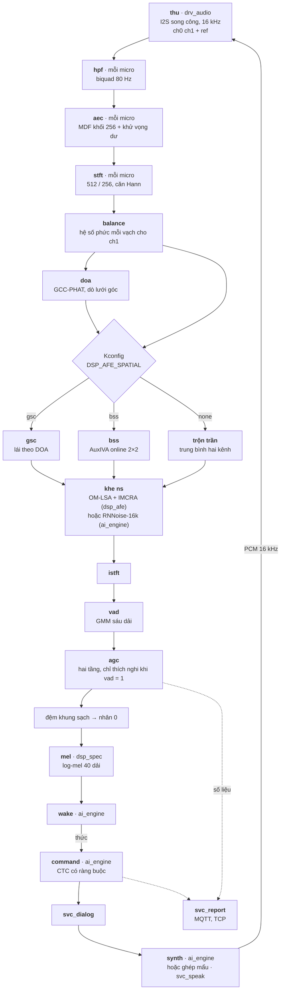

# Bộ nghe và nói tiếng Việt trên ESP32-S3 — Kế hoạch triển khai

Nguồn sự thật về kiến trúc của repo `esp-sr`. Lý do chọn hướng và bậc thang thuật toán nằm ở
`docs/tong_quan_version_5.md` (gọi tắt **TỔNG QUAN**). Chỗ nào hai file lệch nhau thì **file này
đúng**, và §0.2 liệt kê đủ từng chỗ lệch.

Quy tắc làm việc ở `CLAUDE.md`, backlog ở `docs/TASKS.md`, sổ kiểm lỗi đồng thời ở `docs/FREERTOS.md`.

Ký hiệu: 🔬 là số ước hoặc số của tài liệu ngoài, **chưa đo trên board của dự án**. Số đo thật nằm ở
`docs/measurements/`, không nằm ở đây.

## Mục lục

- [0. Phạm vi và quan hệ với TỔNG QUAN](#0-phạm-vi-và-quan-hệ-với-tổng-quan)
- [1. Mô hình, dữ liệu, giấy phép](#1-mô-hình-dữ-liệu-giấy-phép)
- [2. Phần cứng](#2-phần-cứng)
- [3. Thuật toán](#3-thuật-toán)
- [4. Cấu trúc repo](#4-cấu-trúc-repo)
- [5. FreeRTOS: task, nhân, IPC](#5-freertos-task-nhân-ipc)
- [6. Bộ nhớ và lưu trữ](#6-bộ-nhớ-và-lưu-trữ)
- [7. Mạng: Wi-Fi, MQTT, luồng tiếng, OTA](#7-mạng-wi-fi-mqtt-luồng-tiếng-ota)
- [8. Thứ tự thực hiện](#8-thứ-tự-thực-hiện)
- [9. Ngoài phạm vi](#9-ngoài-phạm-vi)
- [Nguồn tham khảo](#nguồn-tham-khảo)

---

## 0. Phạm vi và quan hệ với TỔNG QUAN

### 0.1 Việc và điều kiện xong

| | |
|---|---|
| Việc | chuỗi tiếng nói đầy đủ trên board hai micro, từ thu tới nói lại, bằng mã đọc được |
| Ngôn ngữ đích | tiếng Việt cho từ đánh thức, lệnh và tiếng nói ra |
| Nền | `dl_fft`, `esp-dl` — hai thư viện mã mở của Espressif; `esp-dsp` được đo và loại ba lần: FFT ở ADR-0002, biquad của `hpf` ở ADR-0004, nhân phức của `balance` ở ADR-0005. **Không** link bất kỳ `.a` nào của ESP-SR (TỔNG QUAN §1) |
| Chip | ESP32-S3, hai nhân Xtensa LX7 240 MHz, flash 16 MB, PSRAM 8 MB octal |
| Đường về máy tính | MQTT cho trạng thái, số liệu, sự kiện; TCP cho tiếng khi bật tay |
| XONG khi | mọi khối đạt cửa riêng; chạy đồng thời trong một bản dựng; liền 30 phút **0 khung mất**, heap không trôi; mọi con số dựng lại được bằng **một lệnh** `make` |

### 0.2 Chỗ kế hoạch này chốt khác TỔNG QUAN

Bảng này tồn tại cho tới khi TỔNG QUAN được sửa theo (E1-T9). Sửa xong thì xoá bảng.

| # | TỔNG QUAN | Kế hoạch chốt | Vì sao | Mục |
|---|---|---|---|---|
| 1 | Bốn component `mica_spec` `mica_afe` `mica_kws` `mica_tts`, mỗi cái trộn thuật toán thuần với mạng học | Chia theo **bản chất**: `dsp_spec`, `dsp_afe` (xử lý tín hiệu), `lang_vi` (luật ngôn ngữ), `ai_engine` (mọi mô hình học, mỗi model một thư mục), `svc_*` (ghép) | Thuật toán thuần dịch được trên máy tính và kiểm từng bit; mạng học cần esp-dl, C++, và kiểm bằng mô phỏng int8. Trộn hai thứ trong một component là bắt cả component mang gánh nặng của phần khó kiểm hơn. Luật tầng còn cấm `mica_tts` gọi ngang sang `g2p` nằm trong `mica_kws` | §4.5.4 |
| 2 | Module `mase` là tách mù | Module tên **`bss`** | Trong ESP-SR, MASE là *Mic Array Speech Enhancement*; tách mù của họ tên là BSS. Tên phải nói đúng việc | §3.8 |
| 3 | `mase` yếu vì hoán vị luồng giữa các dải tần | IVA sinh ra chính là để khử hoán vị giữa dải. Cái còn lại: chọn luồng ra nào là người nói, và phải dùng **bản online** | AuxIVA gốc chạy theo lô, không chạy dòng được | §3.8 |
| 4 | `aec` chọn AECM | **MDF** (NLMS khối miền tần số, chồng-lưu) cộng khử vọng dư; AECM chỉ làm đối chứng | AECM là bộ triệt theo biên độ phổ, không phải bộ lọc thích nghi tuyến tính; nó không nằm trên bậc thang mà chính TỔNG QUAN đã chọn | §3.5 |
| 5 | `balance` đứng trước AEC, làm ở miền thời gian | Sau STFT, nhân **một hệ số phức mỗi vạch** | Bù theo dải ở miền tần số là một phép nhân; ở miền thời gian phải dựng bộ lọc cân bằng. Phép bù tuyến tính nên đổi chỗ với AEC không đổi kết quả | §3.4 |
| 6 | "Bù bằng phần mềm chỉ sửa được biên độ", nhưng module `balance` lại "cân độ nhạy và pha" | Pha **tĩnh** bù được nếu đo ở hướng chính diện trong phòng ít vang; phần trôi theo nhiệt và tuổi thì không. Mốc 10° giữ nguyên làm tiêu chí chọn linh kiện | Hai câu trong TỔNG QUAN mâu thuẫn nhau | §2.3, §3.4 |
| 7 | Thứ tự `AGC → VAD` | **`VAD → AGC`** | AGC chỉ được thích nghi khi có người nói, nên cần cờ VAD; VAD dựa trên năng lượng dải, nên phải đọc mức chưa bị AGC kéo | §3.10 |
| 8 | DOA GCC-PHAT, không nói độ phân giải | Dò **lưới góc** trên phổ chéo đã làm trơn, không lấy đỉnh trễ nguyên | Micro của board B cách 4,5 cm ở 16 kHz chỉ có ±2,10 mẫu trễ: lấy đỉnh nguyên chỉ ra 5 góc | §3.6 |
| 9 | `command` so chuỗi âm vị với danh sách | **Chấm CTC có ràng buộc** từng lệnh bằng thuật toán tiến, kèm **biến thể phương ngữ** | Giải tham lam rồi so chuỗi vứt đi xác suất; tập lệnh đóng cho phép chấm thẳng từng lệnh với giá gần bằng không | §3.12 |
| 10 | Thanh điệu: ba đường | Bốn đường, thêm **nhãn thanh chen trong cùng chuỗi CTC**; đặc trưng cao độ là biến số phải đo | Một đầu ra, bộ ký hiệu nhỏ, không phải căn hai đầu ra theo thời gian | §3.11, §3.12 |
| 11 | Từ đánh thức 2–3 âm tiết | **3–4 âm tiết** | Âm tiết tiếng Việt ngắn; cụm hai âm tiết dài chừng nửa giây và trùng lời nói thường ngày nhiều | §3.11 |
| 12 | `ns` mạng ~24% một nhân, ~40 MFLOPS | RNNoise phải **dựng lại dải cho 16 kHz và huấn luyện lại**; ở 62,5 khung/s phần mạng ~11 MFLOP/s 🔬 | Số 40 MFLOPS là của bản 48 kHz, 100 khung/s | §3.9 |
| 13 | Task `nhan` ở nhân 1 cùng `thu` và `sach` | `nhan` ở **nhân 0** | TỔNG QUAN tự nói "một nhân không đủ", nhưng lại dồn cả ba việc liên tục vào nhân 1; cửa sổ lệnh 11–18 ms mỗi 32 ms đẩy nhân 1 quá 100% | §5.1 |
| 14 | RAM nội ~97 KB; luật "RAM nội chỉ giữ thứ bị chạm mỗi khung" kéo trọng số `ns` và `wake` vào RAM nội | Ước lại, thiếu ba khoản: ngăn xếp mạng, trạng thái AEC thật, đệm luồng. **Mọi model — trọng số và vùng làm việc — nằm ở PSRAM**, trọng số chép từ flash lên lúc nạp | Cộng cả trọng số `ns` và `wake` vào thì RAM nội vượt phần còn cấp được sau Wi-Fi | §6.5 |
| 15 | Mốc TTS ngoài chạy 22,05 kHz | Tiếng ra **16 kHz** | I2S song công dùng chung xung nhịp, nên phát và thu cùng một tần số | §2.4, §3.13 |
| 16 | `feed` nhận hai kênh xen kẽ | Hai **hoặc ba** kênh theo chuỗi định dạng `"MM"` / `"MMR"`, chốt ngay trong hợp đồng dù AEC làm sau | Đổi hợp đồng sau khi đã có module là đúng cái bẫy TỔNG QUAN §5.2 cảnh báo | §4.5.5 |
| 17 | Mỗi component có `CHANGELOG.md` | Không. `idf_component.yml` chỉ để khai phụ thuộc | Lịch sử nằm ở git (CLAUDE.md §8 luật 7). Component nội bộ không phát hành lên registry | §4.5.3 |
| 18 | Tham chiếu chéo | Sửa: bảng §3 dòng `synth` trỏ `V5.7.1` → **`V5.6.1`**; §3.2 trỏ `V5.6.1` → **`V5.5.2`**; §7 đánh số 6.1–6.3 → **7.1–7.3** | Lỗi đánh số | — |
| 19 | Mốc micro: SNR ≥ 62 dB | Board dùng **2 × INMP441**, SNR 61 dBA theo datasheet. Chấp nhận, ghi là giới hạn đã biết, **không chặn Cửa 0** | Chủ dự án chốt dùng micro đang lắp; SNR chỉ hạ trần của tầm thu, không phá chuỗi | §2.1 |
| 20 | Một đường đi thẳng tới app trọn vẹn ở pha C | Thêm **mốc demo MQTT** trước pha C: chuỗi nghe → `wake` → `command` → sự kiện lên server, không cần loa. Không bỏ module nào | Board hiện chưa có loa; demo chứng minh cả đường nghe và đường gửi về máy tính sớm nhất có thể | §8 |
| 21 | Thu bổ sung qua chính board, có giọng nam nữ, xa và gần (V5.5.6) | Học **từ kho công khai và TTS**, qua đường mô phỏng board dựng trên bản soi gương của `dsp_afe`; thu qua board vài người, **mặc định làm tập thử**, vào tập học khi cần tiếng thật | Chủ dự án chốt 27/09: không thu được hàng trăm người. Đường mô phỏng cho phần thuần của đặc trưng trùng board từng bit, nên tập thử chỉ còn đo phòng, micro và giọng thật | §1.2, §1.3, §3.11 |

Mã task: TỔNG QUAN dùng `V5.x.y`; `docs/TASKS.md` dùng `E<epic>-T<số>` như mọi repo của chủ dự án, và
có cột ánh xạ về mã `V5.x.y`.

---

## 1. Mô hình, dữ liệu, giấy phép

### 1.1 Bảng mô hình

Chỉ bốn khối dùng mô hình học. Mọi khối khác là công thức, không cần dữ liệu huấn luyện.

| Nhánh | Chỗ chạy | Kiến trúc | Vào | Ra | Cỡ mục tiêu | Khởi đầu từ |
|---|---|---|---|---|---|---|
| `ns` | `ai_engine/src/ns/`, cắm vào khe `ns` của `dsp_afe` | RNNoise dựng lại cho 16 kHz: dày 24 → GRU 24 / 48 / 96 → gain 18–22 dải + xác suất tiếng nói | đặc trưng dải tính từ 257 vạch | gain từng dải, nội suy ra 257 vạch | ~88 k tham số, ~90 KB int8 🔬 | kiến trúc RNNoise; **huấn luyện mới hoàn toàn** vì dải và tần số lấy mẫu khác bản gốc |
| `wake` | `ai_engine/src/wake/` | TCN tích chập giãn nở nhân quả, 6–8 tầng, bước giãn 1 → 32 | log-mel 40 dải × khung 16 ms | xác suất từ đánh thức mỗi khung | 16–50 KB int8 | tự huấn luyện |
| `command` | `ai_engine/src/command/` | mạng âm học chạy dòng (TCN hoặc CRNN nhỏ) + CTC trên đơn vị của §3.12 | log-mel, cộng cao độ nếu E11 chứng minh có lợi | xác suất đơn vị mỗi khung | **≤ ~1,8 MB int8** — trần sinh ra từ bảng phân vùng §6.1 | tự huấn luyện trên kho tiếng Việt |
| `synth` | `ai_engine/src/synth/` | chốt ở E12-T1: mạng chưng cất kiểu sanoTTS (trường độ → âm học → iSTFT) | chuỗi đơn vị + trường độ | PCM 16 kHz | ≤ 1 MB | tuỳ phương án; phương án không mạng nằm ở `svc_speak` (§3.13) |

Runtime của cả bốn là `esp-dl`, ghim bản chính xác (§4.5.1). `esp-dl` có sẵn GRU int8
(`dl_module_gru.hpp`) cho `ns` và mô-đun `StreamingCache` (`dl_module_streaming_cache.hpp`) cho mạng
tích chập chạy dòng, nên `wake` không phải tính lại cả cửa sổ mỗi khung. Xuất được mạng dòng qua
ESP-PPQ hay không là việc phải chứng minh ở E11-T10, chưa phải sự thật.

### 1.2 Dữ liệu

**Học từ kho có sẵn, thu qua board để chấm.** Dự án không thu được tiếng của hàng trăm người qua board, nên dữ
liệu học đến từ kho công khai và tiếng tổng hợp. Chúng đi qua **đường mô phỏng board** (dưới đây) để mang đúng
miền thiết bị. Bản thu qua board gồm vài người nói ở ít nhất hai phòng, và mặc định chỉ dùng để chấm và chọn
model. Khi cần tiếng thật để học (đường lùi của Cửa 2 và 3), bản thu vào tập học theo luật tách người và phòng
của §1.3, cùng khuôn thư mục và split.

Bảng dưới là **ứng viên**. Danh sách chốt, số giờ thật và sha256 nằm ở `docs/DU_LIEU.md` sau E11-T1.

| Nguồn | Dùng cho | Cỡ | Giấy phép | Ghi chú |
|---|---|---|---|---|
| Common Voice tiếng Việt (Mozilla) | `command`, âm bản cho `wake` | vài chục giờ đã kiểm 🔬 | CC0 | nhiều người nói, câu đọc |
| VIVOS (AILAB, ĐHQG TP.HCM) | `command` | ~15 giờ, 65 người nói | CC BY-NC-SA 4.0 | **phi thương mại**, ràng buộc lan sang model |
| FPT Open Speech Data | `command` | ~30 giờ 🔬 | chưa kiểm 🔬 | |
| VLSP các năm | `command` | lớn | đăng ký, chỉ nghiên cứu 🔬 | |
| MUSAN | `ns`, tăng cường | ~100 giờ nhiễu, nhạc, lời nói | CC BY 4.0 phần lớn 🔬 | |
| DEMAND | `ns` | 15 môi trường, 16 kênh | CC BY-SA 3.0 🔬 | |
| DNS Challenge (Microsoft) | `ns` | hàng trăm giờ | CC BY 4.0 phần nhiễu 🔬 | |
| OpenSLR 28 | tăng cường vang | RIR thật và mô phỏng | Apache 2.0 | |
| Cảnh dựng bằng `pyroomacoustics` | `doa` `gsc` `bss` `ns`, đường mô phỏng board | không giới hạn | của dự án | vật liệu **có nhãn** cho mọi khối không gian (§4.4) |
| Tiếng tổng hợp bằng TTS trên máy tính | **`wake` dương — nguồn chính**, cụm gần âm cho âm bản, tăng lượng `command` | không giới hạn, nhiều giọng | theo giấy phép mô hình TTS dùng 🔬 | **không bao giờ** vào tập thử |
| Thu qua chính board | tập thử của `wake` và `command`, âm bản gần âm; nhiễu phòng; tập học khi cần tiếng thật | vài người nói, ≥ 2 phòng (E11-T6) | của dự án, có phiếu đồng ý (§1.4) | nguồn **duy nhất** đúng miền thiết bị |

**Đường mô phỏng board** (`srpipe/scenes/device.py`) biến một mẩu tiếng sạch thành đúng thứ bộ nhận dạng thấy trên
máy:
1. Đặt người nói và nhiễu vào một phòng `pyroomacoustics`, hoặc chập RIR thật của OpenSLR 28, lên dàn hai micro của
   `array.yaml`.
2. Áp chênh lệch giữa hai micro theo hiệu chuẩn của board (§3.4), nền ồn micro và lượng tử `pcm_shift`.
3. Chạy `srpipe.dsp.afe.chain` và log-mel của `srpipe.dsp.spec`. Đây là bản soi gương khớp firmware từng bit
   (§3.14), với đúng danh sách module sản phẩm.

Phần thuần của đặc trưng lúc học vì thế trùng đặc trưng trên board. Phần còn khác là phòng thật, micro thật và giọng
thật, và tập thu qua board đo đúng phần ấy. Chuỗi đổi (bật một module, chọn đường không gian) thì sinh lại đặc
trưng bằng một lệnh.

Nhiễu của chính phòng dùng (TỔNG QUAN V5.3.2) thu bằng `test_apps/capture` (§4.5.7), không thu bằng
máy khác: đáp ứng của micro là một phần của miền dữ liệu.

### 1.3 Quy tắc chia dữ liệu

| Luật | Vì sao |
|---|---|
| Tách theo **người nói**: một người chỉ nằm ở một tập | Cùng giọng ở cả train lẫn test thổi phồng mọi con số nhận dạng |
| Bản thu qua board tách theo **phiên** và **phòng**; tập thử có ít nhất một phòng không góp gì vào tập học (`train`, `val`, `calib`) | Vang và nhiễu nền của phòng là thứ mô hình học thuộc được |
| Mỗi con số trên tập thu qua board ghi kèm **số người nói và số phòng** | Tập thử chỉ có vài người; con số không kèm cỡ mẫu trông chắc hơn thực tế |
| Âm bản để đo báo nhầm của `wake`: **≥ 24 giờ**, không trùng nguồn học — phần kho công khai giữ riêng, qua đường mô phỏng board, cộng nền phòng thu qua board | Đo "≤ 1 lần mỗi giờ" trên một giờ âm bản là không đo gì cả |
| Tiếng tổng hợp không vào tập thử | Nó đúng miền của TTS, không đúng miền của người thật |
| Tập hiệu chuẩn int8 lấy từ vật liệu học (mô phỏng board, hoặc bản thu của tập học), không lấy mẩu hay người nói nào của tập thử | Tập thử không góp gì vào model, kể cả dải giá trị của lượng tử |
| Mỗi split có `SPLIT.md` ghi luật, seed, sha256, commit ở `ml/data/splits/` | Dựng lại được bằng một lệnh |
| So hai biến thể: cùng split, cùng seed, cùng số epoch | Khác một điều kiện là bảng vô nghĩa |
| Chọn mô hình bằng số **sau int8** trên **tập thu qua board** | Số FP32 trên tập công khai không nói gì về máy thật |

### 1.4 Giấy phép và dữ liệu cá nhân

Tiếng nói ghi được của một người là **dữ liệu cá nhân** (Nghị định 13/2023/NĐ-CP; Luật Bảo vệ dữ liệu
cá nhân 2025, hiệu lực 01/01/2026 🔬 kiểm điều khoản áp dụng ở E11-T2). Bốn luật:

1. **Phiếu đồng ý trước khi thu.** Không có phiếu thì không thu, kể cả thu thử.
2. **Mã hoá người nói.** Tên thật chỉ nằm trong một bảng ngoài repo; mọi file dùng mã `spk_NNN`.
3. **Bản thu không vào git** (CLAUDE.md §6). Chỉ `ml/data/manifests/` và `ml/data/splits/` vào git (§4.4.1).
4. **Xoá được theo yêu cầu.** Mã người nói trỏ được tới mọi file của người đó, nên xoá là một lệnh.

Giấy phép **lan sang mô hình**: model huấn luyện trên VIVOS mang ràng buộc phi thương mại của VIVOS.
`docs/DU_LIEU.md` ghi giấy phép của từng nguồn, và `contracts/models.lock.json` ghi model nào đã học
từ nguồn nào.

---

## 2. Phần cứng

### 2.1 Board

Dự án chạy trên **board B** — board duy nhất đã có micro, nên mọi phép đo cần thu âm thật chạy trên nó.

| | |
|---|---|
| Module | ESP32-S3-WROOM-1, revision v0.1 |
| Flash / PSRAM | 16 MB / 8 MB (AP_3v3, octal) |
| Cầu nạp | CH340 (`1a86:7523`) → `/dev/ttyUSB0`; console là **UART0** |
| MAC cơ sở | `34:85:18:8f:7a:70` → `deviceId` mặc định `sr-3485188f7a70` (§6.2) |
| Micro | **2 × INMP441, đã lắp**, chung một dây dữ liệu I2S |
| Loa, ampli | **chưa lắp**. Mốc demo (§8) chỉ gửi kết quả lên server qua MQTT nên chưa cần; cần từ `aec` (E10) và `synth` (E12) |
| Camera | không |

**INMP441 dưới mốc SNR 1 dB.** Datasheet ghi SNR 61 dBA, độ nhạy −26 dBFS ở 94 dB SPL, ra 24 bit trong
khe 32 bit; hướng dẫn phần cứng của Espressif đặt mốc 62 dB cho chuỗi này (TỔNG QUAN V5.0). Chủ dự án
chốt dùng cặp đang lắp. SNR không sửa được bằng phần mềm, nên đây là **giới hạn đã biết**: E2-T4 đo SNR
thật của từng micro, E14-T8 đo tầm thu thật. Thay bằng ICS-43434 (cùng cách đấu, cùng chân chọn kênh,
SNR 65 dBA) chỉ xét lại nếu Cửa 2 hoặc Cửa 3 trượt vì tầm thu.

**Thêm ampli MAX98357A và loa 4 Ω 3 W khi tới E10**, vào hai chân dành sẵn ở §2.2, dùng chung BCLK và
WS với micro để tham chiếu đồng bộ mẫu (§2.4). Chưa lắp thì chuỗi chạy với định dạng `"MM"` và mọi khối
trừ `aec` và đường phát vẫn làm và đo được. Công tắc là `APP_SPEAKER_ENABLE` trong `Kconfig.projbuild`,
mặc định **n** cho tới E10: tắt thì `drv_audio` không mở chiều TX, `app_tasks.c` không tạo `noi_task`,
và `svc_dialog` bỏ bước phát nhưng vẫn gửi sự kiện. Phương án có vòng lặp phần cứng (ESP32-S3-BOX-3 hay Korvo-2,
ES7210 lấy một kênh từ đầu ra DAC) chỉ xét lại nếu E10 chứng minh tham chiếu số không đủ.

**16 MB flash và 8 MB PSRAM là đủ**: bảng phân vùng §6.1 cần 16 MB, `command` và `synth` cần PSRAM.
Đổi lại, chân 33–37 bị PSRAM octal chiếm.

### 2.2 Bảng chân

Chân GPIO khai ở **đúng hai chỗ**: bảng này và `firmware/components/bsp_board/include/app_config.h`,
sửa cùng một commit (CLAUDE.md §1.3).

| Chức năng | GPIO | Trạng thái | Ghi chú |
|---|---|---|---|
| I2S0 BCLK (SCK) | **19** | đã lắp | chung cho RX và TX: đây là thứ làm tham chiếu đồng bộ mẫu (§2.4). **Trùng USB D−** |
| I2S0 WS (LRCL) | **20** | đã lắp | chung cho RX và TX. **Trùng USB D+** |
| I2S0 DIN (SD) — hai micro chung dây | **16** | đã lắp | micro nối L/R xuống GND ra khe trái, lên VDD ra khe phải; micro nào là `ch0` xác nhận ở E2-T7 |
| I2S0 DOUT → MAX98357A DIN | 17 | dành sẵn, lắp ở E10 🔬 | chân trống, cạnh GPIO 16; không nối gì khác vào |
| MAX98357A SD — tắt ampli | 18 | dành sẵn, lắp ở E10 🔬 | kéo xuống là ampli im và bớt dòng tĩnh |
| LED trạng thái và riêng tư | 21 | đề xuất 🔬 | nếu board có sẵn LED thì dùng chân của nó; sáng khi luồng tiếng đang mở (§7.5) |
| Nút | 0 | có sẵn | nút BOOT, chỉ đọc sau khi đã khởi động |
| Console | 43 / 44 | có sẵn | UART0 qua CH340 |

| Chân cấm | Vì sao |
|---|---|
| 3, 45, 46 | chân strapping |
| 26–32 | flash SPI |
| 33–37 | PSRAM octal |
| 43, 44 | console UART0 — đường nạp và log duy nhất của board này |

**GPIO 19 và 20 là hai chân USB của USB-Serial-JTAG trong chip, và ở board này chúng mang I2S.** Ba
hệ quả, cả ba phải nằm trong cấu hình chứ không nằm trong trí nhớ người dựng:

1. Console chỉ được là UART0: `CONFIG_ESP_CONSOLE_UART_DEFAULT=y`.
2. **Tắt console phụ**: `CONFIG_ESP_CONSOLE_SECONDARY_NONE=y`. IDF bật sẵn console phụ USB-Serial-JTAG
   trên ESP32-S3; để nguyên thì bộ USB tranh hai chân này với I2S.
3. Không gỡ lỗi JTAG qua USB được. Gỡ lỗi bằng log UART, core dump và GDB stub qua UART.

`bsp_board` kiểm lúc biên dịch: bật console USB-Serial-JTAG trong khi `APP_I2S_BCLK_GPIO` là 19 thì
dừng dịch với một thông báo rõ.

**Khe I2S của RX là 32 bit × 2**: micro I2S số ra 24 bit trong khe 32 bit và cần 64 BCLK mỗi chu kỳ
WS. TX dùng chung BCLK và WS nên **cũng phải là khe 32 bit × 2**: `drv_audio` ghi mẫu phát dạng
`int32` trái phải, MAX98357A nhận được. Đổi một bên là đổi cả hai.

### 2.3 Dàn micro

**Khoảng cách của dàn đã lắp là số phải đo, không phải số được chọn** (E2-T3, thước kẹp, giữa tâm hai
lỗ âm). Nó đi vào `contracts/array.yaml` và từ đó vào `doa`, `gsc`, `bss` và bộ dựng cảnh. Bảng dưới
cho biết hai đầu của dải 4–6,5 cm trong hướng dẫn của Espressif mua được gì:

| | 4 cm | **4,5 cm — board B (E2-T3)** | 6,5 cm |
|---|---|---|---|
| Trễ lớn nhất giữa hai kênh ở 16 kHz | ±1,87 mẫu | **±2,10 mẫu** | ±3,03 mẫu |
| Tần số bắt đầu gập vòng pha, c / 2d | 4,29 kHz | **3,81 kHz** | 2,64 kHz |
| Tính hướng của chùm cố định dưới 1 kHz | gần như không có | gần như không có | gần như không có, nhưng hơn |

Board B đo bằng thước được khoảng **4,5 cm** giữa tâm hai lỗ âm, và bằng tiếng **44,4 mm** (E2-T4: vỗ tay ở hai đầu
dàn, khoảng cách là nửa hiệu hai trễ trung vị, nên lệch giờ tĩnh giữa hai kênh tự triệt). Hai số khớp trong sai số đo,
`array.yaml` giữ 0,045 m. Số nằm trong dải, nên dàn giữ nguyên.

Khoảng cách đo ra nằm ngoài 4–6,5 cm thì ghi thành một dòng ở `docs/measurements/mic_array.md` kèm hệ
quả cho `doa`, và **chỉ gắn lại dàn** nếu Cửa 1 trượt vì nó. Gắn lại thì chọn 6,5 cm: độ phân giải
hướng không mua lại được bằng phần mềm, còn GCC-PHAT vẫn đọc được tín hiệu băng rộng khi một phần dải
bị gập (§3.6).

Bốn chỉ tiêu phải đo và mốc chấm là của TỔNG QUAN V5.0 (khoảng cách, chênh độ nhạy ≤ 3 dB, chênh pha
≤ 10°, SNR ≥ 62 dB). Chênh pha **tĩnh** bù được bằng `balance` (§3.4); mốc 10° vẫn giữ làm tiêu chí
chọn cặp micro vì phần pha trôi theo nhiệt độ và tuổi linh kiện thì không bù được.

**Quy ước kênh và dấu** (TỔNG QUAN V5.0.3), đã xác nhận trên board B ở E2-T7 (vỗ tay đầu `ch1` cho `τ` +1,89 mẫu, đầu `ch0` cho −2,25 mẫu):

| Mục | Quy ước |
|---|---|
| `ch0` | micro khe trái, là kênh chuẩn pha và kênh ra của mọi phép bù |
| `ch1` | micro khe phải |
| `ref` | kênh thứ ba khi có AEC: bản sao luồng phát (§2.4) |
| Trễ | `τ = t₀ − t₁`, giây; dương khi âm tới `ch1` trước |
| Góc | `θ = arccos(c·τ / d)`: **0° là phía `ch1`**, 90° là chính diện, 180° là phía `ch0` |
| Trước và sau | dàn thẳng hai micro **không phân biệt được** nguồn đằng trước với nguồn đối xứng đằng sau; góc ra chỉ trong 0–180° |

Đặt loa: cách dàn micro xa nhất có thể và **trên đường trung trực** của hai micro, để vọng trực tiếp
tới hai kênh cùng lúc và cùng mức.

### 2.4 Đường tham chiếu cho khử vọng

**Một bộ I2S song công, RX và TX chung xung nhịp.** Mẫu phát và mẫu thu đi theo cùng BCLK nên lệch
nhau một **hằng số** — độ sâu hàng DMA cộng trễ của ampli — chứ không trôi. Ba hệ quả:

1. **Phát và thu cùng 16 kHz.** Mọi tiếng phát ra, kể cả của `synth`, phải ở 16 kHz (§3.13).
2. **TX không bao giờ dừng.** Lúc im, TX phát số 0 (`auto_clear` của driver I2S). Dừng TX là mất mốc
   căn giữa hai luồng, và mọi hệ số AEC đã học thành rác.
3. **Trễ khối đo một lần** bằng tiếng quét tần lúc hiệu chuẩn (E2-T9), lưu NVS `calib/aec_delay`
   (§6.2). AEC vẫn tự dò phần dư.

Giới hạn: tham chiếu là **số** gửi đi, không chứa méo phi tuyến của ampli và loa nhỏ khi mở to. Phần
méo ấy thành vọng dư mà bộ lọc tuyến tính không trừ được; `aec` phải có tầng khử vọng dư (§3.5), và âm
lượng tối đa đặt ở mức loa còn tuyến tính, đo ở E10.

Board có vòng lặp phần cứng (§2.1) lấy tham chiếu analog từ đầu ra DAC nên chứa cả méo của đường phát;
khung dữ liệu vào `dsp_afe` vẫn là `"MMR"`, nên đổi board không đổi hợp đồng.

### 2.5 Datasheet

PDF không vào git. `hardware/datasheets/INDEX.md` giữ tên file ↔ URL ↔ sha256, đúng khuôn của repo
face attendance.

| Linh kiện | Tài liệu |
|---|---|
| ESP32-S3 | Datasheet, Technical Reference Manual (chương I2S, GDMA, USB-Serial-JTAG, bộ nhớ) |
| ESP32-S3-WROOM-1 | Datasheet module (bản N16R8) |
| INMP441 | Datasheet TDK InvenSense — micro đang lắp |
| ICS-43434 | Datasheet TDK InvenSense — phương án thay nếu tầm thu trượt cửa |
| MAX98357A | Datasheet Analog Devices |
| CH340 | Datasheet WCH |
| Dàn micro | Hướng dẫn thiết kế micro cho ESP-SR (Espressif) |

---
## 3. Thuật toán

TỔNG QUAN §3 giữ bậc thang của từng khối và lý do chọn nấc. Mục này là **bản chốt**: thuật toán,
tham số khởi đầu, chi phí ước, thước đo. Mỗi khối ghi rõ nó là **thuật toán thuần** hay **mô hình
học**, vì hai loại nằm ở hai component khác nhau (§4.5.4) và kiểm bằng hai cách khác nhau (§3.14).

### 3.1 Lưới thời gian chung

Mọi khối đọc cùng một lưới. Đổi lưới là đổi hợp đồng: sửa `contracts/grid.yaml`, sinh lại header và
hằng số Python, sinh lại toàn bộ golden, sửa mục này — **trong cùng một commit** (CLAUDE.md §1.3).

| Tham số | Giá trị | Vì sao |
|---|---|---|
| Tần số lấy mẫu | 16 000 Hz | băng tiếng nói tới 8 kHz; mọi mô hình huấn luyện ở đây; phát và thu cùng tần số (§2.4) |
| Mẫu vào `dsp_afe` | `int16`, xen kẽ kênh | dạng `drv_audio` giao, khỏi một lần chép |
| Khung (bước) | **256 mẫu = 16 ms** | luỹ thừa 2 cho `dl_fft`; khớp đúng khối 256 của AEC MDF (§3.5) |
| Cửa sổ và FFT | **512 mẫu = 32 ms**, căn Hann tuần hoàn cho cả phân tích lẫn tổng hợp | chồng 50%; tích hai cửa sổ là Hann, cộng dồn bằng hằng, nên không xử lý gì thì dựng lại đúng sóng gốc |
| Số vạch | 257, cách nhau 31,25 Hz | |
| Nhịp khung | 62,5 khung/s | mọi hằng số làm trơn lấy từ bài báo phải quy đổi theo nhịp này |
| Trễ thuật toán của STFT | một cửa sổ, 32 ms 🔬 xác nhận ở E6-T4 | |

**Vì sao không 10 ms như RNNoise và phần lớn bài báo.** 160 mẫu không phải luỹ thừa 2; `dl_fft` chỉ
nhận luỹ thừa 2 (`dl_fft.h`: *"must be power of two"*). Đệm 320 lên 512 thì phần tổng hợp không còn
cộng dồn bằng hằng.

**Hằng số thời gian khai bằng giây, quy ra hệ số lúc khởi tạo.** Cấu hình ghi `tau_s`, code tính
`alpha = exp(−hop / (tau_s · fs))`. Viết thẳng `alpha = 0.98` là gắn chết hành vi vào một nhịp khung:
đổi lưới thì mọi bộ làm trơn chậm đi hoặc nhanh lên mà không ai thấy.

**Chi phí STFT, đo ở E6-T3** (`latency.md` §1, ADR-0002). Mỗi khung hai phân tích và một tổng hợp; với
`dl_fft` 0.7.0 ở `-O2` trên board B, phân tích một bước mất 143 µs, tổng hợp 165 µs → **451 µs mỗi khung,
~2,8% một nhân**. Bản `int16` nhanh gấp tám nhưng SNR chỉ ~58 dB ở 512 điểm — không đủ cho AEC và NS,
nên không dùng.

### 3.2 Chuỗi đã chốt



Sáu chỗ khoá cứng của TỔNG QUAN §2.2 vẫn đúng. Ba chỗ đổi, đã ghi ở §0.2: `balance` sang sau STFT,
`vad` lên trước `agc`, `ns` thành một **khe** nhận hai bản cài.

**Khe `ns` là cách giữ `dsp_afe` không biết mô hình học tồn tại.** `dsp_afe` khai một bảng hàm
`dsp_afe_ns_ops_t` (cỡ trạng thái, khởi tạo, xử lý một khung phổ công suất ra gain 257 vạch). Bản
OM-LSA nằm ngay trong `dsp_afe`; bản RNNoise nằm ở `ai_engine/src/ns/` và phơi ra đúng bảng hàm ấy;
`svc_front` chọn bản nào và cắm vào lúc khởi tạo. Hướng phụ thuộc vẫn đi xuống, và `dsp_afe` vẫn dịch
được trên máy tính mà không kéo theo esp-dl.

### 3.3 Bảng chốt từng khối

| Khối | Loại | Chỗ nằm | Thuật toán chốt | Tham số khởi đầu | Chi phí ước mỗi khung 🔬 | Cửa |
|---|---|---|---|---|---|---|
| `fft` `window` `stft` | thuần | `dsp_spec` | FFT thực (`dl_fft`), căn Hann, chồng 50% | §3.1 | **451 µs đo** cả chuỗi | E6-T4 |
| `mel` | thuần | `dsp_spec` | log-mel, MFCC giữ làm đối chiếu | 40 dải, 20–7 600 Hz | **~180 µs đo** (`rfft` 118 + 40 dải 62) | E6-T5 |
| `pitch` | thuần | `dsp_spec` | NCCF, ra log F0 + delta + độ hữu thanh | 60–400 Hz | ~300 µs; **chỉ dựng nếu E11-T8 chứng minh có lợi** | E11-T8 |
| `hpf` | thuần | `dsp_afe` | IIR bậc hai Butterworth, dạng II chuyển vị viết tay (ADR-0004) | 80 Hz | ~41 µs hai kênh | E7-T1 |
| `balance` | thuần | `dsp_afe` | nhân hệ số phức hiệu chuẩn mỗi vạch cho `ch1`, vòng viết tay (ADR-0005) | từ NVS `calib/bal` | ~18 µs | E7-T2 |
| `aec` | thuần | `dsp_afe` | MDF chồng-lưu, bước học tự chỉnh, khử vọng dư | 8 phân đoạn × 256 = 128 ms đuôi | ~1,3 ms hai micro | E10-T4 |
| `doa` | thuần | `dsp_afe` | GCC-PHAT trên phổ chéo đã làm trơn, dò lưới 2° | dải 200 Hz – c/2d | ~550 µs khi cập nhật | E8-T1 |
| `gsc` | thuần | `dsp_afe` | chùm trễ và cộng, ma trận chặn, NLMS rò có điều khiển thích nghi | μ 0,05, rò 1e-4 | ~150 µs | E8-T2 |
| `bss` | thuần | `dsp_afe` | AuxIVA online, cập nhật IP2 kín cho 2×2, chiếu ngược | quên α ứng τ 1 s | ~400 µs | E8-T3 |
| `ns` sàn | thuần | `dsp_afe` | OM-LSA + IMCRA | gain sàn −12 dB | **1,69 ms đo** (đỉnh 1,88); FPU của S3 tốn 4–6 chu kỳ mỗi lệnh float, không chạy chồng | E9-T1 |
| `ns` mạng | **mô hình** | `ai_engine/src/ns/` | RNNoise dựng lại cho 16 kHz | 18–22 dải | ~0,8–1,6 ms float, ít hơn nếu int8 | E9-T5 |
| `vad` | thuần | `dsp_afe` | GMM sáu dải kiểu WebRTC, kéo dài 240 ms | bảng WebRTC ở `contracts/afe.yaml` | ~140 µs | E7-T3 |
| `agc` | thuần | `dsp_afe` | hai tầng: chậm theo mức nói, nhanh chặn đỉnh nhìn trước 4 ms | đích −26 dBFS | ~260 µs, ~340 µs khi chặn mọi mẫu | E7-T4 |
| `wake` | **mô hình** | `ai_engine/src/wake/` | TCN giãn nở nhân quả int8, chạy dòng | trường nhìn ~2 s | ~3,6 ms (mốc 22,6% một nhân của mô hình cùng loại) | E11-T11 |
| `normalize` `g2p` `lexicon` | thuần | `lang_vi` | luật chính tả → đơn vị, sinh biến thể phương ngữ | `contracts/lang_vi.yaml` | chỉ lúc nạp bộ lệnh: **1,18 ms đo** mỗi lệnh, ba vùng | E11-T4 |
| `command` | **mô hình** + thuần | `ai_engine/src/command/` | mạng âm học + CTC, chấm có ràng buộc từng lệnh, từ chối theo khoảng cách với vòng tự do | | 11–18 ms mỗi 32 ms, **chỉ trong cửa sổ lệnh** | E11-T13 |
| `synth` | **mô hình** hoặc thuần | `ai_engine/src/synth/` hoặc `svc_speak` | chốt ở E12-T1 | | < 1× thời gian thực, dựng trước rồi phát | E12-T4 |

Cột chi phí là **ước để kiểm kế hoạch có vừa không**, không phải số để báo cáo. Bước 4 của công thức
TỔNG QUAN §5.3 thay từng ô bằng số đo, ghi ở `docs/measurements/budget.md`.

### 3.4 `hpf` và `balance`

**`hpf`** — biquad Butterworth bậc hai, tần số cắt `hpf.cutoff_hz` của `contracts/afe.yaml` (80 Hz), float32, mỗi
micro một bộ, **dạng trực tiếp II chuyển vị viết tay**. Hệ số theo công thức RBJ (Q = 1/√2), module tự tính bằng float32
lúc init; bản Python soi gương đúng công thức và đúng thứ tự phép tính ấy. `esp-dsp` có sẵn biquad nhưng bị loại
(ADR-0004): kernel ấy là dạng II không chuyển vị, đo trên board **không nhanh hơn** vòng viết tay (biquad là đệ quy, mỗi
mẫu chờ kết quả mẫu trước nên độ trễ của bộ tính dấu phẩy động quyết định), mà sai số làm tròn lớn hơn 10–20 dB vì cực
nằm sát z = 1. Đứng đầu chuỗi vì lý do của TỔNG QUAN §2.2. Thước: độ lệch một chiều sau lọc so với trước, tính bằng dB;
đáp ứng biên độ ở 100 Hz và 200 Hz khớp bản Python.

**`balance`** — một hệ số phức `g[k]` cho mỗi vạch `k`, nhân vào `ch1` sau STFT:
`X₁'[k] = g[k] · X₁[k]`. Biên độ của `g` bù chênh độ nhạy, pha của `g` bù chênh pha **tĩnh**. Module là một vòng viết
tay, bốn phép nhân và hai phép cộng float32 mỗi vạch, đúng thứ tự của `srpipe.dsp.afe.balance.apply` (ADR-0005): không
thư viện nào có phép nhân phức từng phần tử, và ghép nó từ phép nhân thực của `esp-dsp` chậm gần ba lần. Không có
`calib` thì module không chạy và `ch1` đi qua nguyên vẹn.

Hệ số ước bằng `srpipe.dsp.afe.balance` (E2-T6) từ các phiên ồn trắng **chính diện**: loa trên đường trung trực
của dàn, sau một đoạn im (`mic_array.md` §0 bước 5), thu bằng `capture`, ở **ít nhất hai chỗ đặt loa** khác nhau
về phía hay khoảng cách — 20 cm trước hộp, 20 cm sau hộp, 1 m. Loa 20 cm cho độ kết hợp cao dưới 1,6 kHz; loa 1 m
cho trường gần khuếch tán, kém ở pha nhưng ít hố lược ở mức dải cao. Ở chính diện trễ thật bằng 0,
nên chênh lệch còn lại giữa hai kênh là của linh kiện **cộng** tiếng dội của phòng; đo trên board B cho thấy phần
thứ hai không bỏ qua được (`mic_array.md`): cùng một board, đặt loa trước hay sau hộp, chênh **mức** giữ nguyên còn
**pha** trên 1,6 kHz đổi tới 40°. Vì thế `g` chỉ lấy phần các chỗ đặt loa cùng đồng ý:

| Phần của `g[k]` | Cách ước | Vì sao |
|---|---|---|
| Biên độ | `√(ΣS₀₀ / ΣS₁₁)`, hai tổng lấy trên phổ tự cộng dồn của **mọi** phiên hiệu chuẩn (ít nhất hai chỗ đặt loa) và trên các vạch trong cửa sổ 1/3 octave quanh `k`, tối thiểu 5 vạch | mức là của linh kiện và trơn theo tần số; từng vạch ở dải cao mang hố lược của tiếng phản xạ, đổi theo chỗ đặt loa, nên tỉ số tổng trong 1/3 octave mới lặp lại được |
| Pha | `−(φ₀ + ω_k·τ)`, với `τ` và `φ₀` khớp từ đường pha của phổ chéo cộng dồn (`mic_pair.linear_phase_fit`, 200 Hz – c/2d) | pha từng vạch ở dải cao là của phòng; trễ nhỏ cộng pha hằng là phần mọi phép đo cùng thấy |
| Vạch 0 và 256 | phần ảo bằng 0 | hai vạch này của phổ thực là số thực |

Phổ lấy ở đúng lưới của firmware (FFT 512, 257 vạch). **Kiểm chéo trước khi ghi**: bỏ ra từng chỗ đặt loa, ước từ
các chỗ còn lại, áp lên chỗ bị bỏ ra; chênh biên độ sau bù phải dưới 1 dB ở mọi dải có độ kết hợp ≥ 0,9. Dải có độ
kết hợp thấp hơn không kiểm được bằng cách này: ở đó các chỗ đặt loa tự khác nhau vài dB vì phòng, và gộp thêm
chỗ đặt loa là cách duy nhất làm hẹp sai số. `host/src/srhost/calib.py`
ước, in bảng kiểm, lưu hệ số thành `docs/measurements/calib/<board>_balance.csv` (số đo, commit), rồi gửi xuống
console của `test_apps/calib`; app ấy ghi blob 257 × 2 float vào NVS `calib/bal` kèm `bal_ver`, `bal_at` và đọc lại
CRC32 để máy tính đối chiếu với bản đã gửi.

Vì sao sau STFT: bù theo dải ở miền tần số là **một phép nhân mỗi vạch**; ở miền thời gian phải dựng
một bộ lọc cân bằng pha tuyến tính. Phép bù tuyến tính và bất biến nên đổi chỗ với AEC (cũng tuyến
tính, mỗi kênh một bộ) không đổi kết quả; ràng buộc "trước mọi phép không gian" của TỔNG QUAN §2.2
vẫn giữ vì `balance` đứng ngay trước `doa`.

Thước: chênh biên độ sau bù **dưới 1 dB** toàn băng 50 Hz – 8 kHz (TỔNG QUAN V5.0.2) trên phiên không dùng để
ước; chênh pha sau bù ghi thành số, đo lại ở hai nhiệt độ phòng để biết phần trôi. Loa điện thoại gần như không
phát dưới 200 Hz; ở đó nguồn là chính tiếng phòng, vốn kết hợp tốt giữa hai micro cách nhau 4,5 cm.

### 3.5 `aec`

**MDF — bộ lọc thích nghi khối đa trễ miền tần số (Soo và Pang, 1990)**, chồng-lưu, khối 256, FFT
512, **8 phân đoạn** tức đuôi vọng 128 ms, mỗi micro một bộ, chạy **trước** STFT ở miền thời gian.

| Thành phần | Chốt | Vì sao |
|---|---|---|
| Khung | chồng-lưu, cửa sổ chữ nhật | phép chập tuyến tính cần chồng-lưu; cửa sổ căn Hann của STFT không cho phép chập tuyến tính, nên AEC có phép biến đổi riêng — chạy trên **cùng** bộ FFT 512 điểm của chuỗi mà `dsp_afe_aec_init` nhận vào, để bảng `dl_fft` chỉ cấp một lần trong `sach_task` (luật 7 §4.5.3) |
| Ràng buộc gradient | luân phiên: mỗi khối ràng buộc **một** phân đoạn | ràng buộc đủ cả 8 là 16 FFT mỗi khối mỗi micro; luân phiên giữ hội tụ với 2 FFT |
| Bước học | tự chỉnh theo ước lượng vọng dư (Valin, 2007) | cho phép bỏ bộ dò hai bên cùng nói, thứ hay dò sai nhất |
| Khử vọng dư | ước phổ vọng dư mỗi vạch, **chuyển cho khe `ns`** cộng vào phổ nhiễu | loa nhỏ mở to méo phi tuyến; bộ lọc tuyến tính dừng ở cỡ 15–25 dB 🔬 |
| Trễ khối | bù bằng `calib/aec_delay` (§2.4) trước khi vào bộ lọc | 128 ms đuôi phải dành cho đường vọng, không dành cho trễ DMA |
| Số học | float32 | S3 có FPU đơn chính xác; bản số nguyên chỉ khi đo thấy nhanh hơn rõ |

**Vì sao không AECM.** AECM của WebRTC là bộ triệt cho điện thoại: dò trễ bằng phổ nhị phân rồi ước
đáp ứng theo **biên độ phổ** và nhân gain. Nó không trừ tín hiệu, nên lúc hai bên cùng nói nó dìm
luôn tiếng người gần — đúng lúc bộ nhận lệnh cần tiếng ấy nhất. Nó giữ vai **đối chứng** ở E10-T5
nếu MDF không vừa ngân sách.

**Chi phí** mỗi micro mỗi khối: một FFT của sai số, một IFFT của đầu ra, 8 × 257 phép nhân phức cho
lọc, 8 × 257 cho cập nhật, 2 FFT cho ràng buộc luân phiên; FFT của tham chiếu dùng chung hai micro.
Cỡ ~650 µs mỗi micro 🔬. Trạng thái: trọng số 2 micro × 8 × 257 phức float = **33 KB**, phổ tham chiếu
8 × 257 phức = 16 KB — bị chạm mỗi khung nên nằm RAM nội (§6.5).

**Thước** (TỔNG QUAN V5.4): ERLE **≥ 20 dB** khi chỉ loa nói, đo sau cả khử vọng dư, ở âm lượng tối
đa đã chốt; lúc hai bên cùng nói **không phân kỳ** và tiếng người gần bị dìm **≤ 3 dB**.

`aec` không chặn module nào: không có `ref` thì chuỗi định dạng là `"MM"` và khối này tự bỏ qua.

### 3.6 `doa`

**GCC-PHAT (Knapp và Carter, 1976) trên phổ chéo đã làm trơn, dò lưới góc thay vì lấy đỉnh trễ.**

Với d = 4,5 cm của board B và fs = 16 kHz, trễ lớn nhất là 2,10 mẫu. Lấy đỉnh của hàm tương quan ở trễ
nguyên chỉ ra 5 giá trị, tức 5 góc, và ở gần hai đầu dàn một mẫu trễ ứng với gần 60°. Nên:

```
Φ[k]  ← β·Φ[k] + (1−β)·X₀[k]·conj(X₁[k])          làm trơn, τ_β = 0,2 s
R(θ)  = Σₖ Re{ Φ[k]/|Φ[k]| · exp(j·ωₖ·d·cosθ / c) }   với k trong dải dùng
θ̂     = argmax R(θ) trên lưới 0°…180°, bước 2°
```

| Chốt | Giá trị | Vì sao |
|---|---|---|
| Dải dùng | 200 Hz – c/2d (3,81 kHz ở 4,5 cm) | trên tần số gập, vạch nào cũng cho đỉnh ma; dải đầy đủ là biến thể đem so ở E8-T1 |
| Pha xoay | tính dồn: `exp(jωₖτ) = exp(jω₁τ)^k`, mỗi vạch một phép nhân phức | bảng cos/sin 91 góc × 257 vạch là 187 KB, không đáng |
| Khi nào cập nhật | khung trước có `vad = 1`, mỗi hai khung một lần | ngoài lúc nói, đỉnh là hướng của nhiễu |
| Ra | góc 0–180°, độ tin là tỉ số đỉnh trên trung bình | trước và sau không phân biệt được (§2.3) |

Chi phí ~91 góc × ~115 vạch phép nhân phức mỗi lần cập nhật, cỡ 550 µs 🔬.

**Thước** (TỔNG QUAN V5.2.1): sai số góc trung bình và phần trăm khung trong ±10° trên cảnh dựng có
nhãn, theo SNR và RT60; ghi riêng vùng gần hai đầu dàn (0–30°, 150–180°) vì ở đó độ phân giải kém
nhất theo hình học.

### 3.7 `gsc`

**GSC hai micro ở miền STFT, lái theo `doa`**, bản bền vững theo Hoshuyama (1999):

```
căn:     X̃₁[k] = X₁[k] · exp(−jωₖτ̂)
chùm:    F[k]  = ½ (X₀[k] + X̃₁[k])
chặn:    B[k]  = X₀[k] − X̃₁[k]                       tham chiếu nhiễu duy nhất
trừ:     Y[k]  = F[k] − W[k]* · B[k]
học:     W[k] ← (1 − μλ)·W[k] + μ · B[k]·conj(Y[k]) / (P_B[k] + ε)   chỉ khi được phép học
chặn chuẩn: |W[k]| ≤ W_max
```

**Điều khiển thích nghi là phần quyết định, không phải chi tiết.** GSC hỏng theo đúng một cách: tiếng
người nói lọt vào `B` (lái lệch, vang) rồi bộ lọc học cách trừ chính người nói. Nên `W` chỉ học khi
**không có người nói** hoặc khi tỉ số công suất `F/B` thấp; rò `λ` và chặn chuẩn `W_max` giới hạn
thiệt hại khi điều kiện ấy sai.

**Giới hạn vật lý phải ghi trước khi đo.** Ở 4,5 cm của board B, chùm cố định gần như **không có tính
hướng dưới 1 kHz** — bước sóng 34 cm dài gần gấp tám lần khoảng cách micro. Phần lợi đến từ bộ trừ thích nghi với
**nguồn nhiễu có hướng**; với nhiễu khuếch tán (điều hoà, đám đông) hai micro chỉ mua được cỡ 3 dB 🔬.
Kỳ vọng cao hơn thế là kỳ vọng sai.

**Thước** (TỔNG QUAN V5.2.2): cải thiện SIR và SI-SDR với một nguồn nhiễu có hướng lệch ≥ 60°; độ méo
của người nói; **cộng phép kiểm cố ý cho DOA sai ±20° và ±45°**, ghi mức người nói bị dìm.

### 3.8 `bss`

**AuxIVA online (Taniguchi và cộng sự, 2014), cập nhật IP2 dạng kín cho trường hợp 2×2 (Ono, 2012),
chiếu ngược về `ch0`.**

| Chốt | Giá trị | Vì sao |
|---|---|---|
| Bản online | ma trận hiệp phương sai có trọng số cập nhật mỗi khung với hệ số quên α, τ ≈ 1 s | AuxIVA gốc (Ono, 2011) lặp trên cả đoạn thu, không chạy dòng được |
| Cập nhật | IP2: bài toán trị riêng tổng quát 2×2 giải kín, cập nhật cả hai hàng của ma trận tách một lượt | nhanh và hội tụ nhanh hơn IP1 ở đúng trường hợp hai nguồn hai micro, không cần bước học |
| Mô hình nguồn | cầu Laplace, trọng số `1 / ‖yᵢ‖` trên mọi vạch | chính mô hình nối mọi vạch với nhau này là thứ **khử hoán vị giữa các dải** |
| Chiếu ngược | nhân đường chéo của `W⁻¹` (nguyên lý méo tối thiểu) | tách mù không xác định được biên độ từng vạch; bỏ bước này là ra tiếng bị nhuộm màu |
| Chọn luồng ra | **chốt bằng đo ở E8-T4**, ba ứng viên: (a) hướng của cột `W⁻¹` khớp `doa`; (b) chạy `wake` trên cả hai luồng; (c) luồng có xác suất `vad` cao hơn | (b) nhân đôi chi phí `wake`; (a) rẻ nhưng cần `doa` đúng |

**Chỗ TỔNG QUAN chưa đúng.** Hoán vị giữa các dải là điểm yếu của ICA từng vạch; IVA sinh ra để giải
đúng nó. Cái IVA còn lại là **hoán vị toàn cục** — luồng số 1 là người hay nhiễu — và đó là lý do có
dòng "chọn luồng ra" ở bảng trên.

**Giới hạn phải ghi:** tách miền tần số kém dần khi thời gian vang của phòng dài hơn nhiều so với
cửa sổ (Araki và cộng sự, 2003). Cửa sổ 32 ms trong phòng RT60 300–600 ms là đúng vùng kém ấy. Hai
micro cũng chỉ tách được hai nguồn điểm; nhiễu khuếch tán không phải nguồn điểm.

Chi phí mỗi khung: 257 vạch × (hai ma trận 2×2 Hermit + trị riêng 2×2 + nhân tách) ≈ 40 k FLOP, cỡ
400 µs 🔬.

**Thước** (TỔNG QUAN V5.2.3): khớp bản tham chiếu `pyroomacoustics.bss.auxiva` trên cảnh dựng, có đối
chứng âm; SIR, SDR theo RT60.

**So hai đường** (TỔNG QUAN V5.2.4) chạy cả `gsc`, `bss` và trộn trần trên **cùng vật liệu**, cùng
thước, và thước quyết định là tỉ lệ bắt `wake` và đúng `command` trên tập thu qua board có nhiễu,
không phải SI-SDR (§3.15). Thắng thì đường ấy thành mặc định của Kconfig; không đường nào hơn trộn
trần thì giữ trộn trần và ghi đúng như vậy (Cửa 1).

### 3.9 `ns`

**Sàn — OM-LSA cộng IMCRA (Cohen và Berdugo, 2001; Cohen, 2003)**, thuật toán thuần, nằm ở
`dsp_afe` (`ns_omlsa.c`) và cắm vào khe `ns` như mọi bản khác. Bắt buộc dựng, như TỔNG QUAN §3.1 đã nói. Bản dựng
theo `omlsa.m` 2003 của tác giả ở chế độ không dừng `medium`, quyết định toàn băng bật, dìm tông thuần tắt; mã ấy giữ
bản quyền nên chỉ lấy thuật toán và hằng số, cũng là của hai bài báo, không chép mã. Mọi hằng số nằm ở `ns:` của
`contracts/afe.yaml`.

| Phần | Cách làm |
|---|---|
| Vào, ra | công suất 257 vạch của lối ra không gian, phổ vọng dư của `aec` (§3.5) cộng thẳng vào ước lượng nhiễu khi có; ra một gain mỗi vạch và xác suất có tiếng nói của khung |
| Bước | hằng số trong bài chuẩn cho **bước 128 mẫu ở 16 kHz**; ở đây bước 256, nên mọi hệ số làm trơn đổi `α → α²`. Cấu hình ghi `tau_s` (§3.1) và code tự quy đổi, không ai phải nhớ việc này |
| IMCRA | làm trơn tần số bằng cửa sổ Hann 3 vạch, làm trơn thời gian τ 76 ms; hai lượt tìm cực tiểu (thô, rồi chỉ trên vạch được coi là vắng tiếng) trên 8 cửa con 8 bước, tức ~1 s như 8 × 15 khung 8 ms của bài; `B_min` 1,66, `ζ₀` 1,67, `γ₀` 4,6, `γ₁` 3; nhiễu làm trơn τ 49 ms, chậm lại theo xác suất có tiếng, nhân bù 1,4685 |
| Vắng tiếng | xác suất tiên nghiệm từ `ξ` làm trơn τ 22 ms ở ba mức: cục bộ (Hann 3 vạch), toàn cục (Hann 31 vạch), khung (trung bình 50 Hz – 8 kHz); ngưỡng −10 / −5 dB, `P_min` 0,005, `q` tối đa 0,998; mức cục bộ ép về `P_min` ở 500–3500 Hz khi trung bình của nó dưới 0,25 |
| SNR tiên nghiệm | quyết định hướng, τ 156 ms, sàn −18 dB |
| Gain | `G = G_H1^p · G_min^(1−p)`, `G_H1` là gain LSA, gain Wiener khi `v > 5`. `G_min` là sàn, khởi đầu **−12 dB** (NVS `afe/ns_floor_db`), nông hơn con số −20 dB hay dùng cho nghe: tiếng nhạc và méo làm hỏng bộ nhận dạng nhanh hơn nhiễu còn sót. Chốt bằng thước cuối của §3.15. Gain áp ra chặn ở 1, khác `omlsa.m`: LSA nâng vạch nằm sâu dưới nhiễu về mức kỳ vọng, gain có lúc tới hàng nghìn, còn khe `ns` hứa 0..1 và năng lượng bịa từ tiên nghiệm không giúp bộ nhận dạng; trạng thái quyết định hướng vẫn dùng `G_H1` gốc |
| `E₁(v)` | tra bảng 256 điểm trên [0, 5] của phần trơn `E₁(v) + ln v`, dựng lúc khởi tạo bằng chuỗi ở double chỉ với phép tính cơ bản; lúc chạy `exp(E₁/2)` là giá trị bảng chia `√v`, không tính chuỗi |
| exp, log | của riêng module: `frexp`, `ldexp` và đa thức float32, sai số tương đối dưới 1e-6, nên C khớp bản soi gương từng bit mà không phụ thuộc `expf` / `logf` của từng libm, như `vad` (§3.10) |
| Chưa làm | dìm tông thuần và sàn gain thích nghi của `omlsa.m` (`tone_flag`); xoá vạch 0–2 và Nyquist như `omlsa.m` là việc của `hpf`. Thêm lại khi đo thấy có lợi |

Độ trung thành: bản soi gương chạy ở đúng khung của bài (Hamming 512, bước 128, hằng số gốc) so với `omlsa.m` gốc trong
Octave, trên cùng tín hiệu. Thước (TỔNG QUAN V5.3.1): nhiễu bị dìm bao nhiêu dB và tiếng nói mất bao nhiêu dB, đo bằng
cách áp đúng gain tính trên hỗn hợp vào riêng phần tiếng nói và riêng phần nhiễu, mỗi phần qua `hpf` trước như trong chuỗi.

**Mạng — RNNoise dựng lại cho 16 kHz**, mô hình học, nằm ở `ai_engine/src/ns/`, cắm vào khe `ns`.

| Điểm | Chốt |
|---|---|
| Dải | dựng lại 18–22 dải kiểu Bark trên 257 vạch, 0–8 kHz. 22 dải gốc trải tới 20 kHz ở 48 kHz nên **không dùng lại được trọng số công bố** |
| Bộ lọc cao độ | bỏ ở bản đầu; thêm lại nếu E9-T6 thấy có lợi. Nó cần dò cao độ mỗi khung, tốn hơn cả phần mạng |
| Huấn luyện | tiếng Việt sạch trộn nhiễu của §1.2 cộng nhiễu phòng dùng, qua RIR, ở đúng lưới §3.1 |
| Chạy | `esp-dl` GRU int8; mã suy luận C của RNNoise là phương án lùi |
| Chi phí | 88 k trọng số × 2 phép tính × 62,5 khung/s ≈ **11 MFLOP/s** cho phần mạng, cỡ 5–10% một nhân float 🔬. TỔNG QUAN ghi ~24% từ con số 40 MFLOPS của bản 48 kHz, 100 khung/s |
| Chỗ đặt trọng số | ~90 KB, bị chạm **mỗi khung**, nằm ở PSRAM như mọi model (§6.5); E9-T7 đo độ trễ đỉnh một khung |

**Luật chọn** giữ nguyên: bản mạng phải hơn sàn bằng số đo, không hơn thì bỏ (Cửa 1) — với thước
quyết định của §3.15.

### 3.10 `vad` và `agc`

**`vad` đứng trước `agc`**, cả hai sau `istft`, cùng một khung.

`vad` — GMM hai lớp trên log năng lượng sáu dải, theo thiết kế VAD của WebRTC; kéo dài **240 ms** sau
khung nói cuối để không cắt cụt âm cuối. Đọc tín hiệu **chưa qua AGC**, vì đặc trưng của nó là năng
lượng tuyệt đối. Thước (TỔNG QUAN V5.1.4): hơn ngưỡng năng lượng trần bằng F1 mức khung trên tập có
nhãn, ghi riêng tỉ lệ bỏ sót và báo nhầm.

Module là bản float32 của thuật toán WebRTC (`common_audio/vad`, giấy phép BSD-3, ghi ở
`firmware/third_party/webrtc_vad/`), chạy mỗi bước 16 ms:

| Phần | Cách làm |
|---|---|
| Vào | bước sạch nhân 32 768, vì mô hình WebRTC học trên thang `int16` |
| Hạ mẫu | 16 → 8 kHz bằng cặp lọc thông tất nửa dải của WebRTC: 128 mẫu mỗi bước, nằm giữa khung 10 ms và 20 ms của nó |
| Sáu dải | cây lọc thông tất tách đôi: 80–250 Hz (lọc thông cao 80 Hz ở 500 Hz), 250–500 Hz, 500–1 k, 1–2 k, 3–4 k, 2–3 k theo chỉ số dải 0–5; 8, 8, 16, 32, 32, 32 mẫu mỗi bước. Nửa 2–4 kHz bị đảo phổ khi hạ mẫu, nên dải 4 của WebRTC là 3–4 kHz và dải 5 là 2–3 kHz, ngược với chú thích trong mã của nó; bảng GMM học trên chính mã ấy nên thứ tự giữ nguyên. Trên 4 kHz không dùng, như WebRTC |
| Đặc trưng | 10·log₁₀ năng lượng dải cộng bù từng dải; log₂ lấy tuyến tính trong mỗi quãng tám như WebRTC |
| GMM | hai Gauss mỗi dải cho mỗi lớp, bảng khởi đầu của WebRTC; mật độ dùng 2^x tuyến tính từng quãng rồi làm tròn xuống bội của 1/1024 như dạng Q10 của WebRTC, nên bằng 0 từ 2⁻¹⁰, tức khoảng 3,7σ; tỉ số hợp lý mỗi dải là hiệu phần nguyên log₂ của hai tổng, tổng bằng 0 tính là 2⁻²⁸ |
| Quyết định | một dải vượt ngưỡng riêng, hoặc tổng có trọng số vượt ngưỡng chung; ngưỡng theo `aggressiveness` 0–3 lấy cột 20 ms của WebRTC, cột gần bước 16 ms nhất |
| Thích nghi | chỉ khi tổng năng lượng các dải > 10; lớp nhiễu học khi không nói, lớp nói học khi nói; trung bình nhiễu kéo về mức tối thiểu trượt (16 giá trị nhỏ nhất của 100 bước gần nhất); hai lớp giữ cách nhau và trong giới hạn, đúng hằng số hiệu dụng của WebRTC |
| Kéo dài | 240 ms (15 bước) thay cho bộ đếm kéo dài của WebRTC |

Ba phép xấp xỉ (log₂, 2^x, phần nguyên của tỉ số) giữ nguyên vì ngưỡng của WebRTC được chỉnh trên chính chúng; chúng chỉ
cần `frexp`, `ldexp`, `floor` và phép tính cơ bản, nên C khớp bản soi gương từng bit mà không phụ thuộc `logf`/`expf` của
từng libm. Các hệ số thích nghi của WebRTC tính theo **khung**, dùng chung cho khung 10–30 ms; module giữ chúng theo **bước**,
nên là ngoại lệ có chủ ý của luật hằng thời gian tính bằng giây (§3.1). Mọi bảng và hằng số nằm ở `vad:` của
`contracts/afe.yaml`. Độ trung thành kiểm không cần nhãn: bản soi gương chạy ở khung 20 ms, cộng bộ đếm kéo dài của WebRTC,
so từng khung với gói `webrtcvad` gốc (nhóm `dev` của `ml/`).

`agc` — hai tầng:

| Tầng | Việc | Chốt |
|---|---|---|
| Chậm | kéo mức lời nói về đích | đích −26 dBFS; lên 3 dB/s, xuống 6 dB/s; **chỉ thích nghi khi `vad = 1`**, im lặng thì đóng băng gain |
| Nhanh | chặn đỉnh | nhìn trước 4 ms (64 mẫu), trần −3 dBFS |

Đóng băng gain lúc im là thứ ngăn AGC khuếch đại nhiễu nền lên mức lời nói giữa hai câu. Thước (TỔNG
QUAN V5.1.3): mức ra trong ±3 dB quanh đích với mức vào từ −50 tới −10 dBFS; không cắt đỉnh; không dao
động chu kỳ.

| Phần | Cách làm |
|---|---|
| Mức lời nói | trung bình công suất của các bước `vad = 1` ở **đầu vào**, một cực hằng thời gian `level_tau_s` 2 s, chỉ trên các bước không thấp hơn mức hiện tại quá `level_gate_db` 10 dB, cùng ý với mức hoạt động của ITU-T P.56: `vad` gắn cờ cả khoảng nghỉ giữa từ và phần kéo dài, không có cổng thì mức ước thấp 1–3 dB và gain cao theo. Cổng 15,9 dB của P.56 làm cho đường bao của chính tín hiệu, không cho các bước `vad` gắn thừa: với nó đầu ra vẫn to hơn đích 1,2 dB, với 10 dB còn 0,8 dB. Khi mọi bước nói đều dưới cổng (người nói nhỏ hẳn đi), mức tụt `level_fall_db_per_s` 1 dB/s cho tới khi bắt lại. Mức khởi đầu là đích trừ `gain_max_db`, để tiếng −50 dBFS qua cổng ngay; gain vẫn bắt đầu ở 0 dB |
| Gain chậm | gain đích = √(công suất đích / mức lời nói), kẹp trong `gain_min_db` … `gain_max_db` (−20 … +30 dB, đủ cho vào −50 … −10 dBFS); gain đi về đích tối đa ×10^(3·0,016/20) mỗi bước lên, ×10^(−6·0,016/20) mỗi bước xuống, không vượt đích; áp một số cho cả bước |
| Chặn đỉnh | tín hiệu sau gain chậm trễ `lookahead_ms` (64 mẫu); gain cần cho mỗi mẫu = trần / \|x\| khi vượt trần −3 dBFS, không thì 1; lấy cực tiểu trượt trên 65 mẫu, hồi phục tuyến tính về 1 trong `release_ms` 50 ms, rồi trung bình hộp 65 mẫu. Mọi mẫu trong cửa sổ trung bình đều ≤ gain cần của mẫu đỉnh, nên mẫu ra không vượt trần |
| Số học | hằng số tuyến tính (công suất đích, bước lên xuống, giới hạn gain, hệ số làm trơn) tính một lần lúc init bằng double rồi làm tròn; mỗi bước chỉ còn nhân, cộng, chia, `sqrt`, nên C khớp bản soi gương từng bit. `gain_db` báo ra khung là 20·log₁₀ của gain chậm. Cực tiểu trượt là hàng đợi đơn điệu, trung bình hộp là tổng chạy cộng lại từ đầu mỗi bước: O(1) mỗi mẫu cả khi chặn đỉnh liên tục, vì quét lại cửa sổ 65 mẫu mỗi mẫu tốn tới 25 ms một bước trên board |

Trên tín hiệu dừng gain hội tụ về đúng đích rồi đứng yên (bước cuối dừng tại đích, không vượt), nên không có chu kỳ.
Mọi số ở `agc:` của `contracts/afe.yaml`.

`agc` chỉ tốt bằng cờ `vad` gác nó. `vad` của WebRTC chặn trung bình mô hình nhiễu ở 67–72 dB thang `int16` mỗi dải, nên
nền ồn to hơn cỡ −40 dBFS bị coi là lời nói; ở mức 0, nền ồn trắng −30 dBFS được gắn cờ gần như liên tục và `agc` thích
nghi trên nhiễu. Đo trên cảnh VIVOS, τ 0,5 s để gain bám cả chênh mức giữa các câu, lệch đích tới 4–7 dB; τ 2 s với
`vad` mức 2 giữ mọi mức vào −50 … −10 dBFS trong ±3 dB (`docs/measurements/afe/agc.md`). Vì thế mức mặc định gieo cho
NVS `afe/vad_mode` là **2**, ở `vad.aggressiveness` của `contracts/afe.yaml`.

### 3.11 Đặc trưng và `wake`

**Đặc trưng** — log-mel 40 dải từ một `rfft` 512 trên tín hiệu ra của `dsp_afe`, cùng lưới §3.1. Chuẩn
hoá trung bình và phương sai theo **thống kê lúc huấn luyện**; thống kê ấy nằm **trong ảnh model**
(§6.3) chứ không nằm trong code, nên model và thống kê không thể lệch nhau (TỔNG QUAN V5.5.4).

**Cao độ là biến số phải đo, không phải mặc định.** Tiếng Việt có thanh là âm vị (TỔNG QUAN §3.2), và
40 dải mel thô ở vùng 100–300 Hz nơi F0 nằm. Nhận dạng tiếng có thanh thường ghép thêm đặc trưng cao
độ. E11-T8 so log-mel 40, log-mel 80, và log-mel 40 + ba chiều cao độ trên **các cặp lệnh chỉ khác
thanh**; thắng mới dựng `dsp_spec/pitch`.

**`wake`** — TCN tích chập giãn nở nhân quả, kernel 3, giãn 1, 2, 4, …, 32 hai lượt: trường nhìn
~127 khung ≈ 2 s. Int8, chạy dòng bằng `StreamingCache` của esp-dl. Đầu ra làm trơn trung bình trượt
5 khung rồi so ngưỡng; ngưỡng nằm ở NVS `kws/wake_th`.

**Từ đánh thức 3–4 âm tiết.** Âm tiết tiếng Việt dài cỡ 200–300 ms; cụm hai âm tiết chỉ nửa giây và
trùng lời nói thường ngày nhiều. Chọn cụm pha **thanh khác nhau** và nguyên âm tương phản, không phải
từ thông dụng (E11-T5).

**Dữ liệu dương** là tiếng tổng hợp nhiều giọng đọc từ đánh thức ở nhiều tốc độ và ngữ điệu, qua đường
mô phỏng board (§1.2). **Âm bản** gồm các kho lời nói tiếng Việt, cộng các cụm gần âm cố ý chọn đọc bằng
TTS. Bản thu qua board để chấm (§1.3). Nếu thiếu Cửa 2 vì giọng tổng hợp khác giọng thật, thêm mẫu
dương thật của vài người tình nguyện vào tập học, tách người với tập thử.

**Thước** (TỔNG QUAN V5.5.7, Cửa 2): bắt **≥ 95%** ở 1 m phòng yên; báo nhầm **≤ 1 lần mỗi giờ** đo
trên **≥ 24 giờ** âm bản. Ghi thêm, không làm cửa: bắt được ở 3 m, ở SNR 10 dB và 5 dB.

### 3.12 `lang_vi`, `g2p` và `command`

**`lang_vi`** — thuật toán thuần, dịch được trên máy tính.

| Module | Việc |
|---|---|
| `normalize` | NFC, chữ thường, **đọc số** theo luật tiếng Việt (mốt, tư, lăm, linh/lẻ, mươi), viết tắt, từ mượn qua một từ điển nhỏ |
| `g2p` | tách âm tiết thành âm đầu, âm đệm, âm chính, âm cuối, thanh; xử lý `gi` `qu` `ngh` `gh` `c/k/q` `y/i` |
| `lexicon` | biến một dòng lệnh thành **mọi biến thể phát âm**, gồm biến thể phương ngữ Bắc và Nam |

**Biến thể phương ngữ là việc bắt buộc, không phải tinh chỉnh.** `d`, `gi`, `r` đọc khác nhau giữa Bắc
và Nam; `-n` và `-ng` cuối nhập làm một ở miền Nam; hỏi và ngã nhập làm một ở phần lớn miền Nam và
miền Trung. Một lệnh chỉ có một chuỗi đơn vị là một lệnh chỉ nhận người nói một vùng. Chấm có ràng
buộc (dưới đây) lấy điểm cao nhất trên các biến thể, nên thêm biến thể gần như không tốn gì.

Mỗi vùng trong mặt nạ cho một cách đọc cả dòng; hai vùng đọc trùng nhau thì gộp, nên một lệnh có tối đa ba
biến thể. Luật khác nhau giữa ba vùng:

| Chỗ | Bắc (Hà Nội) | Trung (Huế) | Nam (Sài Gòn) |
|---|---|---|---|
| đầu `d`, `gi` | z | j | j |
| đầu `r` | z | ʐ | ʐ |
| đầu `v` | v | v | j |
| đầu `s` (`x` luôn là s) | s | ʂ | ʂ |
| đầu `tr` | c, như `ch` | ʈ | ʈ |
| `qu`, `h` trước âm đệm | kw, hw | kw, hw | w, w |
| cuối `-n`, `-t`, trừ sau `i`, `ê` | n, t | ŋ, k | ŋ, k |
| cuối `-nh`, `-ch` | ɲ, c | ɲ, c | n, t |
| `i`, `ê` trước `-n -t -nh -ch` | i, e | i, e | ɨ, ə |
| thanh ngã | ngã | hỏi | hỏi |
| số: 0 ở hàng chục, 1000 | linh, nghìn | lẻ, ngàn | lẻ, ngàn |

Cột Trung dựa trên mô tả giọng Huế, chưa đối chiếu người nói thật; E11-T13 đo tỉ lệ đúng theo vùng.
`lang_vi_normalize` đọc số theo giọng Bắc, còn `lang_vi_lexicon_entry` chuẩn hoá lại theo từng vùng.

**Đơn vị ra** là âm đoạn cộng nhãn thanh: 23 phụ âm đầu, âm đệm `w`, 14 âm chính (11 nguyên âm đơn,
3 nguyên âm đôi) và 6 thanh; âm cuối dùng lại ký hiệu phụ âm và bán âm. Cộng lại là 44 ký hiệu, đặt tên theo
X-SAMPA và vừa `lang_vi_unit_t` một byte. Mỗi âm tiết ra theo thứ tự đầu, đệm, chính, cuối, thanh: `má` là
`m a: T5`. Bộ này dùng chung cho đường 1 và đường 4 dưới đây. Bản Python ra thêm cấu trúc từng âm tiết, để
E11-T3 dựng đường 2 và 3 mà không cần C. Chốt một trong hai đường ấy là đổi hợp đồng đã đóng băng (§4.5.5).

**Âm tiết hợp lệ** là âm tiết mà chính tả tiếng Việt dựng được. Âm đầu ghép với vần theo luật `c/k/q`,
`g/gh`, `ng/ngh`, `gi` và `qu`; vần tắc (`-p -t -c -ch`) chỉ mang sắc hoặc nặng. Âm tiết không dựng được thì
`g2p` từ chối, nên từ mượn phải qua từ điển. Mọi bảng nằm ở `contracts/lang_vi.yaml`: âm đầu, vần, luật
vùng, cách đọc số, từ điển viết tắt và từ mượn. C và Python cùng sinh từ đó (§4.2).

Python ở `ml/src/srpipe/lang/` và C ở `lang_vi` phải cho **đầu ra giống hệt** trên danh sách mọi âm
tiết hợp lệ cộng bộ thử có nhãn gồm số, từ mượn, tên riêng. Sai số cho phép bằng 0.

**Đơn vị nhận dạng** chốt ở E11-T3 bằng đo, bốn đường:

| Đường | Bộ ký hiệu | Giá |
|---|---|---|
| Âm đoạn + đầu ra thanh riêng | ~45 + 6 | hai đầu ra phải khớp nhau theo thời gian |
| Âm vị mang thanh | vần × 6 thanh, hàng trăm | bộ ký hiệu phình, mỗi ký hiệu ít dữ liệu |
| Âm tiết | vài nghìn | tiếng Việt đơn âm tiết, kho âm tiết đóng |
| **Nhãn thanh chen trong chuỗi CTC** | ~45 + 6 | một đầu ra, chuỗi `m a ⁵` — CTC tự căn; đây là đường đề xuất thử trước |

**`command`** — mạng âm học chạy dòng, CTC, int8, trọng số trong PSRAM. **Giải bằng chấm có ràng
buộc**, không giải tham lam rồi so chuỗi:

```
với mỗi lệnh c, mỗi biến thể v của c:
    s(v) = log P(v | X) / T         thuật toán tiến CTC trên ma trận xác suất X, T khung
s(c) = max_v s(v)
s_free = điểm đường tốt nhất không ràng buộc (vòng đơn vị tự do)
chọn c* = argmax s(c)
từ chối khi  s_free − s(c*) > δ₁   hoặc   s(c*) − s(c₂) < δ₂
```

Chi phí: 50 lệnh × 3 biến thể × 100 khung × ~30 trạng thái ≈ 450 k phép cộng log mỗi lần chấm — vài
ms, chỉ chạy một lần khi `vad` báo hết câu. `δ₁`, `δ₂` ở NVS `kws/`, gieo từ Kconfig.

Thêm lệnh là thêm một dòng chữ (TỔNG QUAN §3.1): dòng mới đi qua `lang_vi` **ngay trên máy** lúc nạp
bộ lệnh, qua MQTT `down/commands` hoặc từ `storage/cmd/set.json` (§6.4). Phép kiểm chứng minh của
V5.5.8 là thêm một lệnh chưa từng có trong dữ liệu huấn luyện rồi đo nó.

**Thước** (Cửa 3): mỗi lệnh **≥ 90%**, từ chối đúng **≥ 95%**, trên tập thu qua board, tách theo người
nói và phòng.

### 3.13 `synth`

Chốt ở E12-T1 bằng bảng so bộ nhớ, flash, phép tính, chất lượng. Ba phương án, xếp từ chắc tới rủi ro:

| Phương án | Loại | Chỗ nằm | Giá |
|---|---|---|---|
| **Ghép mẩu cả câu và số** | thuần | `svc_speak` + phân vùng `voice` | thu sẵn câu trả lời và các từ số; 100 câu × 1,5 s × 16 kHz × 2 B = 4,8 MB PCM, ~1,2 MB với IMA-ADPCM. Chất lượng tốt nhất, chỉ nói được câu có sẵn |
| Ghép âm tiết hoặc âm đôi | thuần | `svc_speak` | kho âm tiết đóng làm việc này khả thi hơn ngôn ngữ đa âm tiết; ngôn điệu khô |
| Mạng chưng cất kiểu sanoTTS | mô hình | `ai_engine/src/synth/` | mốc ngoài: 567 008 tham số, 0,22× thời gian thực trên ESP32-S3, đường trường độ → âm học → iSTFT, **22,05 kHz**, tiếng Anh |

**Phương án ghép mẩu luôn được dựng**, vì nó là lối lui của Cửa 4 và là cách duy nhất có tiếng nói
trước khi mạng xong.

**Tiếng ra 16 kHz** (§2.4): mạng phải huấn luyện ở 16 kHz; lấy mẫu lại 22,05 → 16 kHz trên máy tỉ lệ
320/441, đắt và thừa. Đường iSTFT của sanoTTS đi qua `dsp_spec`, nên `ai_engine` phụ thuộc `dsp_spec`.

**Dựng trước rồi phát.** `noi_task` dựng trọn câu vào PSRAM (5 s = 160 KB) rồi mới đẩy xuống TX. Phát
qua DMA gần như không tốn CPU; dựng thì không có hạn cứng. Nên `synth` chỉ cần **dưới 1× thời gian
thực** như TỔNG QUAN đòi, và độ trễ nghe thấy là thời gian dựng một câu.

### 3.14 Số học và sai số cho phép

| Loại khối | Số học | Kiểm khớp Python ↔ C bằng |
|---|---|---|
| Thuần, liên tục (`dsp_spec`, `dsp_afe`) | float32 cả hai bên | golden, sai số tuyệt đối và SNR tối thiểu khai trong `contracts/golden/<module>/tolerance.yaml` |
| Thuần, rời rạc (`lang_vi`, chọn lệnh trong `command`) | số nguyên và chuỗi | golden, **khớp tuyệt đối** |
| Mô hình (`ai_engine`) | int8 qua esp-dl | `model->test()` so với mô phỏng ESP-PPQ, trong một bước int8 mỗi phần tử |

Python viết bằng **float32**, không float64: so float64 với float32 thì sai số của phép so che mất sai
số của thuật toán. Ngưỡng khớp là dữ liệu của golden, không phải hằng số trong code kiểm (§4.9).

Bộ vàng sinh ra phải **giống nhau từng byte trên mọi máy**: CI sinh lại và so với bản đã commit. Hai thứ của numpy đổi
theo CPU nên bản soi gương không dùng: hàm siêu việt float32 (`log10`, `log`, `sin`, …, đi đường SIMD khác trên máy
AVX-512) và tổng qua BLAS (`@`, `dot`, tự chia tổng). Hàm siêu việt tính ở double rồi làm tròn một lần sang float32, tức
bản float làm tròn đúng; tổng float32 cộng lần lượt theo đúng thứ tự bản C (`np.cumsum` hay vòng lặp).

`dsp_afe` dựng với **`-ffp-contract=off`** (ADR-0006): trình biên dịch không gộp `a · b + c` thành một lệnh làm tròn một
lần, nên mỗi phép float32 làm tròn như numpy và bản C khớp bản soi gương từng bit ở mọi profile, trên mọi máy. Parity
trên board dựng bằng cờ trình biên dịch của `bench`, cũng là của `prod` (§4.5.8), để kiểm đúng mã chạy thật.

**Mỗi bộ vàng có đối chứng âm** (TỔNG QUAN §5.3 bước 2): một ca cố ý sai một chỗ — đảo dấu một hệ số,
lệch một mẫu — và phép kiểm phải đỏ ở ca đó. Bộ vàng không bắt được lỗi cố ý là bộ vàng không kiểm gì.

### 3.15 Thước đo

| Khối | Thước |
|---|---|
| `hpf` | độ lệch một chiều còn lại, dB |
| `balance` | chênh biên độ và pha sau bù theo tần số |
| `aec` | ERLE một bên nói; mức dìm tiếng người gần khi hai bên cùng nói |
| `doa` | sai số góc trung bình; % khung trong ±10° |
| `gsc` `bss` | cải thiện SIR, SDR, SI-SDR; méo người nói |
| `ns` | SI-SDR, STOI, PESQ (giấy phép của bản cài ghi rõ trong `ml/`); điểm tự động không cần tiếng sạch |
| `vad` | F1, tỉ lệ bỏ sót, tỉ lệ báo nhầm mức khung |
| `agc` | phân bố mức ra, số lần cắt đỉnh |
| `wake` | tỉ lệ bắt theo khoảng cách và SNR; báo nhầm mỗi giờ; đường DET |
| `command` | đúng từng lệnh; từ chối đúng; ma trận nhầm |
| `synth` | hệ số thời gian thực; điểm chất lượng tự động; nghe thật, ghi cả hai |

**Thước cuối của mọi khối làm sạch là thước của bộ nhận dạng.** `aec`, `gsc`, `bss`, `ns`, `agc` chọn
biến thể bằng tỉ lệ bắt `wake` và đúng `command` trên tập thu qua board có nhiễu. SI-SDR và PESQ đo
cái tai người nghe thấy; một bộ dìm nhiễu điểm PESQ cao vẫn có thể xoá đúng phần phổ mà mạng nhận
dạng cần. Hai loại số đều ghi, nhưng chỉ loại thứ hai được quyết.

---
## 4. Cấu trúc repo

### 4.1 Tổng thể

```
esp-sr/
├── .github/workflows/{contracts.yml, ml.yml, firmware.yml, host.yml}
│                   ★ CI chạy trên GitHub Actions của bản sao công khai; kết quả gắn ngược lên Gitea (§4.8)
├── .gitignore  ├── .gitattributes  ├── .editorconfig  ├── .pre-commit-config.yaml
├── ruff.toml                       # cấu hình ruff cho tools/; ml/ và host/ khai trong pyproject.toml riêng
├── README.md   ├── Makefile
├── CLAUDE.md                       ★ quy tắc làm việc — gitignore, chỉ có ở máy local
├── .claude/                        ★ gitignore
│
├── contracts/     hợp đồng dùng chung — nguồn sự thật duy nhất cho ml, firmware, host
├── ml/            Python — bản soi gương thuật toán, dữ liệu, huấn luyện, xuất model
├── firmware/      ESP-IDF — C; C++ chỉ trong ai_engine
├── host/          Python — công cụ máy tính nhận: xem, chấm, thu
├── deploy/        Docker Compose cho broker MQTT — chỉ hạ tầng chạy, không chứa CI
├── hardware/      README.md · datasheets/INDEX.md · giá đỡ dàn micro (file in 3D nguồn)
├── tools/         script ngang khối: gen_contracts · check_comments · check_layers
│                   · check_purity · budget; tests/ kiểm chính các script ấy
└── docs/
    ├── KE_HOACH_esp_sr_esp32s3.md       # kiến trúc — nguồn sự thật
    ├── tong_quan_version_5.md           # lý do và bậc thang thuật toán
    ├── TASKS.md                         # backlog
    ├── FREERTOS.md                      # sổ kiểm lỗi đồng thời, soát lại mỗi khi thêm task
    ├── DU_LIEU.md                       # dữ liệu đã tải, giấy phép, số giờ, sha256
    ├── adr/                             # quyết định có bảng đối chứng
    └── measurements/{budget.md, latency.md, ram.md, parity.md, mic_array.md}
                      ├ bench/           # CSV thô của bench_*, commit cùng bảng nó sinh ra
                      ├ calib/           # hệ số hiệu chuẩn từng board (balance), bản đã ghi xuống NVS
                      └ {afe,kws,tts}/   # số 🔬 theo khối
```

| File gốc | Vai trò |
|---|---|
| `.editorconfig` | thống nhất thụt lề và cuối dòng cho C, Python, YAML, Markdown |
| `.gitattributes` | `* text=auto eol=lf`, `*.espdl binary`, `*.gold binary`, `*.wav binary`, `*/generated/* linguist-generated` |
| `.pre-commit-config.yaml` | `check_comments` · `check_layers` · `check_purity` · `ruff` · `clang-format` |
| `Makefile` | điểm vào duy nhất: `make gen` · `make lint` · `make golden` · `make fw-dev` · `make measure` · `make report` |

**Hai remote, một nguồn.** `origin` là Gitea nội bộ — nơi giữ mã và nơi đọc trạng thái. `github` là bản sao
công khai để chạy CI, vì máy phát triển không gánh nổi runner Docker (ổ C: gần đầy, Docker Desktop hỏng
đĩa khi thử). GitHub không vào được Gitea trong LAN, nên chiều ngược lại do `make ci-status` ở máy làm:
đọc kết quả bằng `gh`, gắn trạng thái `github/<workflow>` lên commit trên Gitea. Mật khẩu Gitea không bao
giờ đi sang GitHub; token Gitea nằm ở `~/.config/esp-sr/gitea_token`, ngoài repo.

**Một lệnh `git push origin` làm hết.** `origin` có hai địa chỉ push, Gitea và GitHub; git lấy token Gitea
qua credential helper riêng của repo, còn GitHub qua `gh`. Hook `pre-push` của pre-commit gọi
`ci_status.py --from-pre-push`: với lượt đẩy sang GitHub, nó tách một tiến trình nền theo dõi lượt chạy
và gắn trạng thái lên Gitea — vòng xoay khi bắt đầu, xanh hoặc đỏ khi xong — rồi trả lệnh push ngay.
Mỗi task gạch xong trong TASKS là một lần push; phần còn lại tự chạy. Cả hai repo để công khai theo
quyết định của chủ dự án; không bí mật nào nằm trong lịch sử git.

Ba khối `ml` / `firmware` / `host` **không bao giờ chép định nghĩa của nhau**. Lưới thời gian, hình
học dàn micro, tham số số của các module `dsp_afe`, payload MQTT, khuôn luồng tiếng, bộ lệnh mặc định,
vector vàng — tất cả nằm ở `contracts/`, mỗi bên sinh code từ đó. Đổi bộ micro hay chỉnh một tham số là sửa
đúng một file YAML rồi `make gen`; C và Python cùng nhận số mới.

**Vì sao `host/` tách khỏi `ml/`.** Cùng Python nhưng hai vòng đời: `ml/` kéo PyTorch, ESP-PPQ và chạy
hàng giờ trên GPU; `host/` chạy cạnh board suốt buổi đo, chỉ cần `paho-mqtt`, `numpy`, `pyserial`; `srpipe` là phần phụ `score` cho việc chấm và hiệu chuẩn.
Gộp lại là bắt máy đo cài PyTorch.

### 4.2 `contracts/`

```
contracts/
├── grid.yaml                      # lưới thời gian §3.1
├── array.yaml                     # hình học dàn micro, thứ tự kênh, quy ước dấu §2.3
├── afe.yaml                       # tham số số của từng module dsp_afe (§3.4–§3.10), mặc định cho cả hai đầu
├── lang_vi.yaml                   # bảng luật của lang_vi: đơn vị, âm đầu, vần, luật vùng, đọc số, từ điển (§3.12)
├── schema/                        # JSON Schema — viết một lần, sinh ra C và Python
│   ├── status.schema.json         #   online/offline, kèm LWT
│   ├── heartbeat.schema.json
│   ├── telemetry.schema.json
│   ├── event.schema.json
│   ├── device_cmd.schema.json
│   ├── command_set.schema.json
│   ├── ota_manifest.schema.json
│   └── responses.schema.json      #   khuôn của responses/vi.json — không phải payload MQTT
├── mqtt_topics.yaml               # topic + QoS + retained + chiều + schema
├── stream/frame.yaml              # khuôn nhị phân một khung của luồng tiếng TCP (§7.4)
├── commands/default_vi.json       # bộ lệnh mặc định, hợp lệ theo command_set.schema.json
├── responses/vi.json              # id câu trả lời → chữ cho synth, tên mẩu cho ghép mẩu
├── golden/                        # ✅ COMMIT — Python sinh, C kiểm
│   └── <khối>/{case_000.gold, …, tolerance.yaml}
├── models.lock.json               # model đang deploy: file, sha256, run_id, nguồn dữ liệu
└── README.md
```

`tools/gen_contracts.py` là **một** điểm vào, sinh ra:

| Nguồn | File sinh ra | Ai dùng |
|---|---|---|
| `grid.yaml` | `firmware/components/common/include/gen_grid.h` | `dsp_spec`, `dsp_afe`, `ai_engine` |
| `grid.yaml` | `ml/src/srpipe/generated/grid.py` | mọi bản soi gương và mọi nhánh huấn luyện |
| `array.yaml` | `common/include/gen_array.h`, `ml/src/srpipe/generated/array.py` | `doa`, `gsc`, `bss`, bộ dựng cảnh |
| `afe.yaml` | `dsp_afe/include/gen_afe.h`, `ml/src/srpipe/generated/afe.py`, `firmware/sdkconfig.afe` | `dsp_afe` và bản soi gương của nó; `sdkconfig.afe` bật đúng các module của `modules:` cho mọi bản dựng sản phẩm, `bench_afe` và profile `modules` của parity, còn `srpipe.dsp.afe.chain` đọc cùng danh sách để dựng bộ vàng `chain_modules` |
| `lang_vi.yaml` | `lang_vi/priv_include/gen_lang_vi.h`, `ml/src/srpipe/generated/lang_vi.py` | `lang_vi` và bản soi gương `srpipe.lang` |
| `stream/frame.yaml` | `common/include/gen_stream.h`, `host/src/srhost/generated/stream.py` | `net_stream`, `svc_report`, `host` |
| `schema/` | `firmware/components/net_mqtt/include/gen_payload.h` | `svc_report`, `svc_dialog`, `main` |
| `schema/` | `host/src/srhost/generated/payload.py` | `host` |
| `mqtt_topics.yaml` | `net_mqtt/include/gen_topics.h`, `host/src/srhost/generated/topics.py` | `net_mqtt`, `host` |

**`gen_payload.h` nằm ở `net_mqtt`, không ở `common`.** Payload dựng bằng cJSON, và `common` phải là
header thuần để `dsp_spec` với `dsp_afe` dịch được trên máy tính mà không kéo theo thư viện JSON.

**Topic dựng bằng hàm, không bằng chuỗi định dạng**, như repo face attendance: `gen_topics.h` phát
mỗi topic một hàm nhận bộ đệm của người gọi cộng một macro chốt độ dài tối đa, nên tràn là lỗi lúc
biên dịch.

**Khuôn `.gold`** giữ nguyên khuôn của repo face attendance: magic `GOLD`, `version` u32, `count` u32,
mỗi tensor một bản ghi — tên 32 B, `dtype` u32 (0 `f32`, 1 `i8`, 2 `i32`, 3 `u8`, 4 `i16`), `ndim`,
`dims` 4 × u32, `nbytes`, dữ liệu đệm bội 4 B. `ml/src/srpipe/golden/gold.py` là chỗ **duy nhất** giữ
hàm ghi và hàm đọc. `test_apps/parity` nướng cả cây `contracts/golden/` vào phân vùng `storage` bằng
`littlefs_create_partition_image(... FLASH_IN_PROJECT)`, theo **bảng phân vùng riêng** của app ấy
(`test_apps/parity/partitions.csv`): `nvs` đúng chỗ và đúng cỡ như §6.1 để hiệu chuẩn và khoá trên board còn nguyên, app
ở chỗ `ota_0`, `storage` 8 MB ở chỗ `ota_1` và các khe model. `storage` 1,75 MB của §6.1 đã đầy 91% sau bốn module của
E7; bộ vàng của E8–E10 cần gấp nhiều lần.

**File sinh ra không sửa tay.** CI chạy lại generator rồi `git diff --exit-code`.

### 4.3 Quy ước git cho cả repo

| Loại | Ví dụ | Git |
|---|---|---|
| Source | code, YAML, schema, `SPLIT.md`, file in 3D nguồn | ✅ commit |
| Sinh từ `contracts/` | `gen_*.h`, `*/generated/*` | ✅ commit — không sửa tay, CI sinh lại rồi diff |
| Vector vàng | `contracts/golden/**` | ✅ commit — vài trăm KB, mất là mất khả năng tái lập |
| Split và manifest | `ml/data/splits/**`, `ml/data/manifests/**` | ✅ commit |
| Khoá model | `contracts/models.lock.json`, `firmware/models/*/meta.json` | ✅ commit |
| Sinh lại được tại chỗ | `sdkconfig`, `managed_components/`, `build*/` | ❌ gitignore |
| Artifact nặng | checkpoint, `.onnx`, `.espdl`, `models.bin` | ❌ gitignore — lưu ngoài, ghi sha256 vào lock |
| Dữ liệu thô | kho tiếng tải về | ❌ gitignore — mô tả trong `ml/data/manifests/` |
| **Bản thu tiếng người** | thu qua board, mẩu câu trả lời | ❌ gitignore — dữ liệu cá nhân (§1.4); lưu ngoài, ghi sha256 |
| Cấu hình công cụ AI agent | `CLAUDE.md`, `.claude/` | ❌ gitignore — chỉ ở máy local |

### 4.4 `ml/` — Python

Ba tầng dữ liệu `raw/` → `interim/` → `processed/` theo đúng luật của repo face attendance: `raw/`
chỉ đọc, hai tầng sau sinh lại được bằng một lệnh; thư mục nào không sinh lại được là đang nằm sai tầng.

```
ml/
├── pyproject.toml  ├── uv.lock        # ✅ ghim phiên bản, không requirements.txt rời
├── .env.example                       # ✅ commit — biến và giá trị giả
├── configs/
│   ├── common/{paths.yaml, hardware.yaml}
│   ├── afe/{hpf.yaml, aec.yaml, doa.yaml, gsc.yaml, bss.yaml, ns_omlsa.yaml, vad.yaml, agc.yaml}  # chỉ ghi đè cho thí nghiệm; mặc định là contracts/afe.yaml
│   └── models/{ns.yaml, wake.yaml, command.yaml, synth.yaml, quant.yaml}
│
├── src/srpipe/
│   ├── core/                          # ── HẠ TẦNG: không chứa tên khối nào ──
│   │   ├── config.py                  # pydantic + gộp YAML + ghi đè CLI
│   │   ├── run_dir.py                 # ★ thư mục run: config.resolved + env + split.lock
│   │   ├── audio_io.py  ├── seed.py  ├── logger.py
│   │   └── splits.py                  # ★ đọc split, kiểm luật §1.3 (§4.4.1)
│   ├── generated/                     # sinh từ contracts/, không sửa tay
│   ├── golden/gold.py                 # ★ khuôn .gold — một khuôn, một chỗ
│   ├── scenes/                        # ★ dựng cảnh có nhãn bằng pyroomacoustics: phòng, RT60,
│   │                                  #   hướng người nói và nhiễu, SNR, dàn micro từ array.yaml
│   │   ├── vad.py                     # câu đọc + khoảng nghỉ + nhiễu ở SNR và mức cho trước, nhãn mỗi bước
│   │   │                              #   từ tiếng sạch; chấm vad với ngưỡng năng lượng trần (§3.10)
│   │   ├── agc.py                     # cùng cảnh ở mức vào −50 … −10 dBFS qua vad rồi agc; mức ra, đỉnh (§3.10)
│   │   ├── ns.py                      # câu đọc + nhiễu ở SNR cho trước; chấm khe ns: nhiễu bị dìm, tiếng nói mất,
│   │   │                              #   bằng đúng gain áp riêng vào từng phần (§3.9)
│   │   └── device.py                  # ★ đường mô phỏng board: phòng hoặc RIR thật → dàn array.yaml → chênh micro
│   │                                  #   đã hiệu chuẩn, pcm_shift → dsp.afe.chain → log-mel; dữ liệu học (§1.2)
│   │
│   ├── dsp/                           # ── THUẬT TOÁN THUẦN, soi gương firmware 1:1 ──
│   │   ├── spec/{fft.py, window.py, stft.py, mel.py, pitch.py}        # ★ dsp_spec
│   │   ├── afe/{hpf.py, balance.py, aec.py, doa.py, gsc.py, bss.py,
│   │   │        ns_omlsa.py, vad.py, agc.py, chain.py}                # ★ dsp_afe
│   │   └── emit_golden.py             # → contracts/golden/{spec,afe}/…
│   ├── lang/{normalize.py, g2p.py, lexicon.py, emit_golden.py}        # ★ lang_vi
│   │
│   ├── tasks/                         # ── MÔ HÌNH HỌC, mỗi nhánh một thư mục độc lập ──
│   │   │   Cùng khuôn: README · model/ · data.py · train.py · eval.py · quant.py · postproc/
│   │   │   ★ postproc/ là phần phải khớp 1:1 với ai_engine/src/<nhánh>/, kiểm bằng golden
│   │   ├── ns/                        # RNNoise-16k; postproc/bands.py ★
│   │   ├── wake/                      # TCN; postproc/smooth.py ★
│   │   ├── command/                   # mạng âm học + CTC; postproc/ctc_score.py ★
│   │   └── synth/                     # chỉ khi E12-T1 chọn mạng
│   │
│   ├── metrics/{sisdr.py, stoi.py, pesq.py, erle.py, doa_err.py, det.py, mic_pair.py, vad.py}
│   ├── compress/quant/ptq_espdl.py    # ESP-PPQ → .espdl + mô phỏng int8 trên máy tính
│   └── export/{pack_models.py, update_lock.py}
│
├── scripts/                           # đánh số theo thứ tự chạy; mỗi script một việc
│   ├── 10_prepare.sh  ├── 11_scenes.sh
│   ├── 20_train_ns.sh ├── 21_train_wake.sh ├── 22_train_command.sh ├── 23_train_synth.sh
│   ├── 30_quantize.sh ├── 40_export.sh     ├── 41_emit_golden.sh
│   ├── 50_pack_and_flash.sh               └── 60_eval_board.sh
├── data/{README.md, manifests/, splits/}   # ✅ chỉ siêu dữ liệu; dữ liệu ở SRPIPE_DATA_ROOT (§4.4.1)
├── artifacts/                         # ❌ gitignore — mỗi run một thư mục
└── tests/                             # pytest; mỗi golden có một phép kiểm đối chứng âm;
                                       #   test_splits.py chạy luật §1.3 trên mọi split đã commit
```

**`dsp/` và `lang/` là thuật toán thuần, `tasks/` là mô hình học** — đúng đường ranh của firmware
(§4.5.4). Một file trong `dsp/` import từ `tasks/` là lỗi: bản thuần không được biết mạng tồn tại.

**Bản soi gương viết trước bản C** (TỔNG QUAN §5.3 bước 1). Bản C khớp bản Python, không phải ngược lại.

Mỗi lần huấn luyện ghi vào `artifacts/<nhánh>/runs/<ngày>_<gitsha>_<cfghash>/` kèm
`config.resolved.yaml`, `split.lock`, `env.txt`, như repo face attendance.

#### 4.4.1 `ml/data/` — dữ liệu

Hai câu hỏi, hai cách chia:

| Câu hỏi | Trả lời | Vì sao |
|---|---|---|
| Nằm ở đâu? | **Siêu dữ liệu** (`README.md`, `manifests/`, `splits/`) ở `ml/data/` trong repo, commit. **Dữ liệu** (`raw/`, `interim/`, `processed/`, `cache/`) ở `SRPIPE_DATA_ROOT`, không bao giờ vào git | kho tiếng hàng trăm GB nằm ổ khác; thứ để dựng lại kết quả thì phải đi theo commit |
| Chia thế nào? | `raw/` theo **loại vật liệu**; từ `interim/` trở đi theo **nhánh** | một kho tiếng phục vụ nhiều nhánh — Common Voice là dữ liệu học của `command`, âm bản của `wake`, tiếng sạch để trộn của `ns` — nên tải một lần; xử lý và chia tập thì mỗi nhánh một kiểu |

```
ml/data/                                   # trong repo — chỉ siêu dữ liệu, ✅ commit
├── README.md                              # cái gì nằm ở đâu, lệnh nào sinh ra
├── manifests/                             # một file cho một kho, cùng bố cục với raw/
│   ├── speech/{common_voice_vi, vivos, fpt_open, vlsp}.yaml
│   ├── noise/{musan, demand, dns, speech_commands}.yaml
│   ├── rir/openslr28.yaml
│   └── device/board_b.csv                 # ★ mỗi phiên thu qua board một dòng
└── splits/                                # mỗi nhánh một thư mục, mỗi phiên bản một thư mục con
    ├── ns/v1/{train, val, test}.txt + SPLIT.md
    ├── wake/v1/{train, val, test_pos, test_neg}.txt + SPLIT.md
    ├── command/v1/{train, val, test}.txt + SPLIT.md
    ├── synth/                             # chỉ khi E12-T1 chọn mạng
    └── device/v1/{calib_ns, calib_wake, calib_command, test_device}.txt + SPLIT.md

$SRPIPE_DATA_ROOT/                         # ổ ngoài — ❌ không bao giờ vào git
├── raw/                                   # CHỈ ĐỌC; theo loại vật liệu
│   ├── speech/<kho>/  noise/<kho>/  rir/<kho>/   # đúng như lúc tải về
│   └── device/board_b/<phiên>/            # ★ thu qua board; phiên = <yyyymmdd>_<phòng>_<nnn>
│       ├── ch0.wav  ch1.wav  [ref.wav]    # 16 kHz int16, đúng như stream_rx ghi
│       ├── session.json                   # nhãn của phiên, trường ở bảng dưới
│       └── gaps.txt                       # các đoạn hở seq
├── interim/                               # sinh lại được từ raw/; từ đây theo nhánh
│   ├── scenes/<bộ>/                       # cảnh dựng có nhãn (E4-T4) cho doa gsc bss ns
│   └── {ns, wake, command, synth}/        # đã cắt, lấy mẫu lại, trộn, căn nhãn; TTS ở <nhánh>/synth_*
├── processed/{ns, wake, command, synth}/  # đặc trưng, shard sẵn sàng nạp
└── cache/                                 # xoá lúc nào cũng được
```

**Bản thu qua board vào `raw/`** vì nó là nguồn gốc, như một kho vừa tải về: `host/session.py` ghi thư
mục phiên và thêm một dòng vào `manifests/device/board_b.csv` (E13-T3). Không script nào của `srpipe`
ghi vào `raw/`. Tiếng tổng hợp bằng TTS trên máy tính sinh lại được bằng một lệnh, nên nằm ở
`interim/<nhánh>/synth_*`, không ở `raw/`.

| `kind` của phiên | Là gì | Vào split của |
|---|---|---|
| `wake` | người nói đọc từ đánh thức | `wake` |
| `cmd` | câu lệnh | `command` |
| `neg` | lời nói thường, âm bản gần âm | `wake` (âm bản), `command` (từ chối) |
| `noise` | nhiễu phòng, không người nói (TỔNG QUAN V5.3.2) | `ns`, tăng cường |
| `probe` | thu thử để kiểm đường thu | **không nhánh nào** |

`session.json` mang `session`, `board`, `fw` (`PROJECT_VER` + commit), `grid_hash`, `pcm_shift`, `kind`,
`spk` (`spk_NNN`, `null` với `noise`), `consent` (mã phiếu, `null` với `noise`), `room`, `distance_cm`,
`doa_deg`, `prompt` (chữ đã đọc), `start_utc`, `seq_gaps`. `board_b.csv` lặp lại các cột ấy để lọc mà
không mở từng phiên, thêm `duration_s` và `sha256` của `ch0.wav`. Bảng tên thật ↔ `spk_NNN` và bản quét
phiếu đồng ý nằm **ngoài repo và ngoài `SRPIPE_DATA_ROOT`** (§1.4, E11-T2).

Manifest của một kho, ví dụ `manifests/speech/vivos.yaml`:

```yaml
name: vivos
source_url: https://ailab.hcmus.edu.vn/vivos
downloaded: 2026-10-01
license: CC BY-NC-SA 4.0
sha256: {vivos.tar.gz: 3fedf70d…}
counts: {hours: 15.7, speakers: 65, utterances: 12420}
consumed_by: [command]
notes: phi thương mại — ràng buộc lan sang model (§1.4)
```

**Một dòng split** là TSV bốn cột `item  spk  room  origin`: `item` là đường dẫn so với `raw/` hoặc
`interim/`; `spk` là mã người nói của kho hoặc `spk_NNN`, `-` với nhiễu; `room` là phòng thu với bản của
board, `-` với kho công khai; `origin` là `public` | `board` | `synth` | `scene`. Một file tự đủ để kiểm
luật mà không mở dữ liệu. `SPLIT.md` ghi luật, seed, lệnh sinh, và một dòng `- <file>: <sha256>` cho mỗi
file của phiên bản.

`ml/tests/test_splits.py` chạy `srpipe/core/splits.py` trên mọi split đã commit; mỗi luật có một ca đối
chứng âm cố ý vi phạm:

| Luật §1.3 | Phép kiểm trong một thư mục phiên bản |
|---|---|
| tách theo người nói | một `spk` khác `-` chỉ nằm ở một vai — `train`, `val`, `calib`, `test`: phần tên file trước dấu `_` đầu tiên |
| tiếng tổng hợp không vào tập thử | không dòng `synth` trong file tên bắt đầu `test` |
| hiệu chuẩn int8 tách khỏi tập thử | `calib_*` và `test*` không chung `item` |
| tập thử có phòng lạ | nếu `test*` có dòng `board`, ít nhất một `room` của nó không có trong `train*` |
| dựng lại được | sha256 trong `SPLIT.md` khớp từng file `.txt` |

### 4.5 `firmware/` — ESP-IDF

#### 4.5.1 Ba nguồn code

| Nguồn | Nằm ở | Git | Khai báo bằng |
|---|---|---|---|
| ESP Component Registry | `managed_components/` | ❌, ✅ `dependencies.lock` | `idf_component.yml` của **chính component dùng nó** |
| Third-party không có trên registry | `third_party/<name>/` kèm `UPSTREAM.md` | vendor | `EXTRA_COMPONENT_DIRS` |
| Tự viết | `components/` | ✅ | tự động |

| Phụ thuộc | Khai ở | Ghim |
|---|---|---|
| `espressif/dl_fft` | `dsp_spec` | `==0.7.0`, bản đo ở E6-T3 (ADR-0002) |
| `espressif/esp-dl` | `ai_engine` | `==` bản xuất model ở E11-T10 |
| `espressif/mqtt`, `espressif/cjson` | `net_mqtt` | `^`; IDF v6 đã đưa cả hai ra khỏi lõi, `REQUIRES mqtt` trơ fail ở bước giải phụ thuộc |
| `joltwallet/littlefs` | `sys_storage` | `^` |

**Ghim bản chính xác cho mọi thư viện tính toán.** Lý do là bài học đã trả giá ở repo face
attendance: thêm một phụ thuộc bất kỳ làm trình quản lý giải lại cả cây, một thư viện tính toán nhảy
bản, kernel đổi, và số trên board lệch số trên máy tính mà không dòng code nào của dự án đổi. Mọi số
trong `docs/measurements/` chỉ đúng với đúng bản đã đo.

**`espressif/esp-sr` bị cấm** trong mọi `idf_component.yml`, và `tools/check_layers.py` fail nếu thấy
nó. Toàn bộ lý do tồn tại của repo này là TỔNG QUAN §1.

#### 4.5.2 Cây thư mục

```
firmware/
├── CMakeLists.txt                    # project() + PROJECT_VER
├── sdkconfig.defaults                # chung mọi bản dựng
├── sdkconfig.defaults.esp32s3        # riêng chip: PSRAM octal, cache, nhân (§4.5.8)
├── sdkconfig.{dev,bench,prod,ci}     # bốn profile
├── sdkconfig.afe                     # sinh từ modules: của contracts/afe.yaml — module dsp_afe sản phẩm bật
├── sdkconfig.secrets                 # ❌ gitignore — mật khẩu broker của bàn thử, nếu có
├── partitions.csv                    # §6.1
├── dependencies.lock                 # ✅
├── .clang-format                     # thụt 4, gần kiểu ESP-IDF; file gen_*.h không đi qua nó
│
├── main/
│   ├── CMakeLists.txt  ├── idf_component.yml  ├── Kconfig.projbuild
│   ├── app_main.c                    # gọi app_boot rồi app_tasks_start; in watermark từng task
│   │                                 #   một lần sau khi chạy ổn (§5.5 luật 11)
│   ├── app_boot.{c,h}                # ★ chuỗi khởi tạo, không logic; test_apps/soak dựng
│   │                                 #   đúng chuỗi này, không phải bản chép lại
│   ├── app_tasks.{c,h}               # ★ bảng task tĩnh §5.2, nơi DUY NHẤT tạo task
│   ├── app_wiring.{c,h}              # ★ nơi DUY NHẤT tạo hàng đợi, đệm, cờ §5.3
│   └── app_console.{c,h}             # NVS, hiệu chuẩn, mở luồng tiếng qua USB; Kconfig tắt ở prod
│
├── components/                       # ── 100% CODE TỰ VIẾT ──
│   ├── common/        [C]   L0  # header thuần: app_err.h, app_events.h, gen_grid.h, gen_array.h, gen_stream.h
│   ├── dsp_spec/      [C]   L1  # fft, window, stft, mel, pitch — thuật toán thuần
│   ├── lang_vi/       [C]   L1  # normalize, g2p, lexicon — luật ngôn ngữ thuần
│   ├── bsp_board/     [C]   L1  # include/app_config.h: MỌI chân GPIO, một file duy nhất
│   ├── dsp_afe/       [C]   L2  # hpf balance aec doa gsc bss ns_omlsa vad agc + khe ns
│   ├── drv_audio/     [C]   L2  # I2S song công, 24→16 bit, đếm khung, bắt tràn DMA, bản sao phát
│   ├── drv_led/       [C]   L2  # LED trạng thái và riêng tư
│   ├── sys_storage/   [C]   L2  # NVS + LittleFS + mmap ảnh model; sở hữu storage_format.h
│   ├── sys_time/      [C]   L2  # SNTP
│   ├── ai_engine/     [C++] L3  # esp-dl; src/core/ không biết tên model; src/{ns,wake,command,synth}/
│   ├── net_wifi/      [C]   L3
│   ├── net_mqtt/      [C]   L3  # include/gen_topics.h, gen_payload.h
│   ├── net_stream/    [C]   L3  # TCP khách, đẩy khung theo khuôn contracts/stream
│   ├── net_ota/       [C]   L3  # E13, tuỳ chọn
│   ├── svc_front/     [C]   L4  # thu + sach: drv_audio → dsp_afe (+ ns của ai_engine) → khung sạch
│   ├── svc_listen/    [C]   L4  # nhan: mel → wake → command, bảng lệnh qua lang_vi
│   ├── svc_speak/     [C]   L4  # noi: synth hoặc ghép mẩu → drv_audio TX
│   ├── svc_report/    [C]   L4  # gui: số liệu → MQTT, khung → net_stream
│   └── svc_dialog/    [C]   L5  # máy trạng thái hội thoại §5.4
│
├── third_party/README.md
│   └── webrtc_vad/{LICENSE, UPSTREAM.md}   # nguồn của thuật toán và bảng `vad` (§3.10); không vendor mã
├── models/                           # ❌ gitignore trừ README.md, models.lock.json, */meta.json
│   └── {ns,wake,command,synth}/{*.espdl, meta.json}
├── test_apps/                        # test TÍCH HỢP toàn hệ; unit test nằm trong component
│   ├── components/test_report/       # dòng kết quả có số thứ tự và CRC32, gửi lại khi máy tính xin (§4.5.7)
│   ├── test_report.py                # phía máy tính của test_report: kiểm CRC, xin lại dòng thiếu
│   ├── parity/                       # đọc contracts/golden/, so C với Python; partitions.csv riêng, storage 8 MB
│   ├── bench_afe/  ├── bench_kws/    # µs trung bình và đỉnh mỗi module → CSV
│   ├── bench_mem/                    # heap đỉnh, watermark ngăn xếp, RAM tĩnh
│   ├── soak/                         # chạy dài, đếm khung mất, theo dõi heap
│   ├── capture/                      # ★ app chỉ thu: đẩy thô ch0 ch1 ref về máy để lấy dữ liệu
│   └── calib/                        # ★ hiệu chuẩn balance và trễ tham chiếu, ghi NVS
└── scripts/                          # rỗng có chủ ý: script ngang khối ở /tools, nạp model ở ml/scripts
```

**App khung rỗng của TỔNG QUAN V5.0.9 không phải app thứ hai.** Nó là `main` khi mọi module của
`dsp_afe` còn tắt trong Kconfig: thu → STFT → iSTFT → gửi ra. Một app khung riêng sẽ trôi khỏi `main`
sau vài tuần, và số đo trên nó thôi nói về máy thật.

#### 4.5.3 Bố cục và quy chuẩn một component

```
components/dsp_afe/
├── CMakeLists.txt          # SRCS theo Kconfig; REQUIRES không điều kiện
├── idf_component.yml       # chỉ khi component có phụ thuộc registry
├── Kconfig                 # chỉ công tắc DSP_AFE_<MODULE>_ENABLE; số của module ở contracts/afe.yaml
├── include/
│   ├── dsp_afe.h           # ★ mặt tiền: workspace_bytes / init / feed / fetch
│   └── dsp_afe/            # header riêng từng module, để kiểm độc lập
│       ├── hpf.h  ├── balance.h  ├── aec.h  ├── doa.h  ├── gsc.h
│       ├── bss.h  ├── ns.h       ├── vad.h  └── agc.h
├── priv_include/afe_internal.h
├── src/{dsp_afe.c, hpf.c, balance.c, aec.c, doa.c, gsc.c, bss.c, ns_omlsa.c, vad.c, agc.c}
├── test_apps/
│   ├── unit/{main/test_*.c, CMakeLists.txt, pytest_unit.py}   # chạy trên board
│   └── host/{main/test_*.c, CMakeLists.txt}                   # chạy trên máy tính
└── README.md               # một trang: làm gì, phụ thuộc gì, số đo ở đâu, giới hạn gì
```

Mười hai luật. Luật 1–6 áp cho mọi component; 7–10 riêng cho tầng thuật toán thuần (`common`,
`dsp_*`, `lang_*`); 11–12 riêng cho `svc_*`.

| # | Luật | Vì sao |
|---|---|---|
| 1 | Tên component có tiền tố **theo bản chất**: `dsp_` xử lý tín hiệu thuần · `lang_` luật ngôn ngữ thuần · `ai_` mô hình học · `bsp_` board · `drv_` driver · `sys_` hệ thống · `net_` mạng · `svc_` dịch vụ ghép | Nhìn tên là biết kiểm bằng cách nào và được gọi ai (§4.5.4) |
| 2 | Header công khai tên trùng component; header module nằm ở `include/<component>/`; symbol công khai mang tiền tố component | `#include "dsp_afe/doa.h"` là biết nó ở đâu |
| 3 | Header công khai chỉ cú pháp C: POD, handle mờ, `extern "C"`. C++ chỉ sống sau mặt tiền, và chỉ ở `ai_engine` | `app_main.c` và mọi component C gọi được |
| 4 | Mọi hàm công khai có doc comment theo khuôn CLAUDE.md §2.7, **bắt buộc `@ctx`** | Người gọi biết được gọi từ đâu, có chặn không, ai giữ bộ nhớ |
| 5 | Tắt một module là **đổi danh sách nguồn**: `if(CONFIG_DSP_AFE_GSC_ENABLE) list(APPEND srcs src/gsc.c) endif()`. `REQUIRES` **không** đặt trong điều kiện | Bọc lệnh rẽ nhánh vẫn nạp mã và bộ nhớ của khối đã tắt (TỔNG QUAN §4.3). CMake giải phụ thuộc trước khi đọc Kconfig, nên `REQUIRES` có điều kiện không hoạt động |
| 6 | Không hàm nghiệm thu nào trong `src/` hay header công khai; nghiệm thu nằm ở `test_apps/` của chính component | Để trong thư viện thì nó thành API vĩnh viễn và mỗi lần boot phải trả giá cho thứ chỉ dùng lúc cắm dây |
| 7 | **Người gọi cấp bộ nhớ.** Mỗi module có `_workspace_bytes(cfg)` và `_init(cfg, mem, bytes)`; bên trong không `malloc`, không `heap_caps_*`. **Ngoại lệ duy nhất:** bảng của `dl_fft` — thư viện tự cấp bảng trong hàm init và không có đường nhận bộ nhớ ngoài; `dsp_spec_fft_init` để nó cấp **một lần** lúc khởi tạo, ép RAM nội, `workspace_bytes` chỉ tính phần của `dsp_spec`, và `check_purity.py` miễn đúng file bọc `dsp_spec/src/fft_dl.c` | Chỗ đặt (RAM nội hay PSRAM) là quyết định của người gọi và đo được; kiểm trên máy tính dùng `malloc` thường. Đây là câu hỏi "ai cấp phát bộ đệm" mà TỔNG QUAN §5.2 đòi chốt trước |
| 8 | Không FreeRTOS, không driver, không `esp_timer`, không log trong đường nóng. `tools/check_purity.py` quét `#include` | Dịch được trên máy tính, và một lời log trong vòng khung là một lần chặn trên khoá log của IDF |
| 9 | Không trạng thái toàn cục thay đổi được; mỗi thể hiện chỉ một task dùng một lúc; không khoá bên trong | Hai thể hiện chạy song song an toàn; khoá thuộc về tầng dùng, nơi biết ai chạm vào |
| 10 | Không chặn, không chờ. Lỗi trả `esp_err_t`; sự cố trong đường nóng ghi vào **bộ đếm** trong struct thống kê | Hàm thuần chạy trong hạn chót của khung; bộ đếm đọc được từ `svc_report` mà không tốn gì |
| 11 | Component **không tự tạo task** (trừ thư viện ngoài như esp-mqtt). Nó phơi `*_step()`; vòng lặp task sống ở `main/app_tasks.c` | Nhân, ưu tiên, ngăn xếp của cả hệ nằm trong một bảng, soát một chỗ (§5.2) |
| 12 | Component **không tự tạo hàng đợi dùng chung**; handle do `main/app_wiring.c` tạo và trao vào lúc khởi tạo | Hai component gặp nhau qua hàng đợi thì không ai phải `REQUIRES` ai |

Đơn vị luôn nằm trong tên: `_samples`, `_bins`, `_hz`, `_ms`, `_db`, `_dbfs`, `_deg`, `_bytes`.

#### 4.5.4 Bảng tầng và phụ thuộc

| L | Component | Bản chất | Ngôn ngữ | `REQUIRES` — chỉ đi xuống |
|---|---|---|---|---|
| L0 | `common` | header thuần | C | — |
| L1 | `dsp_spec` | thuật toán thuần | C | `common`, `dl_fft` |
| L1 | `lang_vi` | thuật toán thuần | C | `common` |
| L1 | `bsp_board` | board | C | `common`, `esp_driver_gpio`, `esp_driver_i2s` |
| L2 | `dsp_afe` | thuật toán thuần | C | `common`, `dsp_spec` |
| L2 | `drv_audio` | driver | C | `common`, `bsp_board`, `esp_driver_i2s` |
| L2 | `drv_led` | driver | C | `common`, `bsp_board` |
| L2 | `sys_storage` | hệ thống | C | `common`, `nvs_flash`, `esp_partition`, `littlefs` |
| L2 | `sys_time` | hệ thống | C | `common`, `lwip` |
| L3 | `ai_engine` | mô hình học | C++ | `common`, `dsp_spec`, `dsp_afe` (kiểu của khe `ns`), `sys_storage`, `esp-dl` |
| L3 | `net_wifi` / `net_mqtt` / `net_stream` / `net_ota` | mạng | C | `common`, `sys_storage`, `esp_wifi` / `mqtt` `cjson` / `lwip` / `esp_https_ota` |
| L4 | `svc_front` | ghép | C | `common`, `drv_audio`, `dsp_afe`, `ai_engine` |
| L4 | `svc_listen` | ghép | C | `common`, `dsp_spec`, `lang_vi`, `ai_engine`, `sys_storage` |
| L4 | `svc_speak` | ghép | C | `common`, `drv_audio`, `lang_vi`, `ai_engine`, `sys_storage` |
| L4 | `svc_report` | ghép | C | `common`, `net_mqtt`, `net_stream`, `net_wifi` (radio thức khi luồng tiếng mở, §7.2) |
| L5 | `svc_dialog` | ghép | C | `common`, `sys_storage` |
| L6 | `main` | nối dây | C | tất cả |

**Ba luật bất di bất dịch**, giữ nguyên từ repo face attendance:

1. Không component nào `REQUIRES` lên tầng trên hoặc ngang tầng, **không ngoại lệ**. Hai component
   cùng tầng cần nhau nghĩa là một trong hai đặt sai tầng: hạ nó xuống. Đây chính là lý do `g2p`
   rời `mica_kws` của TỔNG QUAN xuống `lang_vi` ở L1: cả `svc_listen` lẫn `svc_speak` cần nó.
2. **`dsp_afe` không biết `ai_engine` tồn tại.** RNNoise vào chuỗi qua khe `dsp_afe_ns_ops_t`, do
   `svc_front` cắm (§3.2). **`svc_dialog` không gọi `svc_listen` hay `svc_speak`**; ba bên gặp nhau qua
   hàng đợi do `app_wiring.c` nối (§5.3).
3. `tools/check_layers.py` đọc `REQUIRES` và `PRIV_REQUIRES` trong mọi `CMakeLists.txt`, fail khi có
   cạnh đi ngược hoặc khi thấy `espressif/esp-sr`. `tools/check_purity.py` fail khi `common`, `dsp_*`,
   `lang_*` include một header FreeRTOS, driver, Wi-Fi, `esp_timer`, `esp_log` hay `esp_heap_caps`.

**Ánh xạ từ TỔNG QUAN §4.2** — 18 module, không mất module nào:

| TỔNG QUAN | Kế hoạch |
|---|---|
| `mica_spec/{fft, window, stft, mel}` | `dsp_spec/{fft, window, stft, mel}` |
| `mica_afe/{hpf, balance, aec, doa, gsc, agc, vad}` | `dsp_afe/{hpf, balance, aec, doa, gsc, agc, vad}` |
| `mica_afe/mase` | `dsp_afe/bss` |
| `mica_afe/ns` | sàn `dsp_afe/ns_omlsa` + mạng `ai_engine/src/ns/`, cùng khe `ns` |
| `mica_kws/feature` | `dsp_spec/mel` (+ `dsp_spec/pitch` nếu E11-T8 chọn); chuẩn hoá đi theo model trong `ai_engine` |
| `mica_kws/g2p` | `lang_vi/{normalize, g2p, lexicon}` |
| `mica_kws/wake` | `ai_engine/src/wake/` |
| `mica_kws/command` | `ai_engine/src/command/` (mạng + chấm CTC); bảng lệnh do `svc_listen` dựng qua `lang_vi` |
| `mica_tts/synth` | `ai_engine/src/synth/`, hoặc ghép mẩu trong `svc_speak` |

**`ai_engine` giữ đúng khuôn của repo face attendance.** `src/core/` nạp ảnh model, cấp vùng làm
việc, chạy, đo — không biết tên model nào. Mỗi model một thư mục `src/<nhánh>/` chứa tiền xử lý và
hậu xử lý riêng của nó (dải RNNoise, làm trơn đầu ra `wake`, chấm CTC của `command`). Phần hậu xử lý
là C thuần và có golden riêng, dù nằm trong component C++.

#### 4.5.5 Hợp đồng gọi — đóng băng ở E3

Đóng băng ở E3, **trước khi viết module đầu tiên** (TỔNG QUAN V5.0.4). Sau đó đổi phải qua quy trình
CLAUDE.md §1.2. Phác thảo dưới đây chốt **hình dạng**; tên trường cụ thể chốt ở E3-T2.

```c
// dsp_afe.h — mặt tiền. Một thể hiện, một task gọi cả feed lẫn fetch.
typedef struct {
    const char *input_format;              // "MM" hoặc "MMR": ch0, ch1, rồi ref nếu có
    dsp_afe_spatial_t spatial;             // NONE | GSC | BSS, từ Kconfig
    const dsp_afe_ns_ops_t *ns;            // NULL là OM-LSA nội bộ; ai_engine cắm RNNoise vào đây
    void *ns_ctx;
    const dsp_afe_calib_t *calib;          // hệ số balance, trễ tham chiếu — từ NVS
} dsp_afe_config_t;

size_t    dsp_afe_workspace_bytes(const dsp_afe_config_t *cfg, size_t *hot_bytes);
esp_err_t dsp_afe_init(dsp_afe_t **out, const dsp_afe_config_t *cfg,
                       void *hot_mem, size_t hot_bytes,      // bị chạm mỗi khung → RAM nội
                       void *cold_mem, size_t cold_bytes);   // lớn, ít chạm → PSRAM
esp_err_t dsp_afe_feed(dsp_afe_t *afe, const int16_t *interleaved, size_t frames);
esp_err_t dsp_afe_fetch(dsp_afe_t *afe, dsp_afe_frame_t *out);   // ESP_ERR_NOT_FOUND khi chưa đủ

typedef struct {
    int16_t  pcm[GEN_GRID_HOP_SAMPLES];    // một kênh đã làm sạch
    uint32_t seq;                          // số thứ tự khung, liên tục từ lúc init
    int16_t  doa_deg;                      // 0..180, −1 khi chưa có
    uint8_t  doa_conf;                     // 0..255
    uint8_t  vad;                          // 0 | 1
    int8_t   level_dbfs;                   // trước agc
    int8_t   gain_db;                      // agc đang áp
    uint16_t flags;                        // DSP_AFE_FLAG_* : aec phân kỳ, cắt đỉnh, …
} dsp_afe_frame_t;
```

Bốn điểm đã chốt, mỗi điểm một lý do:

| Điểm | Chốt | Vì sao |
|---|---|---|
| Kênh vào | chuỗi định dạng `"MM"` / `"MMR"` ngay từ bản đầu | AEC làm sau cùng (E10) mà không phải đổi hợp đồng |
| Bộ nhớ | hai vùng, `hot` và `cold`, người gọi cấp | luật 7 của §4.5.3; chỗ đặt đo được |
| Nhịp | `feed` và `fetch` **cùng một task**; hàng đệm bên trong chỉ vài khung | thư viện thuần không có khoá (luật 9). Chỗ "nạp và lấy không cùng nhịp" của TỔNG QUAN §4.3 là hàng đợi FreeRTOS **giữa** `sach_task` và `nhan_task` (§5.3), không nằm trong `dsp_afe` |
| Ra | một kênh + số liệu trong cùng struct | số liệu phải đi cùng đúng khung của nó; hai đường riêng thì lệch nhau |

Các component còn lại theo cùng khuôn `workspace_bytes / init / step`:

| Component | Hàm chính | `@ctx` |
|---|---|---|
| `dsp_spec` | `stft_analyze`, `stft_synthesize`, `mel_frame`, `pitch_frame` | any, không chặn, người gọi giữ bộ nhớ |
| `lang_vi` | `lang_vi_normalize`, `lang_vi_g2p`, `lang_vi_lexicon_entry`, `lang_vi_unit_name` | any, không chặn |
| `ai_engine` | `ai_engine_load(slot)`, `ai_engine_wake_step`, `ai_engine_command_{begin,step,score}`, `ai_engine_ns_ops()`, `ai_engine_synth_render` | task; `load` chặn và đọc flash; `step` không chặn |
| `drv_audio` | `drv_audio_read_frame`, `drv_audio_write`, `drv_audio_stats` | task; `read` chặn tối đa một khung cộng biên |
| `svc_*` | `svc_<x>_init`, `svc_<x>_step` | task, gọi từ đúng task của bảng §5.2 |

#### 4.5.6 Model vào flash bằng cách nào

| Loại | Là gì | Vào flash bằng |
|---|---|---|
| `.espdl` | artifact của `ml/`, không phải source | `ml/scripts/50_pack_and_flash.sh`: kiểm sha256 theo `contracts/models.lock.json` → gộp `models.bin` theo khuôn §6.3 → `parttool.py write_partition` xuống `models_0` và `models_1` |
| Mẩu tiếng cho ghép mẩu | bản thu, không phải source | `svc_speak` đọc từ phân vùng `voice` (§6.1) qua mmap |
| Bộ lệnh mặc định, câu trả lời | source ở `contracts/` | nướng vào ảnh LittleFS `storage` lúc dựng |

**Firmware không nhúng model.** Nhúng thành mảng C thì đổi model phải dựng lại cả firmware.

#### 4.5.7 Test

| Loại | Nằm ở | Chạy bằng |
|---|---|---|
| Unit trên board | `components/<c>/test_apps/unit/` | `idf.py build flash` + `pytest_*.py` (pytest-embedded) |
| Unit trên máy tính | `components/<c>/test_apps/host/` | **CMake thường + lớp đệm** `test_apps/host/shim/` (`esp_err.h`, `esp_heap_caps.h`, `esp_log.h`, …), `dl_fft` dựng từ bản C thuần; chạy thêm cả `contracts/golden/` qua bộ so của `test_apps/parity` ở ba bản dựng (mọi module tắt với `chain`, mọi module bật với bộ vàng từng module, đúng các module của `firmware/sdkconfig.afe` với `chain_modules`), phán bằng `pytest_parity.py`; một lệnh `make parity-host`, workflow `firmware` gọi nó mỗi lần push (chốt ở E6-T6). Target `linux` của IDF bị loại: đòi `libbsd-dev` trên máy và kéo cả cổng FreeRTOS vào một component thuần |
| Parity C ↔ Python | `test_apps/parity/` | đọc `contracts/golden/` trong LittleFS, so theo `tolerance.yaml`; dựng bằng cờ trình biên dịch của `bench` (§3.14), hai lần: mọi module tắt với bộ vàng `chain`, và profile `modules` (đúng `firmware/sdkconfig.afe`) với bộ vàng của từng module thật và `chain_modules`, chuỗi với các module ấy, hiệu chuẩn `balance` và số gieo `afe/*` |
| Chi phí | `test_apps/bench_afe`, `bench_kws`, `bench_mem` | in CSV → lưu ở `docs/measurements/bench/` → `tools/budget.py` → `docs/measurements/budget.md` |
| Chạy dài | `test_apps/soak/` | 30 phút cho Cửa 5, 8 giờ trước khi báo cáo |
| Thu dữ liệu | `test_apps/capture/` | đẩy thô về `host/` |
| Hiệu chuẩn | `test_apps/calib/` | ghi NVS `calib/*` |

Case cần người đứng nói gắn tag `[manual]`; vòng tự động bỏ qua, như repo face attendance.

**Kết quả từ board về máy tính đi qua một kênh tự kiểm.** Cầu CH340 sau usbipd có lúc rơi byte (`parity.md`), nên
`test_apps/components/test_report` in mỗi dòng kết quả thành `<tag> <số thứ tự> <nội dung> crc=<8 hex>`, CRC32 lấy trên
`<số thứ tự> <nội dung>` như `zlib.crc32`, và giữ mọi dòng. Dòng cuối là `end <n> lines`; sau đó board đọc lệnh
`resend <số> …` hay `resend end` trên cổng nối tiếp và in lại đúng các dòng ấy. `test_apps/test_report.py` phía máy tính bỏ
dòng sai CRC, xin lại dòng thiếu tới khi đủ `n` dòng, rồi mới chấm; log của bản dựng máy tính đọc cùng một khuôn. `parity`
và `bench_afe` dùng kênh này.

#### 4.5.8 Bốn profile build

`sdkconfig` gitignore; chỉ commit `sdkconfig.defaults*`. `prod` dựng trong thư mục riêng
(`-B build_prod -D SDKCONFIG=build_prod/sdkconfig`) vì IDF chỉ lấy defaults cho khoá **chưa có**.

| Kconfig | `dev` | `bench` | `prod` | `ci` |
|---|---|---|---|---|
| `COMPILER_OPTIMIZATION_*` | `DEBUG` | **`PERF`** | `PERF` | `DEBUG` |
| `COMPILER_OPTIMIZATION_ASSERTION_LEVEL` | full | silent | silent | full |
| `COMPILER_STACK_CHECK_MODE` | `NORM` | `NONE` | `NONE` | `NORM` |
| `LOG_DEFAULT_LEVEL` / `LOG_MAXIMUM_LEVEL` | `DEBUG` / `VERBOSE` | `INFO` / `INFO` | `WARN` / `WARN` | `INFO` |
| `HEAP_POISONING` | `LIGHT` | `NONE` | `NONE` | `COMPREHENSIVE` |
| `FREERTOS_USE_TRACE_FACILITY` + `GENERATE_RUN_TIME_STATS` | y / n | **y / y** | n / n | y / n |
| `SR_PROFILING` (Kconfig riêng) | n | **y** | n | n |
| `NET_MQTT_REQUIRE_TLS` | n | n | **y** | n |
| `NET_STREAM_ENABLE` | y | y | **n** | y |
| `APP_CONSOLE` | y | y | **n** | y |
| `NVS_ENCRYPTION` | n | n | **y** | n |

`bench` giống `prod` về tốc độ và chỉ khác ở chỗ còn bộ đo. **Số báo cáo lấy từ `bench`**; `-Og` của
`dev` chậm hơn đáng kể. `prod` không có luồng tiếng thô: một máy đặt trong phòng không được có đường
đẩy tiếng người ra ngoài chỉ vì ai đó quên tắt (§7.5).

Chung cả bốn (`sdkconfig.defaults.esp32s3`):

| Kconfig | Giá trị | Vì sao |
|---|---|---|
| `ESP_DEFAULT_CPU_FREQ_MHZ` | 240 | |
| `ESP_CONSOLE_UART_DEFAULT` | **y** | GPIO 19/20 mang I2S, nên console chỉ có đường CH340 (§2.2) |
| `ESP_CONSOLE_SECONDARY_NONE` | **y** | IDF bật sẵn console phụ USB-Serial-JTAG, và nó tranh GPIO 19/20 với I2S |
| `FREERTOS_UNICORE` | n | §5.1 cần hai nhân |
| `FREERTOS_HZ` | 1000 | chờ ngắn không làm tròn về 0 tick |
| `SPIRAM_MODE_OCT` + `SPIRAM_SPEED_80M` | y | PSRAM của N16R8 |
| `ESPTOOLPY_FLASHMODE_QIO` + `FLASHFREQ_80M` | y | ảnh model đọc qua mmap |
| `ESP32S3_DATA_CACHE_64KB` + `DATA_CACHE_LINE_64B` | y | trọng số và trạng thái đi qua D-cache |
| `ESP32S3_INSTRUCTION_CACHE_32KB` | y | vòng xử lý khung nằm gọn trong I-cache |
| `ESP_WIFI_TASK_PINNED_TO_CORE_0` | y | nhân 1 dành cho chuỗi khung (§5.1) |
| `LWIP_TCPIP_TASK_AFFINITY_CPU0` | **y** | mặc định lwIP **không ghim**, nghĩa là có thể chạy sang nhân 1 giữa hạn chót của khung |
| `ESP_TIMER_TASK_AFFINITY_CPU0` | y | như trên |
| `MQTT_TASK_CORE_SELECTION_ENABLED` + `MQTT_USE_CORE_0` | y | như trên |
| `I2S_ISR_IRAM_SAFE` | **y** | ISR của I2S phải chạy được khi cache tắt lúc ghi flash (§5.5) |
| `ESP_TASK_WDT_CHECK_IDLE_TASK_CPU1` | y | nhân 1 bận liên tục vẫn phải nhường IDLE |
| `SPIRAM_FETCH_INSTRUCTIONS` / `SPIRAM_RODATA` | n | đẩy mã sang PSRAM là chậm đi |
| `MBEDTLS_EXTERNAL_MEM_ALLOC` | y | vùng đệm TLS sang PSRAM, RAM nội để dành cho DMA và trạng thái khung |
| `BT_ENABLED` | n | không dùng Bluetooth; cấp Wi-Fi bằng console hoặc SoftAP (§7.2), tiết kiệm RAM nội |

### 4.6 `host/` — máy tính nhận

```
host/
├── pyproject.toml  ├── uv.lock  ├── .env.example
├── src/srhost/
│   ├── generated/                 # sinh từ contracts/: payload (kèm SCHEMAS), topics, stream, grid
│   ├── config.py                  # ★ chỗ DUY NHẤT đọc biến môi trường của host/, kiểm lúc khởi động
│   ├── mqtt_rx.py                 # đăng ký topic, kiểm schema, ghi jsonl theo phiên
│   ├── stream_rx.py               # máy chủ TCP: nhận khung, phát hiện hở seq, ghi WAV từng kênh + json kèm
│   ├── live.py                    # xem trực tiếp: hướng, cờ tiếng nói, mức, sự kiện
│   ├── session.py                 # phiên thu có nhãn: danh sách câu nhắc, mã người nói, mã phiếu đồng ý
│   ├── score.py                   # chấm một phiên đã thu theo nhãn, gọi ml/src/srpipe/metrics
│   └── calib.py                   # ước balance từ phiên ồn trắng (srpipe), kiểm chéo, ghi xuống test_apps/calib
├── plans/                         # kịch bản một buổi thu: mỗi dòng một lời dặn và nhãn một phiên
└── tests/
```

Một buổi thu nhiều phiên đi theo một file ở `host/plans/`: `make session-plan` hiện lời dặn của từng dòng, chờ
người thu bấm Enter rồi chạy đúng `make session` với nhãn của dòng ấy, nên mỗi phiên vẫn là một thư mục và một dòng
manifest như thu tay. Mã người nói và mã phiếu điền lúc chạy, không nằm trong file.

Ba vai của TỔNG QUAN "gửi về máy để xem và chấm": **xem** (`live.py`), **chấm** (`score.py`), **thu**
(`session.py` + `stream_rx.py`). `score.py` import thước đo từ `ml/`, không viết lại: `srpipe` là phần phụ
`score` của `host/` (`uv run --extra score`), nên máy chỉ thu âm không phải cài nó. Với mọi phiên, `score.py`
in mức, một chiều, đỉnh và số mẫu cắt của từng kênh. Với phiên `mode 5`, nó còn chạy `srpipe.dsp.afe.chain`
với mọi module tắt trên `ch0 ch1` rồi so với kênh `clean` của board, bỏ hai bước sau lúc mở và sau mỗi chỗ hở
`seq`, và phán theo `contracts/golden/chain/tolerance.yaml`. Đây là phép kiểm dựng lại của app khung rỗng
(E5-T11). Bản dựng có module (`firmware/sdkconfig.afe`) không so được theo cách này: trạng thái của `vad` và
`agc` kéo qua chỗ hở, mà máy tính không có phần tiếng đã mất; chuỗi ấy được kiểm bằng bộ vàng `chain_modules`.

`score.py` cũng là công cụ đo dàn micro của E2-T4, E2-T7 và đầu vào của E2-T6, bằng `srpipe.metrics.mic_pair`.
Nền ồn từng kênh có trọng số A được tính trên các khung im của mọi phiên. Phiên có nhãn `doa_deg` (một nguồn
ở góc đã biết) có thêm ba thứ, đều tính trên các khung có nguồn (năng lượng trên nền 10 dB):

| Hình | Cách tính | Dùng cho |
|---|---|---|
| Trễ `τ = t₀ − t₁` | GCC-PHAT trên phổ chéo trung bình, băng 200 Hz – 7 kHz, nội suy ×32 | dấu của `τ` so với nhãn (E2-T7); ở đầu dàn (`\|cos θ\| ≥ 0,9`) suy ra khoảng cách `d = c·τ / cos θ` (E2-T4) |
| Chênh mức `ch1 − ch0` | phổ tự trung bình, 8 dải gấp đôi từ 50 Hz tới 8 kHz | chênh độ nhạy (E2-T4, nguồn chính diện) |
| Chênh pha `ch1 − ch0` | góc của phổ chéo trung bình mỗi dải, thô và sau khi trừ trễ khớp từ đường pha (pha = φ₀ + ω·τ, bình phương nhỏ nhất có trọng số độ kết hợp, 200 Hz – c/2d) | chênh pha của linh kiện (E2-T4); phần trừ trễ bỏ được lỗi đặt nguồn lệch chính diện, còn GCC-PHAT bị một pha hằng kéo lệch nên không dùng ở đây |

Mỗi dải kèm độ kết hợp; dải có độ kết hợp dưới 0,9 không dùng để kết luận. SNR không đo được khi thiếu nguồn
chuẩn 94 dB SPL, nên `mic_array.md` ghi nó bằng độ nhạy trên datasheet trừ nền đo được, và nói rõ đó là chặn dưới
vì nền trong phòng gồm cả tiếng phòng. Quy trình đo từng bước nằm ở đầu `docs/measurements/mic_array.md`.

`make session ARGS="…"` chạy `srhost.session` trong một container có cổng luồng publish trên Windows: WSL ở
chế độ NAT không nhận được kết nối từ LAN (`.wslconfig` ghi vì sao không dùng `mirrored`), còn cổng Docker
Desktop publish thì board tới được, như cổng 1883 của broker. Trước khi mở máy nhận, `make session` giữ board
trong bootloader (`esptool --after no-reset`) và chỉ thả nó (`esptool run`) khi máy nhận đã nghe. Nhờ vậy phiên
của app `capture`, vốn gửi ngay từ lúc boot, bắt đầu ở `seq` 0 của đúng một lần boot, không lẫn khung của lần
chạy trước.

`session.py` ghi những trường của `session.json` mà `host` thấy được (`grid_hash` từ code sinh, `start_utc`,
`seq_gaps`, `duration_s`, `sha256`); `fw` (`PROJECT_VER` + commit) và `pcm_shift` là tham số bắt buộc khi mở
phiên, đọc từ log boot của board, vì luồng tiếng không mang chúng. Tên kênh của từng `mode` nằm ở
`contracts/stream/frame.yaml`, không gõ lại ở `host/`.

`mqtt_rx.py` và `live.py` đăng nhập broker bằng tài khoản `srhost` (`SRHOST_MQTT_*` trong `host/.env`), đăng
ký mọi topic `up` lấy từ code sinh và kiểm từng payload bằng `SCHEMAS`. Payload không phải JSON, sai schema
hay mang `deviceId` khác với topic **không bị bỏ lặng lẽ**: nó thành một dòng jsonl có lý do và bản gốc, và
`live.py` đếm nó trên màn hình. File jsonl do người chạy chỉ ra bằng `--jsonl`, mỗi lần chạy nối thêm vào.
`live.py` chạy thẳng trong WSL: kết nối đi ra tới cổng 1883 của Docker Desktop ở `localhost`, nên không cần
container như máy nhận luồng.

### 4.7 `deploy/`

```
deploy/
├── docker-compose.yml             # emqx/emqx:6.3.1, container sr-emqx: 1883 ra LAN, dashboard 127.0.0.1:18084
├── .env.example                   # EMQX_NODE_COOKIE, EMQX_DASHBOARD_PASSWORD — giá trị giả
└── emqx/
    ├── emqx.conf                  # listener 1883, bảng user nội bộ, ACL, retained xuống đĩa
    ├── acl.conf                   # mỗi deviceId chỉ nhánh của nó; srhost đọc mọi up/, gửi down/
    ├── users.csv.example          # ✅ tài khoản mẫu, mật khẩu giả
    ├── users.csv                  # ❌ gitignore — tài khoản thật: mỗi board một dòng, cộng srhost
    └── gen_certs.sh               # CA + cert broker cho mqtts ở prod; certs/ gitignore
```

**Broker là EMQX chạy trong Docker Desktop** trên máy phát triển, cùng bản và cùng khuôn với repo face
attendance. Docker Desktop mở cổng trên máy Windows, nên board nối tới **IP LAN của máy** ở cổng 1883, không
phải tới địa chỉ của WSL. Dashboard chỉ ở loopback, cổng 18084 vì broker của repo face attendance đã giữ
18083 trên cùng máy. **Bàn thử cũng đòi mật khẩu**: EMQX xác thực bằng bảng user nội bộ, nạp từ `users.csv` lúc khởi động; board đăng nhập bằng username là `deviceId` và mật khẩu ở NVS `device/mqtt_pass`, host bằng `srhost`. `make broker-up` từ chối chạy khi chưa có `users.csv`. Retained lưu xuống đĩa (`EMQX_RETAINER__BACKEND__STORAGE_TYPE=disc`): để trong RAM thì
broker khởi động lại là mất `status` `offline` của máy đang tắt. Bàn thử dùng `mqtt://` trong mạng LAN;
`prod` chỉ nhận `mqtts://` (§7.5).

### 4.8 `tools/`

| Script | Việc | Chạy ở |
|---|---|---|
| `gen_contracts.py` | sinh mọi file ở bảng §4.2; chạy hai lần cho ra file giống hệt | `make gen`, CI |
| `check_comments.py` | luật comment CLAUDE.md §2.3, §2.4, §2.6 | pre-commit, CI |
| `check_layers.py` | bảng tầng §4.5.4, cấm `espressif/esp-sr` | pre-commit, CI |
| `check_purity.py` | `common`, `dsp_*`, `lang_*` không include FreeRTOS, driver, log, heap | pre-commit, CI |
| `budget.py` | gộp CSV của `bench_*` ở `docs/measurements/bench/` thành bảng RAM và µs theo module (TỔNG QUAN V5.0.10); CSV commit cùng bảng nên `make report` dựng lại số chỉ từ repo | `make measure` |
| `ci_status.py` | đọc kết quả GitHub Actions của một commit bằng `gh`, gắn trạng thái lên đúng commit ấy trên Gitea qua API | `make ci-status` |
| `tests/` + `__init__.py` | `unittest` cho chính các script trên: hợp đồng hợp lệ, generator tất định và C sinh ra chạy đúng, mỗi luật kiểm có một ca vi phạm cố ý | `make test`, CI |

### 4.9 Cấm hardcode — mỗi hằng số có đúng một nguồn

| Loại | Nguồn duy nhất | Phần còn lại lấy về bằng |
|---|---|---|
| Chân GPIO | `bsp_board/include/app_config.h` + §2.2 | `#include "app_config.h"` |
| Lưới thời gian | `contracts/grid.yaml` | `gen_grid.h` · `srpipe.generated.grid` |
| Hình học dàn, thứ tự kênh, dấu | `contracts/array.yaml` | `gen_array.h` · `srpipe.generated.array` |
| Trường payload MQTT | `contracts/schema/*.json` | `gen_payload.h` · `srhost.generated.payload` |
| Topic, QoS, retained | `contracts/mqtt_topics.yaml` | `gen_topics.h` · `srhost.generated.topics` |
| Khuôn luồng tiếng | `contracts/stream/frame.yaml` | `gen_stream.h` · `srhost.generated.stream` |
| Model đang deploy, sha256 | `contracts/models.lock.json` | đọc file |
| Bộ lệnh mặc định, câu trả lời | `contracts/commands/`, `contracts/responses/` | nướng vào LittleFS |
| Ngưỡng khớp golden | `contracts/golden/<khối>/tolerance.yaml` | đọc file |
| Hệ số hiệu chuẩn từng board | NVS `calib/*` (§6.2) | `sys_storage` — **số đo**, không phải hằng số |
| Tham số số của module `dsp_afe` (tần số cắt, dải, bước học, hằng thời gian, bảng mô hình `vad`), và tập module sản phẩm bật (`modules:`) | `contracts/afe.yaml` | `gen_afe.h` · `srpipe.generated.afe`; bản dựng chỉ chọn module bật bằng Kconfig |
| Ngưỡng vận hành (`wake`, từ chối lệnh, gain sàn) | NVS `kws/*`, `afe/*`; `afe/*` gieo từ `contracts/afe.yaml`, `kws/*` từ `Kconfig` của `svc_listen` | `SET_CONFIG` qua MQTT |
| URL broker, máy nhận luồng, credential | NVS `device/*`, giá trị lùi ở `Kconfig` | `sys_storage` |
| Đường dẫn dữ liệu | `ml/configs/common/paths.yaml` | nạp config |
| Siêu tham số | `ml/configs/**/*.yaml` | nạp config |
| Số hiệu firmware | `PROJECT_VER` trong `firmware/CMakeLists.txt` | `esp_app_get_description()` |
| Biến môi trường `host/`, `deploy/` | `.env.example` của từng khối | nạp lúc khởi động, thiếu là chết ngay |

Số đo được — µs, KB, tỉ lệ bắt — **không phải hằng số**: chúng ở `docs/measurements/`.

---
## 5. FreeRTOS: task, nhân, IPC

Sổ kiểm lỗi đồng thời ở `docs/FREERTOS.md` hỏi các bảng dưới có dính lỗi kinh điển nào không; nó
không chép lại các bảng này.

### 5.1 Nguyên tắc chia nhân

| Nhân | Giao cho | Vì sao |
|---|---|---|
| **Nhân 1** | **chỉ `thu_task` và `sach_task`** | Chuỗi làm sạch có **hạn cứng mỗi 16 ms**: lỡ một khung là mất khung vĩnh viễn và STFT đứt mạch. Không chung nhân với Wi-Fi, lwIP, hay việc chạy từng đợt nào |
| **Nhân 0** | Wi-Fi, lwIP, `esp_timer`, esp-mqtt, cộng `nhan_task`, `dieu_task`, `noi_task`, `gui_task`, `luong_task`, `net_task` | Toàn bộ là việc **chịu trễ được nhờ đệm**: `nhan_task` đọc hàng đợi sâu 1 s nên Wi-Fi chen vài chục ms không mất gì |

**Chỗ đổi so với TỔNG QUAN §6.3.** TỔNG QUAN đặt `thu`, `sach` và `nhan` cùng ở nhân 1, trong khi
chính nó tính tải liên tục là 66–81% một nhân và kết luận "một nhân không đủ". Cộng cửa sổ lệnh 11–18
ms mỗi 32 ms (34–56%) vào đó là nhân 1 quá 100% đúng lúc người dùng đang ra lệnh. Đặt `nhan` ở nhân 0
thì nhân 1 còn ~27% (§5.6) và mọi dao động của phần nhận dạng không chạm được vào hạn chót của khung.

Cái giá: `nhan_task` chung nhân với Wi-Fi. Hàng đợi `q_clean` sâu 1 s là thứ trả giá ấy, và điểm cao
nhất của nó là con số phải đo ở E14-T6 (TỔNG QUAN V5.7.6). Cao hơn nửa độ sâu thì nới hàng đợi hoặc
giảm việc trên nhân 0, **không** kéo `nhan` về nhân 1.

**Ba thứ IDF mặc định không ghim, phải ghim về nhân 0 bằng Kconfig**: task `tcpip` của lwIP, task
`esp_timer`, task của esp-mqtt (§4.5.8). Để mặc định thì chúng có thể chạy sang nhân 1 giữa một khung.

### 5.2 Bảng task

Mọi task tạo ở `main/app_tasks.c` bằng `xTaskCreateStaticPinnedToCore` từ một bảng tĩnh; không
component nào tự tạo task (§4.5.3 luật 11). Cột ngăn xếp là **ước ban đầu** 🔬, E14-T3 thay bằng số
đo watermark cộng biên.

| Task | Component | Nhân | Ưu tiên | Ngăn xếp | Kích hoạt | Việc |
|---|---|---|---|---|---|---|
| `thu_task` | `svc_front` | 1 | 17 | 3 KB | chặn trong `drv_audio_read_frame` tới khi DMA đủ một khung | lấy khung `ch0 ch1 [ref]`, gắn `seq`, đẩy chỉ số ô vào `q_frame`; đếm tràn DMA. **Không làm gì khác** |
| `sach_task` | `svc_front` | 1 | 16 | 6 KB | `q_frame` | `dsp_afe_feed` rồi `fetch`; khung sạch vào `q_clean`; ghi `s_afe_stats`; luồng mở thì chép khung vào `sb_stream` không chờ |
| `nhan_task` | `svc_listen` | 0 | 10 | 8 KB | `q_clean` | log-mel → `wake` mỗi khung; ở trạng thái `LENH` thì chạy `command` thay `wake`; hết câu → chấm → `q_dialog` |
| `dieu_task` | `svc_dialog` | 0 | 8 | 4 KB | `q_dialog`, `q_cmd` | máy trạng thái §5.4; ra `q_speak`, `q_event_up`; báo `nhan_task` đổi chế độ |
| `noi_task` | `svc_speak` | 0 | 5 | 8 KB | `q_speak` | dựng trọn câu vào PSRAM rồi đẩy xuống TX; giương `SPEAKING` suốt lúc phát |
| `gui_task` | `svc_report` | 0 | 4 | 4 KB | nhịp 100 ms | lấy mẫu `s_afe_stats`, gộp 10 mẫu thành một `telemetry` mỗi giây; phát `q_event_up`; `heartbeat` mỗi 30 s |
| `luong_task` | `svc_report` | 0 | 3 | 4 KB | `sb_stream` | đẩy khung qua `net_stream`; TCP nghẽn thì bỏ khung, đếm; không bao giờ chặn người ghi |
| `net_task` | `net_wifi` | 0 | 3 | 4 KB | một lần lúc boot | chờ link **tới khi có**, rồi nối MQTT, mở SNTP; xong thì tự xoá |
| `mqtt_task` | esp-mqtt | 0 | 5 | 6 KB **ở PSRAM** | esp-mqtt tự tạo | gửi nhận, TLS ở `prod` |
| `console` | `esp_console` (REPL) | 0 | 2 | 4 KB | `esp_console` tự tạo, **chỉ khi** `APP_CONSOLE` — không có ở `prod` | đọc dòng lệnh trên UART0, ghi NVS qua `sys_storage`; không lưu lịch sử xuống flash |
| `wifi`, `tcpip`, `esp_timer`, `sys_evt` | IDF | 0 | 18–23 | — | — | IDF quản lý; ghim nhân 0 bằng Kconfig, `sys_evt` tự ghim nhân 0; `net_wifi` nối lại trong callback của `sys_evt` và `esp_timer`, không có task riêng |
| `ipc0`, `ipc1` | IDF | mỗi nhân một | 24 | — | — | IDF quản lý |

**Vì sao `thu` và `sach` là hai task.** `thu_task` chỉ việc rút DMA và gắn số thứ tự, nên nó luôn rút
kịp kể cả khi `sach_task` có một khung đỉnh vượt 16 ms; pool 8 ô giữa hai task là 128 ms biên đo được.
Gộp làm một thì một khung đỉnh của AEC là một lần tràn DMA, và không còn chỗ nào để biết khung mất vì
đâu.

**Luật ưu tiên:** mọi task ứng dụng dưới 18 để không chèn Wi-Fi. Xếp theo **độ gấp của hạn chót**,
không theo độ quan trọng: `thu` > `sach` (nhân 1); `nhan` > `dieu` > `mqtt` = `noi` > `gui` > `luong`
= `net` (nhân 0).

### 5.3 Hàng đợi, đệm, khoá, cờ

Handle nằm ở `main/app_wiring.c` (§4.5.3 luật 12). Mỗi dòng ghi rõ **đầy thì làm gì**; không hàng
đợi nào được đầy trong im lặng.

| Đối tượng | Kiểu | Cỡ | Gửi | Nhận | Đầy thì | Vì sao đặt thế |
|---|---|---|---|---|---|---|
| `q_frame` | Queue depth 8, chỉ số ô `uint8_t` + pool 8 khung `int16` ở **RAM nội** | 8 × 1,5 KB | `thu_task` | `sach_task` | không bao giờ đầy: chỉ ô lấy được từ `q_free` mới được gửi | không chép dữ liệu hai lần; pool cấp lúc boot |
| `q_free` | Queue depth 8, chỉ số ô `uint8_t`, nạp sẵn cả 8 ô lúc boot | 8 B | `sach_task` trả ô đã xử lý xong | `thu_task` lấy ô trước khi đọc DMA | `thu_task` **không chờ**: hết ô thì bỏ khung, tăng `frames_dropped` — con số của Cửa 5 | một ô chỉ có một chủ tại một lúc; thiếu hàng này thì `thu_task` ghi đè ô `sach_task` đang đọc ngay khi `q_frame` vừa có chỗ |
| `q_clean` | Queue depth **64** (~1 s), `dsp_afe_frame_t` ~530 B, bộ nhớ ở **PSRAM** | ~34 KB | `sach_task` | `nhan_task` | `sach_task` không chờ: bỏ khung, tăng `clean_dropped`; `nhan_task` thấy hở `seq` thì đặt lại trạng thái `wake` | đây là chỗ "nạp và lấy không cùng nhịp" của TỔNG QUAN §4.3; điểm cao nhất xuất ra `heartbeat` |
| `s_afe_stats` | `portMUX_TYPE` + một struct (mức, hướng, cờ, gain, bộ đếm) | ~64 B | `sach_task` | `gui_task` | — ghi đè | số liệu là **mức**, không phải chuỗi sự kiện: `gui_task` chỉ cần giá trị mới nhất mỗi 100 ms. Chép dưới spinlock, vài chục byte, không gọi gì bên trong |
| `sb_stream` | StreamBuffer ở PSRAM, **chỉ tồn tại khi** `NET_STREAM_ENABLE`; cỡ `SVC_REPORT_STREAM_BUFFER_KB` | 512 KB: ~5 s ở `mode` 5, ~8 s ở `mode` 2 | `sach_task` | `luong_task` | ghi với timeout 0; không đủ chỗ cho **cả khung** thì bỏ cả khung, đếm; không bao giờ ghi nửa khung | một người ghi, một người đọc — đúng hợp đồng của stream buffer. Đường tới máy nhận khựng 0,4–0,8 s vài lần mỗi 10 phút trên board B (`latency.md` §4), quá 64 KB |
| `q_dialog` | Queue depth 8, `app_event_t`, bộ nhớ ở PSRAM | 8 × 80 B | `nhan_task` | `dieu_task` | chờ 20 ms rồi bỏ, log **một lần** ở cạnh đầy | `nhan_task` không được đứng chờ lâu: sau lưng nó là 1 s đệm đang đầy dần |
| `q_cmd` | Queue depth 4, `device_cmd_t` (sinh từ `contracts/`, chở cả chữ 512 B của `SPEAK`), bộ nhớ ở PSRAM | 4 × ~600 B | task của esp-mqtt | `dieu_task` | bỏ, log | callback esp-mqtt chỉ **phân tích** rồi bỏ vào đây; chờ ở callback là chặn cả đường MQTT |
| `q_cmdset` | Queue depth 1, con trỏ bộ lệnh đã phân tích (PSRAM) | 4 B | task của esp-mqtt | `nhan_task` | bản mới thay bản chờ | `nhan_task` tự chạy `lang_vi` và đổi bảng lệnh **giữa hai câu**, ở trạng thái `NGHE` |
| `q_speak` | Queue depth 4, `app_speak_req_t`, bộ nhớ ở PSRAM | 4 × 546 B | `dieu_task` | `noi_task` | bỏ, log | |
| `q_event_up` | Queue depth 16, `app_event_t`, bộ nhớ ở PSRAM | 16 × 80 B | `nhan_task`, `dieu_task` | `gui_task` | bỏ, tăng `events_dropped` | **người phát sự kiện không bao giờ publish**: publish QoS 1 chờ PUBACK, và `nhan_task` đứng chờ mạng là đệm 1 s đầy dần |
| `eg_system` | EventGroup | 4 B | mọi task | mọi task | — | bit `WIFI_OK` `MQTT_OK` `TIME_OK` `MODELS_OK` `STREAM_ON` `SPEAKING` `CALIBRATING` `OTA_RUNNING` |
| `m_storage` | Mutex, nội bộ `sys_storage` | — | mọi đường ghi NVS và LittleFS | — | chờ có hạn 200 ms | khoá lá, không lấy khoá nào khác bên trong |

**Task ở nhân 1 không lấy mutex nào.** Thứ duy nhất chúng chạm chung với nhân 0 là `s_afe_stats` dưới
spinlock (vài chục byte) và hàng đợi với timeout 0. Một mutex dùng chung với nhân 0 là một lần đảo
ngược ưu tiên có thể xảy ra giữa hạn chót của khung.

**Thứ tự khoá:** chỉ có một khoá, `m_storage`, và nó là khoá lá. Thêm khoá thứ hai thì phải ghi thứ tự
vào đây trước khi viết code.

**ISR:** callback của driver I2S chạy trong ISR, nằm ở IRAM (`I2S_ISR_IRAM_SAFE`), chỉ tăng bộ đếm
nguyên tử và gọi hàm `*FromISR`. Không log, không `malloc`, không float.

### 5.4 Máy trạng thái hội thoại và lịch CPU theo trạng thái

```
        wake ≥ ngưỡng                  hết câu (vad tắt + 300 ms) hoặc 3 s
 NGHE ─────────────────► LENH ───────────────────────────────────► chấm
  ▲                        │ im 1,5 s                                │
  │                        └──────────────► NGHE        lệnh ◄──────┤──── từ chối → NGHE
  │                                                      │
  └────────────── phát xong ◄──── DAP ◄──────────────────┘
```

| Trạng thái | Nhân 1 | `nhan_task` | `noi_task` | Ghi chú |
|---|---|---|---|---|
| `NGHE` | `thu` + `sach` | `wake` mỗi khung | nghỉ | tải thường trực |
| `LENH` | `thu` + `sach` | `command` mỗi khung, **`wake` dừng** | nghỉ | 11–18 ms mỗi 32 ms, tối đa 3 s |
| `DAP` | `thu` + `sach`; `aec` tiếp tục học | nghỉ | dựng rồi phát | nói chen khi máy đang nói nằm ngoài phạm vi (§9) |

Trong code và payload, ba trạng thái mang tên tiếng Anh theo CLAUDE.md §3.1: `NGHE` = `LISTEN`,
`LENH` = `COMMAND`, `DAP` = `REPLY` (`telemetry.schema.json`).

Chính máy trạng thái này là thứ làm tải nhân 0 **không cộng dồn**: `wake`, `command`, `synth` không bao
giờ chạy cùng lúc. Nói chen chỉ mở được sau khi Cửa của `aec` đạt, như một tuỳ chọn ở E14.

### 5.5 Quy chuẩn thêm task hoặc việc song song

Áp dụng mỗi khi thêm một task, một hàng đợi, một khoá, hoặc chuyển một việc sang nhân khác. Sau mỗi
lần như vậy soát lại `docs/FREERTOS.md` từ đầu.

| # | Luật | Vì sao |
|---|---|---|
| 1 | **Một task cho mỗi nguồn nhịp khác nhau**, không cho mỗi module. Module của `dsp_*` và `ai_engine` là hàm do task sở hữu nhịp gọi | Chia task không làm nhanh lên; cái đắt là ngăn xếp và lỗi đồng thời |
| 2 | Việc có hạn cứng theo khung → nhân 1. Việc chịu trễ được nhờ đệm → nhân 0. Mạng luôn ở nhân 0 | §5.1 |
| 3 | Ưu tiên theo độ gấp của hạn chót, dưới 18 | không chèn Wi-Fi; task quan trọng mà không gấp thì không cần ưu tiên cao |
| 4 | Mỗi hàng đợi ghi đủ: độ sâu, ai gửi, ai nhận, **đầy thì làm gì**, và tên bộ đếm khi bỏ | bỏ trong im lặng là lỗi không ai lần ra được |
| 5 | Task ở nhân 1 **không chặn** trên mạng, flash, mutex, hay `ESP_LOGx` trong vòng khung | khoá log của IDF lấy bằng `portMAX_DELAY` |
| 6 | Task, hàng đợi, pool **tạo tĩnh lúc boot**; không cấp phát động sau boot | thiếu RAM lộ ra lúc link hoặc lúc boot, không phải sau ba giờ chạy |
| 7 | Mọi task có vòng lặp tự đăng ký watchdog và nạp mỗi vòng; vòng nào cũng có một chỗ chặn | IDLE của nhân 1 phải được chạy, không thì watchdog kêu tên IDLE1 |
| 8 | Mọi task dùng float phải ghim nhân khi tạo; không float trong ISR | IDF tự ghim task không ghim vào nhân nó dùng FPU lần đầu — ghim ngầm là ghim sai chỗ |
| 9 | **Ghi flash đóng băng nhân kia.** Chiều sâu DMA của I2S phải dài hơn lần ghi flash lâu nhất có thể xảy ra lúc đang nghe | xoá một sector flash làm tắt cache cả hai nhân hàng chục tới hàng trăm ms 🔬; ISR I2S ở IRAM vẫn chạy, nhưng `thu_task` thì không |
| 10 | Chỉ ghi flash khi đổi cấu hình, đổi bộ lệnh, hiệu chuẩn; **không bao giờ theo nhịp**. OTA dừng chuỗi nghe và giương `OTA_RUNNING` — khung mất lúc ấy được khai báo, không tính vào Cửa 5 | luật 9 |
| 11 | Mỗi task mới có một dòng ở `bench_mem` (watermark) và ở `heartbeat` (điểm cao nhất của hàng đợi nó đọc) | không đo thì không biết nó có đủ chỗ không |
| 12 | Tải từng nhân đo bằng `FREERTOS_GENERATE_RUN_TIME_STATS` ở profile `bench`, không đo ở `dev` | `-Og` và poisoning làm số sai |

Luật 9 cộng luật 10 là lý do chiều sâu DMA RX đặt 8 khối × 256 mẫu = **128 ms** (§6.5), và là một phép
kiểm riêng ở E14-T7: ghi NVS liên tục trong lúc nghe, đếm khung mất.

### 5.6 Ngân sách thời gian mỗi khung

Hạn chót 16 ms. Mục tiêu: nhân 1 **trung bình ≤ 50%**, **đỉnh một khung ≤ 80%** (12,8 ms); nhân 0
trung bình ≤ 70%. Mọi ô là ước 🔬 lấy từ §3.3; `docs/measurements/budget.md` thay bằng số đo.

| Nhân 1, mỗi khung | µs ước | Nhân 0 | Tải ước |
|---|---|---|---|
| `thu` | 50 | Wi-Fi + lwIP | 5–15% 🔬 |
| `hpf` hai kênh | 20 | `wake`, trạng thái `NGHE` | ~22% |
| `aec` hai micro | 1 300 | `command`, trạng thái `LENH` | 34–56% (thay `wake`) |
| `stft` hai kênh | 314 | `synth`, trạng thái `DAP` | < 100% trong thời gian dựng |
| `balance` | 10 | `gui` + `mqtt` + `luong` | 2–5% |
| `doa` (mỗi hai khung) | 150 | | |
| `bss` (nặng hơn `gsc`) | 400 | | |
| `ns` RNNoise (nặng hơn sàn) | 800–1 600 | | |
| `istft` | 196 | | |
| `vad` + `agc` | 80 | | |
| chép vào `sb_stream` | 20 | | |
| **Cộng, trường hợp nặng nhất** | **~4 300 µs ≈ 27%** | **Cộng, `LENH`** | **~45–75%** |

Nhân 1 còn biên rộng; nhân 0 chật ở trạng thái `LENH`. Nếu số đo xác nhận điều đó thì thứ tự cắt là:
giảm tần suất `doa` và `telemetry` trong `LENH`, rồi thu nhỏ mạng `command` — không chuyển việc sang
nhân 1.

---

## 6. Bộ nhớ và lưu trữ

### 6.1 Phân vùng flash 16 MB (`partitions.csv`)

```csv
# Name,     Type, SubType,  Offset,    Size,      Flags
nvs,        data, nvs,      0x9000,    0x6000,
otadata,    data, ota,      0xF000,    0x2000,
phy_init,   data, phy,      0x11000,   0x1000,
nvs_keys,   data, nvs_keys, 0x12000,   0x1000,   encrypted
ota_0,      app,  ota_0,    0x20000,   0x300000,        # 3 MB   firmware A
ota_1,      app,  ota_1,    0x320000,  0x300000,        # 3 MB   firmware B
models_0,   data, 0x40,     0x620000,  0x300000,        # 3 MB   ns + wake + command + synth, slot A
models_1,   data, 0x41,     0x920000,  0x300000,        # 3 MB   slot B
voice,      data, 0x42,     0xC20000,  0x200000,        # 2 MB   mẩu tiếng cho ghép mẩu, IMA-ADPCM
storage,    data, littlefs, 0xE20000,  0x1C0000,        # 1,75 MB bộ lệnh, câu trả lời
coredump,   data, coredump, 0xFE0000,  0x10000,
# còn trống: 0xFF0000 → 0x1000000 (64 KB)
```

**Trần 3 MB của một slot model là hệ quả của bảng này, không phải ngược lại.** Cộng `ns` ~90 KB,
`wake` ≤ 50 KB, `synth` ≤ 1 MB thì `command` còn **≤ ~1,8 MB**; TỔNG QUAN ghi `command` "1 tới 4 MB
ngoài". Nếu E11 chứng minh `command` cần hơn thế, đường lùi là **bỏ `models_1`** — mất khả năng quay
về model cũ khi cập nhật hỏng — và cho `models_0` 6 MB. Quyết định ghi ADR, không lặng lẽ nới.

**Slot app 3 MB** vì esp-dl chiếm ~860 KB flash khi link (số của repo face attendance, cùng chip); cộng
Wi-Fi, MQTT, TLS, ảnh dựng cỡ 2 MB 🔬. `idf.py size` trong CI báo biên còn lại.

Bảng phân vùng không đi qua OTA được: đổi bảng là nạp lại qua cổng CH340.

### 6.2 NVS

`prod` bật mã hoá NVS, khoá trong `nvs_keys`. Chỉ `sys_storage` gọi `nvs_*` (CLAUDE.md §4.1).

| Namespace | Key | Kiểu | Ghi chú |
|---|---|---|---|
| `wifi` | `ssid`, `pass` | str | ghi qua console ở `dev`/`bench`, qua SoftAP ở E13 |
| `device` | `serial`, `mqtt_uri`, `mqtt_user`, `mqtt_pass`, `stream_host`, `stream_port`, `sntp_host`, `tz` | str / u16 | vắng `serial` thì dựng từ eFuse MAC: `sr-` + 12 hex thường (board B: `sr-3485188f7a70`); `mqtt_uri` mang cả scheme; vắng thì lùi về `Kconfig` của `net_mqtt` |
| `calib` | `bal` (blob 257 × 2 float), `bal_ver` (u32), `bal_at` (u32 epoch), `aec_delay` (u32, mẫu), `pcm_shift` (u8) | | kết quả của `test_apps/calib`; **đo trên từng board**, không phải hằng số |
| `afe` | `ns_floor_db` (i8), `agc_target_dbfs` (i8), `vad_mode` (u8) | | gieo từ `contracts/afe.yaml`, đổi bằng `SET_CONFIG` |
| `kws` | `wake_th` (u16, ‰), `cmd_reject` (u16), `cmd_margin` (u16) | | gieo từ `Kconfig` của `svc_listen` |
| `model` | `active_slot` (u8), `version` (str), `sha256` (blob 32 B) | | chọn `models_0` hay `models_1` |
| `sys` | `boot_count` (u32), `seed_ver` (u32), `last_ota_result` (u8), `fw_valid` (u8) | | |

**`pcm_shift`** là số bit dịch khi đổi mẫu 24 bit của micro sang `int16` (E2-T5). Cắt thẳng 8 bit thấp
đặt nền ồn của micro sát bước lượng tử `int16`; dịch ít hơn là thêm gain số, đổi lấy trần mức vào. Chọn
bằng đo: tiếng nói to ở 10 cm không cắt đỉnh, nền ồn phòng yên vẫn trên bước lượng tử.

**Chuỗi rỗng tính là vắng mặt**, và **bộ gieo có số hiệu** (`APP_SEED_VER` so với `sys/seed_ver`) —
hai luật giữ nguyên từ repo face attendance, cùng lý do: khoá rỗng đọc ra `ESP_OK` làm bỏ qua giá trị
lùi mà không log nào kêu; một phép đo mới đổi `Kconfig` phải đi tới được thiết bị đã boot một lần.
`APP_SEED_VER` là `version` của `contracts/afe.yaml`: đổi một số gieo `afe/*` thì tăng nó.

### 6.3 Ảnh model

Khuôn khai ở `sys_storage/include/storage_format.h` kèm `static_assert` chốt `sizeof`; không component
nào khai lại struct.

```
offset 0x000  header 1 KB
   +0x000 magic       'SRMD'
   +0x004 format_ver  u32
   +0x008 count       u32, ≤ 8
   +0x00C grid_hash   u32 — băm của contracts/grid.yaml lúc huấn luyện
   +0x040 entry[8] × 64 B:
          name[16]  offset u32  size u32  sha256[32]  kind u32  flags u32
offset 0x400  dữ liệu, mỗi entry căn 64 B
```

`kind`: `ESPDL` (một file `.espdl`), `NORM` (thống kê chuẩn hoá của một model, float32), `UNITS`
(bảng đơn vị của `command`).

**`grid_hash` chặn lệch lúc huấn luyện và lúc chạy.** Firmware biên dịch với băm của `grid.yaml`
trong `gen_grid.h`; ảnh model mang băm của lưới nó được huấn luyện. Khác nhau thì `ai_engine_load`
trả `ESP_ERR_INVALID_VERSION` và không nạp. Không có chốt này, đổi bước khung từ 256 sang 160 vẫn nạp
được model, vẫn chạy, và ra rác.

### 6.4 LittleFS (`storage`)

| Đường dẫn | Chứa | Ghi khi |
|---|---|---|
| `/lfs/cmd/set.json` | bộ lệnh đang dùng, theo `command_set.schema.json` | `down/commands` tới; ghi `set.json.tmp` rồi đổi tên — chống mất điện |
| `/lfs/resp/vi.json` | câu trả lời: id → chữ, id → tên mẩu | nướng lúc dựng; đổi qua OTA |
| `/lfs/golden/**` | vector vàng | chỉ trong ảnh của `test_apps/parity`, phân vùng `storage` 8 MB của bảng riêng app ấy (§4.3) |

**Không ghi log hay hàng đợi offline xuống flash.** Số liệu mất được: mất mạng thì mất số liệu của
khoảng ấy, và `heartbeat` kế tiếp khai bộ đếm. Ghi theo nhịp vừa mòn flash vừa đóng băng nhân 1
(§5.5 luật 9).

### 6.5 RAM nội

TỔNG QUAN §7 ước ~97 KB và thiếu bốn khoản. Bảng ước lại 🔬:

| Khoản | Ước | Căn cứ |
|---|---|---|
| Đệm DMA I2S RX: 8 khối × 256 mẫu × 2 khe × 4 B | 16 KB | 128 ms phủ một lần ghi flash (§5.5) |
| Đệm DMA I2S TX: cùng khuôn | 16 KB | RX và TX căn theo khối |
| Pool `q_frame`: 8 × 1,5 KB | 12 KB | |
| `dsp_spec` + `dsp_afe` trừ `aec`: STFT hai kênh, `doa`, `bss`, `ns` sàn, `vad`, `agc` | ~50 KB | riêng `bss`: 257 vạch × hai ma trận trọng số 2×2 phức + ma trận tách ≈ 25 KB |
| `aec`: trọng số 2 × 8 × 257 phức + phổ tham chiếu 8 × 257 phức + đệm | ~55 KB | §3.5 |
| Ngăn xếp task ứng dụng (§5.2, trừ `mqtt_task`) | ~41 KB | |
| Wi-Fi + lwIP | 50–90 KB | tuỳ số đệm RX/TX trong sdkconfig |
| **Cộng — không có model nào** | **~240–280 KB** | |
| RAM nội còn cấp được trên ESP32-S3 sau IDF và Wi-Fi | ~300–340 KB 🔬 | đo ở E5-T11 |

**Mọi model nằm ở PSRAM — trọng số lẫn vùng làm việc.** `ai_engine_load` mmap slot model qua
`sys_storage`, kiểm sha256 và `grid_hash`, **chép trọng số từng model lên PSRAM**, rồi nhả mmap: lúc chạy
không model nào đọc thẳng từ flash, và không model nào chiếm RAM nội. Kéo trọng số `ns` (~90 KB) và `wake`
(16–50 KB) về RAM nội như luật "chỉ giữ thứ bị chạm mỗi khung" của TỔNG QUAN thì cộng lên ~350–420 KB,
vượt phần còn cấp được; RAM nội để dành cho đệm DMA, trạng thái khung của `dsp_afe`, ngăn xếp và Wi-Fi.
PSRAM octal cũng đọc nhanh hơn flash QIO, nên chép lên là lợi hơn chạy thẳng qua mmap.

E9-T7 và E11-T15 đo độ trễ đỉnh một khung của `ns` và `wake` với trọng số ở PSRAM, **có Wi-Fi đang
chạy**. Vượt nhịp thì thu nhỏ mạng hoặc giảm nhịp chạy, ghi ADR; **không tự kéo model về RAM nội**. Nếu
RAM nội vẫn chật: giảm đệm Wi-Fi, rồi `aec` 8 → 6 phân đoạn (96 ms đuôi), rồi `aec` sang số nguyên.

Mốc ngoài để so: chuỗi làm sạch của ESP-SR lấy 48,7–91,1 KB RAM nội (TỔNG QUAN §7). Bản ở đây float32
nên lớn hơn; đó là giá của mã đọc được và khớp Python từng phép tính.

### 6.6 PSRAM

| Khoản | Ước 🔬 |
|---|---|
| Trọng số và vùng làm việc `command` | ≤ 1,8 MB + ~0,3 MB |
| Trọng số và vùng làm việc `synth` (nếu mạng) | ≤ 1 MB + ~0,3 MB |
| Trọng số và vùng làm việc `ns` + `wake` | ~140 KB + ~50 KB |
| `q_clean` | ~34 KB |
| `q_dialog`, `q_cmd`, `q_speak`, `q_event_up` (§5.3) | ~6 KB |
| `sb_stream` | 512 KB |
| Đệm dựng câu của `noi_task`: 5 s × 16 kHz × 2 B | 160 KB |
| Ngăn xếp `mqtt_task`, vùng TLS | ~50 KB |
| **Cộng** | **~4 MB trên 8 MB** |

**PSRAM không miễn phí về băng thông.** Flash và PSRAM chung một bus MSPI và chung cache dữ liệu; repo
face attendance đo được suy luận chậm đi 16,6% khi nhân kia đẩy ~8,7 MB/s qua PSRAM, kể cả model có
vùng làm việc ở RAM nội. Luồng tiếng thô ba kênh là 96 KB/s — nhỏ — nhưng `command` đọc 1,8 MB trọng
số mỗi lần chạy thì không. Đo ở E14-T6.

---
## 7. Mạng: Wi-Fi, MQTT, luồng tiếng, OTA

### 7.1 Luồng dữ liệu

```
┌──────────────────────────── BOARD B (ESP32-S3) ─────────────────────────────┐
│ 2 micro ─I2S RX─► thu ─► sach (dsp_afe + ns) ─► q_clean ─► nhan (wake, command) │
│                           │  s_afe_stats           │                q_dialog │
│                           │  sb_stream (khi mở)    ▼                         │
│                           │                      dieu ──q_speak──► noi ─I2S TX─► loa
│                           ▼                        │                         │
│                         gui ◄──q_event_up──────────┘                         │
│                           │ telemetry · event · heartbeat     luong ─ khung ─┐│
└───────────────────────────┼──────────────────────────────────────────────────┼┘
                            │ MQTT 1883 (bàn) / MQTTS 8883 (prod)   TCP, chỉ khi bật tay
                            ▼                                                  ▼
                  ┌──────────────────┐                             ┌──────────────────┐
                  │ EMQX (Docker)    │ ◄──── down/cmd, commands ── │ host/            │
                  │ deploy/          │ ───── up/* ───────────────► │ live · score ·   │
                  └──────────────────┘                             │ session · stream │
                                                                   └──────────────────┘
```

### 7.2 Wi-Fi

| Mục | Chốt | Vì sao |
|---|---|---|
| Chế độ | station | máy nối vào mạng có sẵn |
| Cấp thông tin | `dev`/`bench`: console qua CH340 (`wifi set`); sau này: SoftAP bằng `espressif/network_provisioning` (E13) | không dùng BLE: bật Bluetooth tốn RAM nội mà §6.5 không còn |
| Nối lại | lùi dần 1 → 30 s, **không bỏ cuộc** | máy đặt trong phòng phải tự về khi router khởi động lại |
| Tiết kiệm điện | `WIFI_PS_MIN_MODEM` mặc định; `WIFI_PS_NONE` khi luồng tiếng mở | luồng tiếng cần thông lượng đều; số liệu thì không |
| Nhiễu nguồn | đo nền ồn của micro khi Wi-Fi phát và khi tắt (E2-T4) | cụm phát của Wi-Fi làm gợn nguồn; micro số chịu tốt hơn micro analog nhưng vẫn phải đo |

### 7.3 MQTT

Topic, QoS, retained và schema khai ở `contracts/mqtt_topics.yaml`; bảng dưới là bản đọc cho người.

| Topic | Chiều | QoS | Retained | Schema | Nhịp |
|---|---|---|---|---|---|
| `sr/{deviceId}/up/status` | lên | 1 | có | `status` | lúc nối; LWT `offline` |
| `sr/{deviceId}/up/heartbeat` | lên | 0 | không | `heartbeat` | 30 s |
| `sr/{deviceId}/up/telemetry` | lên | 0 | không | `telemetry` | 1 s, mỗi bản 10 mẫu 100 ms |
| `sr/{deviceId}/up/event` | lên | 1 | không | `event` | khi có: thức, lệnh, từ chối, lỗi |
| `sr/{deviceId}/down/cmd` | xuống | 1 | không | `device_cmd` | khi cần: `SET_CONFIG`, `SET_STREAM`, `SPEAK`, `CALIBRATE`, `REBOOT` |
| `sr/{deviceId}/down/commands` | xuống | 1 | **có** | `command_set` | khi đổi bộ lệnh; retained nên máy nối lại là có bản mới nhất |
| `sr/{deviceId}/down/ota` | xuống | 1 | không | `ota_manifest` | E13 |

| Payload | Nội dung | Cỡ ước |
|---|---|---|
| `heartbeat` | uptime, heap nội và PSRAM còn / thấp nhất, `frames_dropped`, `clean_dropped`, `events_dropped`, điểm cao nhất `q_clean`, điểm cao nhất vùng nhớ JSON của `net_mqtt` (`FREERTOS.md` §14 P1), tải từng nhân (ở `bench`), RSSI, phiên bản firmware và model | ~420 B |
| `telemetry` | 10 × {hướng, độ tin, cờ tiếng nói, mức, gain}, trạng thái hội thoại | ~350 B |
| `event` | loại, `seq` khung, điểm, lệnh, khoảng cách với lệnh thứ hai, lý do từ chối | ~150 B |

Tổng ở chế độ thường: ~350 B/s telemetry + ~13 B/s heartbeat + sự kiện thưa → **dưới 1 KB/s**, đạt
TỔNG QUAN V5.7.4, **không gửi tiếng**.

Callback của esp-mqtt chỉ phân tích payload rồi bỏ vào `q_cmd` hoặc `q_cmdset` (§5.3); không làm việc
dài, không ghi flash trong callback.

### 7.4 Luồng tiếng TCP

Chỉ để **thu dữ liệu và gỡ lỗi**. Tắt mặc định, không có trong `prod` (§4.5.8).

| Mục | Chốt |
|---|---|
| Ai nối ai | **board là khách**, nối tới `device/stream_host:stream_port` hoặc địa chỉ trong `SET_STREAM` — board không mở cổng nghe nào |
| Khung | theo `contracts/stream/frame.yaml`: đầu 24 B (`magic 'SRST'`, `version` u16, `mode` u16, `t_us` u64, `seq` u32, `channels` u8, `format` u8, `samples` u16 — mọi trường nằm đúng biên tự nhiên của nó) rồi PCM `int16` xen kẽ |
| Nghẽn | `sach_task` ghi `sb_stream` với timeout 0; thiếu chỗ thì bỏ cả khung; `seq` cho `host` biết chỗ hở và ghi nó vào file json đi kèm WAV |
| Mở, đóng | `SET_STREAM` qua MQTT (E13-T7) mang `mode`, máy nhận và thời lượng; ở `dev`/`bench` thêm lệnh console `stream <mode> [giây]` nhắm `device/stream_host:stream_port`. Tự tắt sau `SVC_REPORT_STREAM_MAX_S` (mặc định 600 s, §7.5) trừ khi được mở lại |
| Nối lại | `luong_task` giữ khung trong `sb_stream` khi mất kết nối và nối lại mỗi giây; khung không kịp vào `sb_stream` thành chỗ hở `seq` ở `host`, đếm ở `streamDropped` của `heartbeat` |

| `mode` | Kênh | Băng thông |
|---|---|---|
| 0 | tắt | 0 |
| 1 | khung sạch, một kênh | 32 KB/s |
| 2 | thô `ch0 ch1` | 64 KB/s |
| 3 | thô `ch0 ch1 ref` | 96 KB/s |
| 4 | thô `ch0 ch1 ref` + sạch | 128 KB/s |
| 5 | thô `ch0 ch1` + sạch | 96 KB/s |

`mode` 5 là `mode` 4 cho board không có loa: không có `ref` thì `mode` 4 không mở được, mà so vào với ra
trên cùng một bước (E5-T11, rồi từng module của E7–E9) cần cả hai trong một khung.

`test_apps/capture` chạy `mode` 3 — `mode` 2 trên board chưa lắp loa như board B, vì không có `ref` — và
không có gì khác trong chuỗi, để bản thu cho dữ liệu huấn luyện không phụ thuộc phiên bản `dsp_afe` nào. Nó
tự mở luồng ngay khi có Wi-Fi, trong `CAPTURE_DURATION_S` (mặc định 31 phút), tới `device/stream_host:stream_port`.
Với `CAPTURE_RADIO_OFF_S` khác 0 (bộ cấu hình `sdkconfig.radio_off`, nạp bằng `make capture-radio-off-flash`), nó thu
đúng bấy nhiêu giây vào `sb_stream` ở PSRAM khi radio **chưa bật**, rồi mới vào Wi-Fi và gửi lại phần đã thu: đó là
phiên nền ồn "Wi-Fi tắt" của E2-T4, cùng khuôn và cùng đường chấm với phiên thường. 60 s `mode 2` chiếm ~3,9 MB PSRAM.

### 7.5 Bảo mật và riêng tư

| Hạng mục | Cách làm |
|---|---|
| Board ↔ broker | bàn thử `mqtt://` trong LAN **có mật khẩu** (bảng user nội bộ của EMQX, §4.7); `prod` chỉ nhận `mqtts://` (`NET_MQTT_REQUIRE_TLS`), cert CA nhúng trong firmware; username là `deviceId`, mật khẩu ở NVS `device/mqtt_pass` |
| Bí mật trên máy | NVS; `prod` mã hoá NVS. `sdkconfig.secrets` gitignore |
| Tiếng người | **không rời máy** ở chế độ thường; luồng tiếng chỉ mở bằng lệnh có chủ đích, **LED sáng suốt lúc mở**, tự tắt sau 10 phút nếu không gia hạn; `prod` không biên dịch luồng tiếng |
| Bản thu để huấn luyện | theo §1.4: phiếu đồng ý, mã người nói, lưu ngoài repo, xoá được |
| Console | Kconfig tắt ở `prod`, vì console ghi được mọi khoá NVS |
| ACL broker | mỗi `deviceId` chỉ ghi `sr/{chính nó}/up/#` và đọc `sr/{chính nó}/down/#` |

### 7.6 OTA — E13, tuỳ chọn

Firmware A/B bằng `esp_https_ota` với rollback (`esp_ota_mark_app_valid_cancel_rollback` sau khi tự
kiểm lúc boot), model A/B bằng `model/active_slot` kèm chốt `sys/last_ota_result` chống đá qua đá lại
giữa hai slot cùng hỏng — cùng khuôn repo face attendance. OTA ghi flash nhiều giây, nên nó **dừng
chuỗi nghe** và giương `OTA_RUNNING` (§5.5 luật 10).

### 7.7 Máy tính nhận

Ba vai — xem, chấm, thu — ở §4.6. `host/` đọc schema và khuôn khung từ code sinh, nên đổi hợp đồng ở
`contracts/` là đổi cả hai đầu trong một lần `make gen`.

---

## 8. Thứ tự thực hiện

Backlog đầy đủ ở **`docs/TASKS.md`**: 14 epic, mỗi task có điều kiện "xong khi" đo được, task chặn
nó, và mã `V5.x.y` tương ứng của TỔNG QUAN.

```
E1 nền repo ─┬─► E2 phần cứng, dàn micro ──┐
             ├─► E3 hợp đồng, lưới ────────┼─► CỬA 0 ─┬─► E7 afe một kênh ─┐
             ├─► E4 ml/ nền ───────────────┤          ├─► E8 afe không gian ┼─► CỬA 1
             └─► E5 firmware nền ──────────┤          ├─► E9 dìm nhiễu ─────┘
                 E6 dsp_spec ──────────────┘          ├─► E10 khử vọng (khi có loa)
                                                      ├─► E11 lang_vi + nhận dạng ─► CỬA 2, 3
                                                      └─► E12 tiếng nói ra ────────► CỬA 4
                                        E13 mạng, máy tính nhận (song song từ E5)
                                                      ▼
                                          E14 ôm về thành app ─► CỬA 5
```

**Pha A của TỔNG QUAN là E1–E6**, pha B là E7–E12, pha C là E14. E13 chạy song song suốt từ lúc
`net_mqtt` có mặt ở E5.

**E3 đi trước module đầu tiên**, không phải sau: hợp đồng gọi, lưới thời gian và luật bộ nhớ ngấm vào
từng module, nên chốt muộn là sửa lại tất cả (TỔNG QUAN §5.2).

**E11-T1 (khảo sát dữ liệu) và E11-T2 (phiếu đồng ý) bắt đầu ngay sau E1**, không đợi Cửa 0: dữ liệu
là việc dài nhất của cả dự án và không cần một dòng firmware nào.

**Mốc demo MQTT — đích trước mắt, chạy được trên board hiện có, chưa cần loa.** Chuỗi nghe chạy trên
board, kết quả lên server, máy tính hiện ra theo thời gian thực:

```
2 × INMP441 → dsp_afe (hpf, balance, trộn trần, ns sàn, vad, agc) → wake → command
            → up/event qua MQTT → server → host/live.py hiện "đã thức", "lệnh X, điểm Y"
```

| Cần | Task |
|---|---|
| Nền, hợp đồng, app khung | Cửa 0 |
| Tầng một kênh và dìm nhiễu sàn | E7, E9-T1 |
| `lang_vi`, `wake`, `command`, `svc_listen` | E11-T4, E11-T9 … E11-T14 |
| Broker, kênh sự kiện, màn xem | E13-T1, E13-T2, E13-T5, E5-T9 |
| Kịch bản demo | E13-T11 |

Mốc demo **không bỏ module nào và không hạ cửa nào**. `gsc`/`bss`, `ns` mạng, `aec`, `synth` và
`svc_speak` vẫn nằm nguyên trong kế hoạch và trong TASKS; demo chỉ chạy trước chúng. Đường không gian
mặc định là trộn trần cho tới khi E8-T4 chốt; câu trả lời bằng tiếng chưa phát vì chưa có loa, còn
`svc_dialog` vẫn gửi sự kiện lên MQTT như thường.

| Cửa | Sau | Đòi | Không đạt thì |
|---|---|---|---|
| **0** | E2, E3, E5, E6 | dàn micro đạt ba chỉ tiêu sửa được; `dsp_spec` khớp Python trong ngưỡng; app khung chạy 10 phút 0 khung mất; hợp đồng đóng băng | **dừng hẳn** |
| **1** | E8, E9 | đường không gian thắng trộn trần; `ns` mạng thắng sàn — **bằng thước của bộ nhận dạng** (§3.15) | giữ trộn trần, giữ sàn, ghi đúng như vậy |
| **2** | E11-T11 | `wake` bắt ≥ 95% ở 1 m, báo nhầm ≤ 1 lần mỗi giờ trên ≥ 24 giờ âm bản | thu thêm dữ liệu; vẫn không đạt thì đổi từ đánh thức |
| **3** | E11-T13 | mỗi lệnh ≥ 90%, từ chối đúng ≥ 95% | **giảm số lệnh**, không nới mô hình |
| **4** | E12 | `synth` dưới 1× thời gian thực, vừa bộ nhớ | **lui về ghép mẩu**, không nới ngân sách |
| **5** | E14 | liền 30 phút, 0 khung mất ngoài `OTA_RUNNING`, heap không trôi | bỏ khối đắt nhất theo `budget.md`, đo lại |

Không cửa nào cho phép "gần đạt thì đi tiếp" (TỔNG QUAN §8).

---

## 9. Ngoài phạm vi

Giữ nguyên TỔNG QUAN §9 — nhận dạng tự do, nhiều hơn hai micro, hai người nói đè nhau, khử vang — và
thêm bốn mục:

| Mục | Vì sao |
|---|---|
| **Nói chen khi máy đang nói** | cần `wake` chạy trong `DAP` trên tín hiệu đã khử vọng, tức Cửa của `aec` phải đạt trước; mở như tuỳ chọn ở E14 nếu còn thời gian |
| **Thu xa hơn 3 m** | vang quyết định tầm thu, và chuỗi này không có khối khử vang (TỔNG QUAN §9.1). Tầm thu thật đo và ghi thành một con số ở E14-T8 |
| **Phân biệt người nói** | nhận ra *ai* nói là bài toán sinh trắc, kéo theo nghĩa vụ pháp lý khác hẳn (§1.4) |
| **Nhận dạng trên máy chủ** | toàn bộ chuỗi chạy trên board; máy tính chỉ xem, chấm, thu |

---

## Nguồn tham khảo

**Nền tảng Espressif**: [ESP-SR](https://github.com/espressif/esp-sr) · [Audio Front-end của ESP-SR cho ESP32-S3](https://docs.espressif.com/projects/esp-sr/en/latest/esp32s3/audio_front_end/README.html) · [esp-dl](https://github.com/espressif/esp-dl) · [dl_fft](https://github.com/espressif/esp-dl/tree/master/esp-dl/tools/dl_fft) · [esp-dsp](https://github.com/espressif/esp-dsp) · [I2S trên ESP32-S3](https://docs.espressif.com/projects/esp-idf/en/stable/esp32s3/api-reference/peripherals/i2s.html) · [Bảng phân vùng](https://docs.espressif.com/projects/esp-idf/en/stable/esp32s3/api-guides/partition-tables.html)

**Khử vọng**: Soo, Pang — *Multidelay block frequency domain adaptive filter*, IEEE Trans. ASSP, 1990 · Valin — *On adjusting the learning rate in frequency domain echo cancellation with double-talk*, IEEE TASLP, 2007 · [SpeexDSP](https://github.com/xiph/speexdsp) (bản MDF tham chiếu, BSD)

**Không gian**: Knapp, Carter — *The generalized correlation method for estimation of time delay*, IEEE Trans. ASSP, 1976 · Hoshuyama, Sugiyama, Hirano — *A robust adaptive beamformer for microphone arrays with a blocking matrix using constrained adaptive filters*, IEEE Trans. SP, 1999 · Ono — *Stable and fast update rules for independent vector analysis based on auxiliary function technique*, WASPAA 2011 · Ono — *Fast stereo independent vector analysis and its implementation on mobile phone*, IWAENC 2012 · Taniguchi và cộng sự — *An auxiliary-function approach to online independent vector analysis for real-time blind source separation*, HSCMA 2014 · Araki và cộng sự — *The fundamental limitation of frequency domain blind source separation for convolutive mixtures of speech*, IEEE TSAP, 2003 · [pyroomacoustics](https://github.com/LCAV/pyroomacoustics)

**Dìm nhiễu**: Cohen, Berdugo — *Speech enhancement for non-stationary noise environments*, Signal Processing, 2001 · Cohen — *Noise spectrum estimation in adverse environments: improved minima controlled recursive averaging*, IEEE TSAP, 2003 · Valin — *A hybrid DSP/deep learning approach to real-time full-band speech enhancement*, 2018 · [RNNoise](https://github.com/xiph/rnnoise)

**Nhận dạng và tổng hợp**: Graves và cộng sự — *Connectionist temporal classification*, ICML 2006 · [sanoTTS](https://arxiv.org/abs/2608.21378) — mốc TTS chưng cất trên ESP32-S3

**Dữ liệu**: [Common Voice](https://commonvoice.mozilla.org) · [VIVOS](https://ailab.hcmus.edu.vn/vivos) · [MUSAN](https://www.openslr.org/17/) · [OpenSLR 28](https://www.openslr.org/28/)
