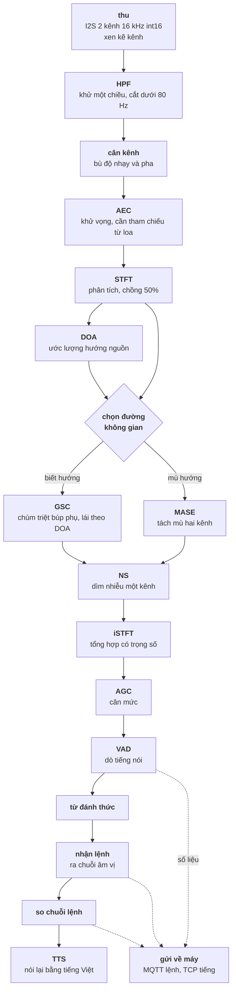

# Version 5: dựng bộ nghe và nói tiếng Việt chạy trọn trên ESP32-S3

**Lập 26/09/2026 · trạng thái: chưa mở cửa 0** · [← tổng quan dự án](../tong_quan_du_an.md)

| | |
|---|---|
| Việc | dựng một chuỗi tiếng nói đầy đủ trên board hai micro, từ thu tới nói lại, bằng mã đọc được |
| Nền | `esp-dsp`, `dl_fft`, `esp-dl`, ba thư viện mã mở của Espressif |
| Ngôn ngữ đích | **tiếng Việt** cho cả từ đánh thức, lệnh và tiếng nói ra |
| Mục tiêu | thu hai kênh, làm sạch, dò từ đánh thức, nhận lệnh, nói lại, cộng đường gửi về máy tính để xem và chấm |
| XONG khi | mọi khối đạt cửa kiểm riêng, chạy đồng thời trong một bản dựng, liền 30 phút không mất khung, và mọi con số dựng lại được bằng một lệnh |

Mã đặt ở `firmware/components/`, bản Python soi gương ở `src/`. Phụ thuộc chỉ đi
xuống, không vòng.

---

## 1. Vì sao dựng lại thay vì lấy thư viện có sẵn

Espressif có ESP-SR, làm đúng chuỗi này. Ba lý do không dùng thẳng được:

| | |
|---|---|
| **Nhị phân đóng** | `lib/esp32s3/` có 12 tệp `.a` nặng **14,7 MB**, còn `src/` chỉ có 4 tệp `.c` nặng **68 KB** và chúng chỉ đọc cấu hình với tìm đường dẫn. Mọi thuật toán nằm trong khối biên dịch sẵn |
| **Không truy được** | luật của kho là mọi con số trong báo cáo phải dựng lại được bằng một lệnh. Số sinh ra từ một khối `.a` không dựng lại được, không đưa vào bộ vàng được |
| **Không có tiếng Việt** | phần tổng hợp tiếng nói chỉ có tiếng Trung; từ đánh thức và lệnh không có bộ tiếng Việt |

Giấy phép của ESP-SR là MIT có sửa, giới hạn dùng trên phần cứng Espressif. Vấn
đề không phải giấy phép mà là **không có mã để đọc, sửa và kiểm**.

---

## 2. Hệ thống đích

### 2.1. Chuỗi đầy đủ



### 2.2. Vì sao thứ tự phải là thứ tự này

Sáu chỗ khoá cứng, mỗi chỗ một lý do vật lý, không phải quy ước:

| Khối | Phải đứng ở đâu | Vì sao |
|---|---|---|
| **HPF** | đầu tiên | thành phần một chiều và tiếng ù dưới 80 Hz làm mọi bộ lọc thích nghi phía sau trôi hệ số. Khử trước thì rẻ, khử sau thì đã hỏng |
| **Cân kênh** | trước mọi phép không gian | mọi phép không gian đọc **chênh lệch giữa hai kênh**. Nếu một phần chênh lệch ấy là của linh kiện chứ không của hướng, mọi quyết định hướng đều lệch một lượng cố định |
| **AEC** | trước mọi khối phi tuyến | nó là phép trừ tuyến tính giữa tiếng thu và tiếng đã phát. Khối nào bóp méo tín hiệu chạy trước là phép trừ không còn khớp |
| **DOA** | sau STFT, trước GSC | GSC cần hướng để lái. DOA cần phổ chéo giữa hai kênh, tức cần STFT |
| **NS** | sau khối không gian | NS là phép **một kênh**. Chạy nó trên hai kênh trước là làm hai lần công và phá quan hệ pha giữa hai kênh, thứ mà khối không gian cần |
| **AGC** | sau cùng, trước bộ nhận dạng | nó đổi biên độ. Chạy trước khối không gian là phá tỉ số mức giữa hai kênh |

### 2.3. Hai đường không gian, không phải một

Khối `G` trong sơ đồ là một nhánh rẽ, và đây là chỗ hay bị gộp nhầm thành một.

| | **GSC** | **MASE** |
|---|---|---|
| Cần biết hướng | **có**, lái theo DOA | **không**, mù hoàn toàn |
| Cách làm | chùm cố định hướng vào nguồn, ma trận chặn tạo tham chiếu nhiễu, lọc thích nghi trừ đi | tìm ma trận tách làm hai luồng ra độc lập thống kê nhất |
| Mạnh khi | người ngồi một chỗ, nhiễu đến từ hướng khác | không biết ai ngồi đâu, hoặc nguồn di chuyển |
| Yếu khi | DOA sai thì nó lái nhầm và **triệt mất chính người nói** | hội tụ chậm, và hoán vị luồng giữa các dải tần |

Cả hai đều dựng, chọn bằng cấu hình lúc dịch, và **cửa kiểm chấm cả hai trên cùng
vật liệu** rồi mới chốt đường mặc định. Không chọn trước bằng phán đoán.

---

## 3. Thuật toán cho từng khối

Mỗi khối chọn từ một bậc thang, hiện đại xuống cổ điển, kèm thứ ESP-SR dùng để
biết mốc công nghiệp nằm đâu.

| Khối | Bậc thang | **Chọn** | Ngân sách đã biết |
|---|---|---|---|
| `fft` `stft` `window` | bộ lọc học được → **FFT thực có cửa sổ** | FFT thực, cửa sổ **căn Hann**, chồng 50%, thoả điều kiện cộng dồn bằng hằng | rẻ, không phải nút thắt |
| `mel` | học được → **log-mel** → MFCC | **log-mel** cho mạng, MFCC giữ làm đối chiếu | rẻ |
| `hpf` | bộ lọc thích nghi → **IIR bậc hai** → trừ trung bình trượt | **IIR bậc hai**, cắt 80 Hz | rẻ |
| `balance` | bù đáp ứng đầy đủ → **bù một hệ số mỗi dải** → bù một hệ số toàn băng | **bù theo dải** | rẻ |
| `aec` | DNN → Kalman → **NLMS miền tần số** | **AECM**, bản số nguyên dựng cho thiết bị di động | chưa đo |
| `doa` | MUSIC, SRP-PHAT → **GCC-PHAT** → so pha thô | **GCC-PHAT**, vì hai micro không đủ bậc tự do cho phương pháp không gian con | chưa đo |
| `gsc` | DNN → **GSC thích nghi** → chùm cố định | **GSC**: chùm trễ và cộng, ma trận chặn, lọc thích nghi có ràng buộc rò | chưa đo |
| `mase` | DNN → MVDR/MWF có hiệp phương sai nhiễu → **AuxIVA** → trễ và cộng | **AuxIVA hai kênh** | chưa đo |
| `ns` | **RNNoise** → OM-LSA cộng IMCRA → MMSE-LSA → Wiener → trừ phổ | **RNNoise**, và **OM-LSA cộng IMCRA** làm sàn bắt buộc | **88 k trọng số, 85 KB int8, ~40 MFLOPS** |
| `agc` | nén đa dải học được → **nén hai tầng có nhìn trước** → nén đơn giản | **nén hai tầng**, một tầng chậm theo mức nói, một tầng nhanh chặn đỉnh | rẻ |
| `vad` | mạng nhỏ → **mô hình hỗn hợp Gauss** → năng lượng và số lần cắt không | **mô hình hỗn hợp Gauss** làm sàn, mạng nhỏ chỉ nhận nếu hơn sàn bằng số đo | rẻ |
| `wake` | transformer → **tích chập giãn nở** → tích chập tách chiều sâu → GMM | **tích chập giãn nở**, int8 | 16 tới 50 KB, ~22,6% một nhân |
| `g2p` | mạng chuỗi sang chuỗi → thống kê → **luật** | **luật**, vì chính tả tiếng Việt gần với âm vị | rẻ |
| `command` | mô hình lớn → **âm vị cộng CTC** → phân loại toàn từ | **âm vị cộng CTC** | 10,5 tới 32 KB nội, 1 tới 4 MB ngoài |
| `synth` | VITS đầy đủ → **chưng cất xuống cỡ vi điều khiển** → ghép mẩu | chốt bằng đo ở `V5.7.1` | 567 k tham số, 680 KB, ~45 MMAC mỗi giây tiếng |

### 3.1. Ba lựa chọn cần giải thích thêm

**`ns` chọn RNNoise chứ không chọn mạng dìm nhiễu theo vạch phổ.** Mạng theo vạch
nhận 161 vạch log phổ và độ phức tạp lớp hồi tiếp tăng theo **bình phương** bề
rộng, nên nó đắt lên rất nhanh. RNNoise đi đường khác: chỉ để mạng tính **22 hệ
số dải tới hạn**, phần tính được bằng công thức thì vẫn tính bằng công thức. Kết
quả 88 k trọng số, **85 KB khi lưu 8 bit** thay vì 340 KB dạng số thực, tổng
khoảng 40 MFLOPS.

Sàn OM-LSA cộng IMCRA là **bắt buộc dựng**, không phải tuỳ chọn. Nó là công thức
thuần, không cần huấn luyện, không cần dữ liệu, dựng lại được từng bước trên máy
tính. Nếu bản mạng không hơn sàn bằng số đo trên vật liệu thật thì **bỏ bản mạng**.

**`command` chọn âm vị chứ không chọn phân loại toàn từ.** Phân loại toàn từ đặt
mỗi lệnh thành một lớp, nên thêm một lệnh là thu thêm dữ liệu và huấn luyện lại,
và số lớp càng nhiều thì mỗi lớp càng ít dữ liệu. Đường âm vị học ánh xạ **tiếng
sang chuỗi âm vị**; một lệnh chỉ là một chuỗi âm vị đem so, nên **thêm lệnh là
thêm một dòng chữ**.

Cái giá phải trả nói rõ: lượng dữ liệu **không giảm, nó đổi chỗ**. Đường toàn từ
cần vài trăm mẫu cho mỗi lệnh; đường âm vị cần một kho tiếng Việt vài chục giờ
nhưng dùng chung cho mọi lệnh.

**`wake` chọn tích chập giãn nở.** Từ đánh thức cần **trường nhìn rộng theo thời
gian**, chừng một giây, mà vẫn phải chạy dòng từng khung. Tích chập giãn nở mua
trường nhìn ấy bằng cách nhân đôi bước giãn qua từng tầng, nên số tầng chỉ tăng
theo lô-ga-rít của trường nhìn. Mạng hồi tiếp cũng cho trường nhìn dài nhưng mang
theo trạng thái, và trạng thái làm phép đối chiếu với bản máy tính khó hơn nhiều.

### 3.2. Thanh điệu, chỗ tiếng Việt khác hẳn

Trong tiếng Việt, **thanh là âm vị**:

```
ma   mà   má   mả   mã   mạ
```

Sáu từ, âm đoạn giống hệt, khác đúng một thứ là thanh, nghĩa khác hẳn. Nên bộ âm
vị dựng cho ngôn ngữ không thanh điệu không dùng thẳng được. Ba đường, chốt bằng
đo ở `V5.6.1`:

| Đường | Cách làm | Giá |
|---|---|---|
| Âm đoạn cộng một đầu ra thanh riêng | mạng có hai đầu ra | hai đầu ra phải khớp nhau theo thời gian |
| Âm vị mang thanh | mỗi vần nhân sáu thanh thành ký hiệu riêng | bộ ký hiệu phình, mỗi ký hiệu ít dữ liệu hơn |
| **Đơn vị âm tiết** | lấy cả âm tiết làm đơn vị | bộ lớn hơn, nhưng tiếng Việt **đơn âm tiết** và kho âm tiết hợp lệ là danh sách đóng |

Đường thứ ba đáng cân nhắc hơn nhiều so với ngôn ngữ đa âm tiết, vì mỗi tiếng
Việt là một âm tiết và số âm tiết hợp lệ đếm được, khoảng vài nghìn, trong đó
dùng thường xuyên chỉ vài trăm.

### 3.3. Một bộ `g2p`, hai chỗ dùng

Nhận lệnh cần chữ sang âm vị để dựng chuỗi đem so. Nói cũng cần chữ sang âm vị
trước khi dựng sóng. **Cùng một module**, viết một lần, đặt ở tầng dùng chung, và
làm **trước** cả hai.

Tiếng Việt thuận bất thường ở đây: chính tả gần với âm vị, nên bộ luật viết tay
là khả thi. Phần khó nằm ở **thanh điệu**, ở **từ mượn** và ở **số**, không nằm ở
ánh xạ chữ sang âm.

---

## 4. Chia component và module

### 4.1. Ranh giới

Yêu cầu là mỗi khối tách rời, thay được, kiểm được riêng. Luật của kho lại cấm
tách thành nhiều component để rồi sao chép phần dùng chung ra nhiều bản.

Hoà bằng cách chia theo **ranh giới phụ thuộc thật**: bốn component, mỗi component
nhiều module, **mỗi module đúng một khối**, có header công khai riêng, `Kconfig`
riêng bật tắt được, và bộ kiểm riêng.

Muốn đúng nghĩa đen một component mỗi khối thì làm được, giá là mười tám bộ
`idf_component.yml` với `CHANGELOG.md`, mười tám số phiên bản canh tay, và cửa
sổ với lưới phân tích bị sao ra nhiều bản. Nói một câu là chuyển.

### 4.2. Bốn component, mười tám module

| Component | Module | Khối |
|---|---|---|
| **`mica_spec`** | `fft` | bọc `dl_fft` và `esp-dsp`, chọn được bản nào lúc dịch |
| | `window` | cửa sổ phân tích và tổng hợp |
| | `stft` | phân tích và tổng hợp, chồng lấn cộng dồn có trọng số |
| | `mel` | dải lọc mel và MFCC |
| **`mica_afe`** | `hpf` | khử một chiều, cắt tần thấp |
| | `balance` | cân độ nhạy và pha hai kênh |
| | `aec` | khử vọng |
| | `doa` | ước lượng hướng nguồn |
| | `gsc` | chùm triệt búp phụ, lái theo hướng |
| | `mase` | tách mù hai kênh |
| | `ns` | dìm nhiễu một kênh |
| | `agc` | cân mức |
| | `vad` | dò tiếng nói |
| **`mica_kws`** | `feature` | đặc trưng cho bộ nhận dạng |
| | `g2p` | chữ tiếng Việt sang âm vị, dùng chung |
| | `wake` | từ đánh thức |
| | `command` | nhận lệnh, ra chuỗi âm vị, so với danh sách |
| **`mica_tts`** | `synth` | dựng sóng từ chuỗi âm vị |

`mica_spec` là nền của ba component còn lại. Nó đi trước và không được phép phụ
thuộc ngược lên ai.

### 4.3. Hợp đồng gọi

Toàn bộ `mica_afe` phơi ra đúng hai hàm, kiểu nạp và lấy, để phần gọi không phải
biết bên trong có bao nhiêu khối:

```
mica_afe_feed(handle, const int16_t *xen_ke, size_t khung)
mica_afe_fetch(handle, mica_afe_ra_t *ra)
```

Ba ràng buộc chốt ngay từ đầu, mỗi cái có lý do:

| Ràng buộc | Vì sao |
|---|---|
| Vào là **xen kẽ kênh**, không phải hai mảng rời | đúng dạng I2S đổ ra, khỏi một lần chép |
| `fetch` trả **một kênh** đã làm sạch, cộng **số liệu** gồm hướng, cờ tiếng nói, mức | phần nhận dạng chỉ cần một kênh; số liệu để gửi về máy và để chấm |
| Nạp và lấy **không cùng nhịp**, đệm vòng ở giữa | khối nhận dạng chạy theo cửa sổ dài hơn khung của phần làm sạch |

Mỗi module bên trong phơi thêm hàm riêng để kiểm được độc lập. Bật tắt từng khối
bằng `Kconfig`, và **cờ tắt phải đổi danh sách nguồn biên dịch**, không chỉ bọc
lệnh rẽ nhánh.

---

## 5. Thứ tự làm: component trước, app sau

### 5.1. Ba pha

| Pha | Làm gì | Ra cái gì |
|---|---|---|
| **A. Nền và hợp đồng** | dàn micro đạt chuẩn, `mica_spec`, chốt API, dựng app khung rỗng | một chỗ để cắm module vào và đo ngay |
| **B. Viết từng module** | mười bốn module còn lại, mỗi module một mình, có bộ kiểm riêng | thư viện chạy được, chưa phải sản phẩm |
| **C. Ôm về thành app** | phân vai app, chia nhân, chia bộ nhớ, chạy dài | máy dùng được |

Pha B là phần dài nhất và làm được song song, vì các module không gọi nhau.

### 5.2. Ba thứ không được để tới pha C

Thứ tự component trước app là đúng, nhưng nó có ba cái bẫy, và cả ba đều là kiểu
làm xong mới biết hỏng:

| Bẫy | Vì sao | Chặn bằng |
|---|---|---|
| **Ngân sách chỉ lộ ra lúc ghép** | viết xong mười tám module rồi mới cộng lại thì đã mất hàng tháng, và nếu không vừa thì phải bỏ bớt khối | **mỗi module đo chi phí ngay khi viết xong**, cộng dồn vào một bảng chạy |
| **Hợp đồng gọi định hình cả module** | ai cấp phát bộ đệm, hàm có được chặn không, trạng thái nằm ở đâu, những cái đó ngấm vào từng module. Chốt sau là phải sửa lại tất cả | **đóng băng API ở pha A**, trước khi viết module đầu tiên |
| **Không có chỗ đo tại chỗ** | đo trên máy tính không thay được đo trên board, mà không có app thì không có chỗ chạy | **dựng app khung rỗng ở pha A**, chạy thu tới tổng hợp rồi thôi |

App khung rỗng không làm gì có ích: nó thu, phân tích, tổng hợp lại, rồi gửi ra.
Giá trị của nó là **từ module đầu tiên trở đi, mọi số đo đều là số trên board
thật**, không phải số ước.

### 5.3. Công thức cho mỗi module

Mỗi module trong pha B đi đúng bốn bước, không bước nào bỏ:

| Bước | Làm | XONG khi |
|---|---|---|
| 1 | bản Python, viết theo thuật toán đã chốt ở mục 3 | chạy đúng trên vật liệu dựng có nhãn |
| 2 | bộ vàng | có **đối chứng âm**: làm sai một chỗ thì nó phải đỏ |
| 3 | bản C, cắm vào app khung rỗng | khớp bản Python trong ngưỡng ghi rõ |
| 4 | đo chi phí trên board | RAM tĩnh, RAM động, µs mỗi khung trung bình và **đỉnh**; cộng vào bảng chạy |

Bước 4 là bước hay bị bỏ nhất và là bước đắt nhất khi bỏ. Một module vượt ngân
sách phát hiện ngay thì sửa được; phát hiện ở pha C thì phải bỏ cả khối.

---

## 6. Cây task

### V5.0: Pha A, nền và hợp đồng ☐

**Nửa phần cứng.** Không phép không gian nào có nghĩa trên hai micro lệch nhau.

| Mã | Việc | XONG khi |
|---|---|---|
| `V5.0.1` | Đo bốn chỉ tiêu của dàn: khoảng cách, chênh độ nhạy, chênh pha, tỉ số tín hiệu trên nhiễu | bảng bốn dòng, không dòng nào để trống |
| `V5.0.2` | Bù chênh độ nhạy theo dải | chênh sau bù **dưới 1 dB** toàn băng 50 Hz tới 8 kHz |
| `V5.0.3` | Chốt quy ước kênh và dấu | tên kênh, dấu của trễ, kênh nào là tham chiếu cho khử vọng |

Mốc để chấm, lấy từ hướng dẫn phần cứng của Espressif cho dàn dùng với chuỗi này:

| Chỉ tiêu | Mốc |
|---|---|
| Khoảng cách hai micro | 4 tới 6,5 cm |
| Chênh độ nhạy | trong **3 dB** |
| Chênh pha | trong **10°** |
| Tỉ số tín hiệu trên nhiễu | từ 62 dB, khuyến nghị 64 dB |

**Bù bằng phần mềm chỉ sửa được biên độ.** Nếu chênh pha vượt 10° thì không phần
mềm nào cứu, phải chọn lại cặp micro khớp hơn. Ghi trước để không mất công bù
nhầm thứ.

**Nửa phần mềm.**

| Mã | Việc | XONG khi |
|---|---|---|
| `V5.0.4` | **Đóng băng hợp đồng gọi** của `mica_afe` và `mica_kws` | header công khai viết xong, có Doxygen đủ, **trước khi viết module nào** |
| `V5.0.5` | Dựng `mica_spec`, bốn module, đủ bộ khung component | có `idf_component.yml`, `Kconfig`, `README`, `CHANGELOG`, bộ kiểm dịch bằng gcc |
| `V5.0.6` | Đo `dl_fft` so với `esp-dsp` trên board | bảng thời gian và bộ nhớ theo độ dài khung; **chọn một bản, ghi lý do bằng số** |
| `V5.0.7` | Bộ vàng cho STFT và iSTFT | phân tích rồi tổng hợp lại dựng đúng sóng gốc, sai số ghi bằng số |
| `V5.0.8` | Bộ vàng cho dải lọc mel | lệch so với bản máy tính dưới ngưỡng ghi rõ, có **đối chứng âm** |
| `V5.0.9` | **App khung rỗng** | thu, phân tích, tổng hợp, gửi ra; chạy liền 10 phút không mất khung |
| `V5.0.10` | Bảng ngân sách chạy, để trống chờ điền | một lệnh in ra bảng RAM và thời gian theo module |

**Cửa 0 đóng khi** dàn micro đạt ba chỉ tiêu sửa được, bản C khớp bản máy tính
trong ngưỡng ghi rõ, app khung rỗng chạy được, và hợp đồng gọi đã đóng băng.
Không đóng thì dừng, vì mọi thứ sau dựng trên nền này.

### V5.1: Pha B, `mica_afe` tầng một kênh ☐

Bốn module không cần mô hình, không cần dữ liệu. Làm trước vì rẻ và vì chúng lấp
đầy bảng ngân sách sớm.

| Mã | Module | Thuật toán | Cửa riêng |
|---|---|---|---|
| `V5.1.1` | `hpf` | IIR bậc hai, cắt 80 Hz | độ trôi một chiều sau lọc dưới ngưỡng ghi rõ |
| `V5.1.2` | `balance` | bù theo dải, hệ số từ `V5.0.2` | khớp bản máy tính trên bộ vàng |
| `V5.1.3` | `agc` | nén hai tầng có nhìn trước | mức ra trong dải đặt trước, không dao động chu kỳ, không cắt đỉnh |
| `V5.1.4` | `vad` | mô hình hỗn hợp Gauss | hơn **ngưỡng năng lượng trần** bằng số đo |

### V5.2: Pha B, `mica_afe` tầng không gian ☐

Ba module nặng nhất về thuật toán. Dựng cả hai đường rồi chấm, không chọn trước.

| Mã | Module | Thuật toán | Cửa riêng |
|---|---|---|---|
| `V5.2.1` | `doa` | GCC-PHAT | sai số góc trên cảnh dựng có nhãn; ghi rõ giới hạn gập vòng pha theo khoảng cách micro |
| `V5.2.2` | `gsc` | chùm trễ và cộng, ma trận chặn, lọc thích nghi có ràng buộc rò | dìm nhiễu bằng số, **cộng phép kiểm khi cho DOA sai cố ý**, vì đó là cách nó hỏng |
| `V5.2.3` | `mase` | AuxIVA hai kênh | khớp bản tham chiếu công bố, có **đối chứng âm** |
| `V5.2.4` | so hai đường | cùng vật liệu, cùng thước | bảng hai cột; **chốt đường mặc định bằng số** |

**Cửa:** đường thắng phải hơn phép trộn hai kênh trần bằng số đo. Không hơn thì
giữ phép trần và ghi đúng như vậy.

### V5.3: Pha B, `mica_afe` dìm nhiễu ☐

| Mã | Module | Thuật toán | Cửa riêng |
|---|---|---|---|
| `V5.3.1` | `ns` sàn | OM-LSA cộng IMCRA | dìm nhiễu và phần mất của tiếng nói, đo trên bản thu thật |
| `V5.3.2` | dữ liệu | tiếng Việt cộng nhiễu của chính phòng dùng | bảng nguồn, số giờ, giấy phép |
| `V5.3.3` | `ns` mạng | RNNoise | **phải hơn sàn bằng số đo**, không hơn thì bỏ và giữ sàn |

### V5.4: Pha B, `mica_afe` khử vọng ☐

Chưa xếp thứ tự vì cần loa và đường lấy tham chiếu, thứ chưa có. Nó **không chặn
module nào khác**: chuỗi chạy được không có khử vọng, chỉ là không dùng được khi
board vừa phát vừa thu.

| Mã | Module | Thuật toán | Cửa riêng |
|---|---|---|---|
| `V5.4.1` | đường tham chiếu | board phát ra loa và giữ bản sao đồng bộ mẫu | có lối lấy tham chiếu cùng nhịp với lối thu |
| `V5.4.2` | `aec` | AECM, bản số nguyên | dìm vọng **≥ 20 dB** |
| `V5.4.3` | giữ ổn định khi hai bên cùng nói | | không phân kỳ, đo trên bản thu có nhãn |

### V5.5: Pha B, `mica_kws` ☐

| Mã | Module | Việc | Cửa riêng |
|---|---|---|---|
| `V5.5.1` | | khảo sát nguồn tiếng nói tiếng Việt dùng được | bảng nguồn, số giờ, số người nói, giấy phép |
| `V5.5.2` | | chốt đơn vị: âm vị có thanh, âm vị cộng đầu thanh, hay âm tiết | chọn bằng đo, không bằng phán đoán |
| `V5.5.3` | `g2p` | luật, chữ tiếng Việt sang đơn vị đã chốt | đúng trên bộ thử có nhãn, kể cả từ mượn, số, tên riêng |
| `V5.5.4` | `feature` | xếp khung log-mel, chuẩn hoá | chuẩn hoá dùng **cùng thống kê lúc huấn luyện và lúc chạy**, có phép kiểm canh |
| `V5.5.5` | | chốt **một** từ đánh thức, hai tới ba âm tiết | lý do âm học: đủ dài để hiếm gặp ngẫu nhiên, đủ tương phản để dễ bắt |
| `V5.5.6` | | thu bổ sung **qua chính board** | có giọng nam nữ, có xa và gần |
| `V5.5.7` | `wake` | tích chập giãn nở, int8 | bắt được **≥ 95%** ở 1 m, báo nhầm **≤ 1 lần mỗi giờ** |
| `V5.5.8` | `command` | âm vị cộng CTC, cộng bộ so chuỗi và ngưỡng từ chối | mỗi lệnh **≥ 90%**, từ chối đúng **≥ 95%**; thêm lệnh **chỉ bằng thêm một dòng chữ**, có phép kiểm chứng minh |
| `V5.5.9` | | đo `wake` trên board, **gồm độ trễ khi trọng số ở bộ nhớ ngoài** | đỉnh một khung có vượt nhịp không |

Con số báo nhầm quan trọng hơn con số bắt được: một máy tự bật mỗi mười phút là
máy không ai dùng.

### V5.6: Pha B, `mica_tts` ☐

Module rủi ro cao nhất, đứng cuối pha B.

| Mã | Module | Việc | Cửa riêng |
|---|---|---|---|
| `V5.6.1` | | chọn giữa chưng cất và ghép mẩu | bảng so bộ nhớ, flash, phép tính, chất lượng; **có cả phương án không dùng mạng** |
| `V5.6.2` | | nối vào `g2p` của `V5.5.3`, thêm trường độ và ngôn điệu | **không viết lại `g2p`** |
| `V5.6.3` | `synth` | dựng sóng | **dưới 1× thời gian thực** trên board |
| `V5.6.4` | | chấm chất lượng | điểm tự động cộng nghe thật, ghi cả hai |

**Cửa có lối thu hẹp:** không đạt dưới 1× thời gian thực hoặc không vừa bộ nhớ
thì **lui về ghép mẩu**, tức thu sẵn tiếng người đọc từng lệnh và từng số rồi
ghép. Xấu hơn nhưng chắc chạy. **Không nới ngân sách để cứu bản mạng.**

Mốc ngoài để biết đang so với cái gì: bản chưng cất nhỏ nhất đã công bố đạt
**567 008 tham số, 680 KB trọng số, ~45 MMAC mỗi giây tiếng, vùng làm việc
289 KB, 0,22× thời gian thực ở 240 MHz**, chất lượng theo thước tự động **2,54**
so với 4,7 của mô hình dạy nó. Bài ấy **không chạy bản tiếng Việt trên vi điều
khiển**, chỉ chạy bản tiếng Anh.

### V5.7: Pha C, ôm về thành app ☐

Mở khi pha B xong đủ module cho một đường chạy trọn.

| Mã | Việc | XONG khi |
|---|---|---|
| `V5.7.1` | Chốt danh sách app và vai từng app | ít nhất: một app chạy thật, một app đo, một app chỉ thu để lấy dữ liệu |
| `V5.7.2` | Bảng bộ nhớ theo module, tĩnh và động | tổng khớp bản đồ liên kết, **không ô nào là suy**, vì từng ô đã đo ở pha B |
| `V5.7.3` | Chia task và ghim nhân | sơ đồ, mỗi task ghi rõ chu kỳ, ưu tiên, kích thước ngăn xếp |
| `V5.7.4` | Gửi trạng thái và số liệu về máy, **không gửi tiếng thô** | dưới 1 KB/s ở chế độ thường |
| `V5.7.5` | Chạy liền 30 phút | **0 khung mất**, heap không trôi |
| `V5.7.6` | Đo hai chỗ chỉ lộ ra lúc ghép | `nhan` chạy xen có làm `sach` trễ khung không; tổng hợp tiếng nói ở nhân 0 có làm rớt gói không |

`V5.7.2` rẻ vì từng ô của nó đã đo ở bước 4 của mỗi module. Nếu pha B làm đúng
công thức thì pha C chỉ là cộng lại và kiểm, không phải đi đo từ đầu.

---
## 7. Ngân sách

Kiểm trước khi viết mã, vì không vừa thì kế hoạch phải đổi chứ không phải phát
hiện lúc cuối.

### 6.1. Luật chỗ đặt

**Mọi trọng số và mọi vùng làm việc của mô hình nằm ở bộ nhớ ngoài.** RAM nội chỉ
giữ thứ bị chạm mỗi khung.

| Vùng | Khoản | Ước |
|---|---|---|
| **RAM nội** | đệm DMA của I2S | ~8 KB |
| | `mica_spec`, đệm phân tích hai kênh | ~25 KB |
| | `mica_afe`, trạng thái chín module | ~40 KB |
| | ngăn xếp năm task | ~24 KB |
| | **cộng** | **~97 KB** |
| **Bộ nhớ ngoài** | trọng số và vùng làm việc `mica_kws` | ~1,1 MB |
| | trọng số và vùng làm việc `mica_tts` | ~1,0 MB |
| | **cộng** | **~2,1 MB** |

Mốc ngoài để so: chuỗi tương đương của Espressif lấy **48,7 tới 91,1 KB** RAM nội
và **739,7 tới 1 238,5 KB** bộ nhớ ngoài cho riêng phần làm sạch.

**Một chỗ phải đo, không được suy.** Bộ nhớ ngoài chậm hơn RAM nội khoảng bảy lần
về băng thông. Khối `wake` chạy **gần như liên tục**, nên độ trễ của nó khi trọng
số nằm ngoài **phải đo riêng** ở `V5.5.9`; nếu đỉnh vượt nhịp thì kéo riêng phần
nóng về RAM nội. Khối `synth` chạy từng lúc nên không có rủi ro ấy.

### 6.2. Thời gian

Board chạy **240 MHz**, hai nhân Xtensa LX7.

| Khối | Ước tải một nhân | Căn cứ |
|---|---|---|
| Tầng làm sạch đầy đủ | 20 tới 35% | chuỗi tương đương của Espressif đo 8,8 tới 32,2% cộng 4,7 tới 22,9% |
| `ns` bản mạng | ~24% | 40 MFLOPS trên ngân sách phép tính của board |
| `wake` | ~22% | mốc ngoài của mô hình cùng loại |
| `command` | chạy từng đợt | 11 tới 18 ms cho mỗi cửa sổ 32 ms |
| **cộng phần chạy liên tục** | **66 tới 81%** | |

**Một nhân không đủ.** Chia hai nhân là việc bắt buộc, nằm ở `V5.7.3`, không để
sau.

Một khoản phải trừ: bộ nhớ ngoài chạy nhịp riêng, không tăng theo nhịp lõi, nên
tính theo chu kỳ lõi thì **ở 240 MHz nó đắt hơn ở nhịp thấp**. Đây là lý do thứ
hai đòi đo riêng khối `wake`.

### 6.3. Chia task

| Task | Nhân | Chu kỳ | Việc |
|---|---|---|---|
| `thu` | 1 | theo DMA | đọc I2S, không làm gì khác |
| `sach` | 1 | mỗi khung | HPF, cân kênh, khử vọng, phân tích, không gian, dìm nhiễu, tổng hợp, cân mức, dò tiếng |
| `nhan` | 1 | khi có tiếng nói | từ đánh thức, rồi nhận lệnh |
| `noi` | 0 | khi được gọi | tổng hợp tiếng nói |
| `gui` | 0 | mỗi 100 ms | lệnh qua MQTT, tiếng qua TCP khi cần |

Nhân 0 gánh ngăn xếp không dây, nên đặt ở đó hai việc **không có hạn cứng**. Nhân
1 giữ trọn phần có hạn cứng theo khung.

Hai chỗ phải đo chứ không được đoán: **`nhan` chạy xen vào `sach` có làm `sach`
trễ khung không**, và **tổng hợp tiếng nói ở nhân 0 có làm rớt gói không**. Cả
hai vào `V5.7.6`.

---

## 8. Cửa kiểm

Mỗi cửa có lối dừng rõ ràng. Không cửa nào cho phép "gần đạt thì đi tiếp".

| Cửa | Sau | Đòi | Không đạt thì |
|---|---|---|---|
| **0** | `V5.0` | dàn micro đạt ba chỉ tiêu sửa được; bản C khớp bản máy tính; app khung rỗng chạy được; **hợp đồng gọi đã đóng băng** | **dừng hẳn**, vì mọi thứ sau dựng trên nền này |
| **1** | `V5.2`, `V5.3` | đường không gian thắng hơn phép trộn trần; `ns` mạng hơn sàn OM-LSA | giữ phép trần, giữ sàn, ghi đúng như vậy |
| **2** | `V5.5.7` | bắt từ ≥ 95%, báo nhầm ≤ 1 lần mỗi giờ | thu thêm dữ liệu; vẫn không đạt thì đổi từ đánh thức |
| **3** | `V5.5.8` | mỗi lệnh ≥ 90%, từ chối đúng ≥ 95% | **giảm số lệnh**, không nới mô hình |
| **4** | `V5.6` | dưới 1× thời gian thực, vừa bộ nhớ | **lui về ghép mẩu**, không nới ngân sách |
| **5** | `V5.7` | chạy liền 30 phút, 0 khung mất, heap không trôi | bỏ khối đắt nhất theo bảng ngân sách, đo lại |

Cửa 5 là cửa duy nhất của pha C, và nó rẻ **chỉ khi pha B đã đo đủ**. Nếu bước 4
của công thức mục 5.3 bị bỏ ở module nào thì cửa 5 là chỗ nó lộ ra, và lúc đó
sửa đắt nhất.

---

## 9. Ngoài phạm vi, và vì sao

**Nhận dạng tiếng nói tự do.** Đọc thành chữ bất kỳ câu nào là bài khác hẳn quy
mô: cần mô hình ngôn ngữ, cần tìm kiếm chùm, cần từ điển phát âm đầy đủ. Version
5 chỉ nhận **tập lệnh đóng**, và bộ giải mã của nó chỉ là phép so chuỗi.

**Nhiều hơn hai micro.** Hướng dẫn phần cứng của Espressif cho con chip này chỉ
có hai cấu hình, hai micro và ba micro đặt tam giác đều. Version 5 làm trên dàn
hai micro.

**Hai người nói đè nhau.** Version 5 giả định **một người đang nói với máy**, và
phần còn lại là nhiễu. Đó là giả định mà cả chuỗi này dựng trên.

### 9.1. Khử vang, nói cho rõ vì nó hay bị lẫn với dìm nhiễu

Hai thứ này khác nhau về bản chất, và chuỗi này chỉ làm thứ thứ nhất.

| | **Dìm nhiễu**, có trong chuỗi | **Khử vang**, không có |
|---|---|---|
| Thứ phải bỏ | tiếng **cộng thêm** vào: quạt, xe, điều hoà | chính tiếng nói ấy **dội lại** từ tường, bàn, trần |
| Về toán | tín hiệu cộng nhiễu | tín hiệu **chập** với đáp ứng phòng |
| Bỏ bằng cách | ước lượng phổ nhiễu rồi trừ hoặc nhân mặt nạ | ước lượng rồi **nghịch đảo** phần chập |

Vì là phép chập chứ không phải phép cộng, **không khối nào trong chuỗi này khử
vang được**. Dìm nhiễu chạy bao nhiêu lần cũng không chạm tới nó.

Ba lý do để ngoài phạm vi:

- **Chuỗi tương đương của Espressif cũng không có.** Trong danh sách module của
  họ không có khối khử vang nào. Nên một bản dựng lại tương đương không thiếu nó.
- **Nó thuộc lớp tính toán khác.** Cách cổ điển đang dùng là dự đoán tuyến tính
  có trọng số: mỗi vạch tần số cần một bộ lọc dự đoán dài, cộng ước lượng ma trận
  hiệp phương sai và phép nghịch đảo. Đắt hơn hẳn mọi khối trong chuỗi này.
- **Nó là bài của phòng, không phải bài của thuật toán.** Kê micro gần người hơn
  mua được nhiều dB hơn bất kỳ bộ khử vang nào, và không tốn chu kỳ nào.

**Nhưng phải ghi rõ cái giá của việc bỏ nó:** vang là thứ quyết định **thu được
xa tới đâu**. Càng xa, tiếng trực tiếp càng yếu theo bình phương khoảng cách
trong khi trường phản xạ gần như không đổi. Nên chuỗi này sẽ kém dần theo khoảng
cách và **không khối nào trong nó cứu được**. Giới hạn ấy phải đo và ghi thành
một con số ở `V5.7`, chứ không để người dùng tự phát hiện.

Một điều an ủi nhỏ và phải nói đúng mức: `gsc` và `mase` **dìm bớt vang một cách
tình cờ**, vì phản xạ tới từ hướng khác với người nói nên bị chùm dìm theo. Đó là
tác dụng phụ, không phải thiết kế, và nó không thay được một bộ khử vang thật.
